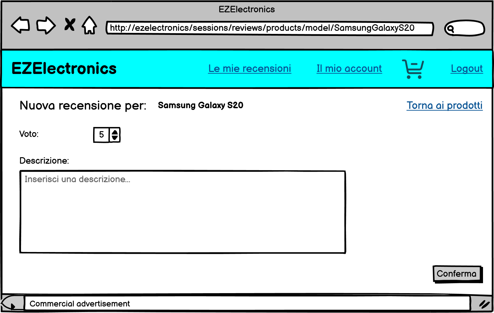
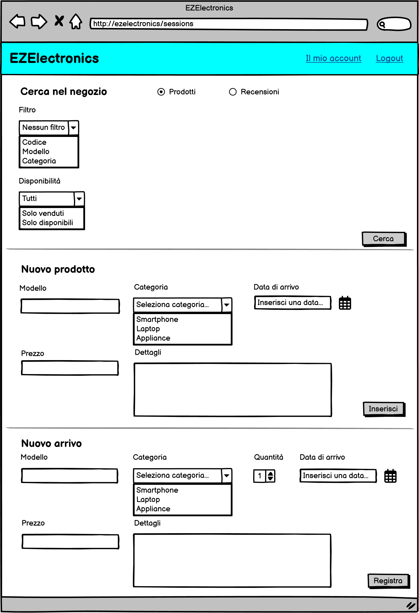
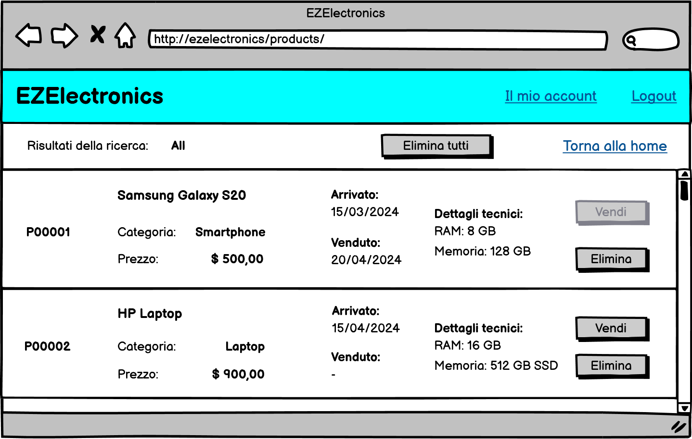

# Graphical User Interface Prototype - FUTURE

Authors:

Date:

Version:

Il prototipo di GUI realizzato per la versione corrente possiede solo il layout browser, essendo un'applicazione web; supponendo il front-end realizzato in modo responsive, tale layout rimane valido sia per un utilizzo desktop, che per un utilizzo da smartphone.

Il [documento completo](/GUIs/version2/version2.pdf) contiene tutti i possibili layout, incluse le eccezioni: per esse è stato talvolta realizzato un unico layout dedicato, il quale raggruppa le caratteristiche comuni di diversi scenari, relativi al medesimo caso d'uso (ad esempio i casi di presenza di input di testo o filtri di ricerca non validi); esso contiene i link funzionanti sui bottoni, consentendo la navigazione tra i diversi layout: tali link sono generalmente (ma non in tutti i casi) riferiti ai casi d'uso di alto livello, pertanto puntano ad una singola versione di un dato layout, tra quelle presenti, il quale può realizzarsi sia nella versione ufficiale, che in quelle alternative.

Nel documento sono presenti note a margine di alcuni layout (sia ufficiali che alternativi), per evidenziare meglio lo svolgimento degli scenari interessati e le diverse funzionalità dei link presenti, che variano a seconda dell'utente (cliente o manager), o, più frequentemente, da dati immessi all'interno dei form oppure dall'esito di operazioni fallibili, come il pagamento o l'aggiunta di un prodotto al carrello.

Di seguito si elencano i prototipi di interfaccia grafica dei casi d'uso principali, nella loro versione nominale:

- Pagina iniziale del negozio virtuale(root dell'applicazione web):

- Lista prodotti trovati da un utente non autenticato:

- Form di registrazione:

- Profilo utente:
    - cliente:
    - manager:.png)

- Modifica password:
    - cliente:
    - manager: .png)

- Impostazione di un'informazione del cliente (qui mostrato solo per l'indirizzo di consegna):

- Homepage di un cliente:

- Lista prodotti trovati da un cliente:

- Lista acquisti effettuati da un cliente:

- Ricerca recensioni effettuate da un cliente:

- Lista recensioni effettuate da un cliente:

- Inserimento nuova recensione:

- Modifica recensione esistente:

- Carrello corrente:
    - possibilità di acquisto:
    - necessario inserimento informazioni:.png)

- Storico carrelli:

- Tracking della spedizione di un carrello:

- Homepage di un manager:

- Lista prodotti trovati da un manager:

- Lista recensioni trovate da un manager:

