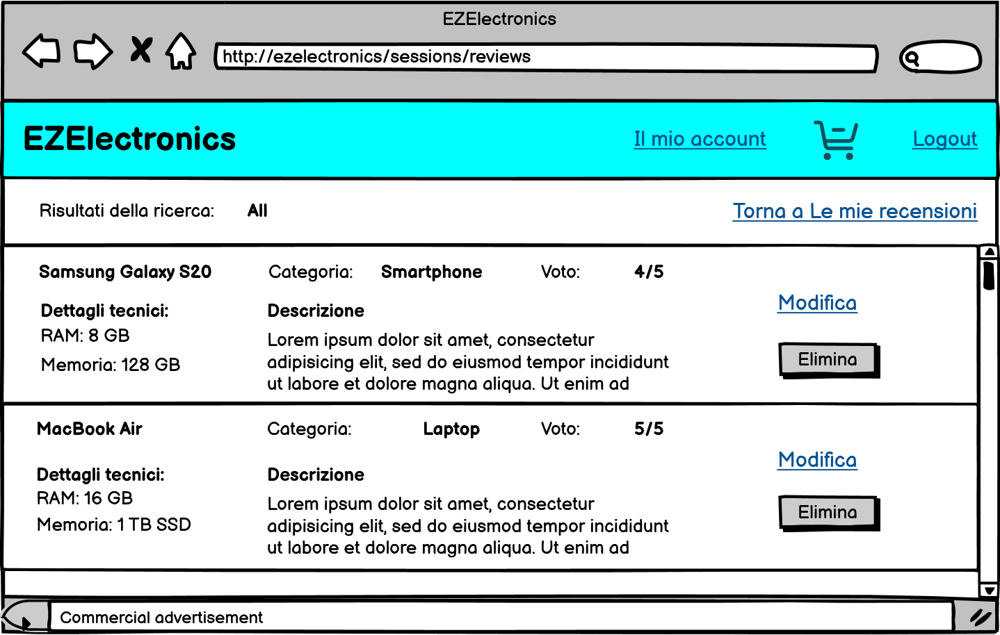

# Graphical User Interface Prototype - FUTURE

Authors:

Date:

Version:

Il prototipo di GUI realizzato per la versione corrente possiede solo il layout browser, essendo un'applicazione web; supponendo il front-end realizzato in modo responsive, tale layout rimane valido sia per un utilizzo desktop, che per un utilizzo da smartphone.

Il [documento completo](/GUIs/version2/version2.pdf) contiene tutti i possibili layout, incluse le eccezioni: per esse è stato talvolta realizzato un unico layout dedicato, il quale raggruppa le caratteristiche comuni di diversi scenari, relativi al medesimo caso d'uso (ad esempio i casi di presenza di input di testo, filtri di ricerca non validi oppure ritorno da operazioni concluse con successo); esso contiene i link funzionanti sui bottoni, consentendo la navigazione tra i diversi layout: tali link conducono solo alla versione ufficiale di un dato layout, ma può essere riferito anche a quelle alternative.

Nel documento sono presenti note a margine di alcuni layout (sia ufficiali che alternativi), per evidenziare meglio lo svolgimento degli scenari interessati e le diverse funzionalità dei link presenti, che variano a seconda dell'utente (cliente o manager), o, più frequentemente, da dati immessi all'interno dei form oppure dall'esito di operazioni fallibili, come il pagamento o l'aggiunta di un prodotto al carrello.

Di seguito si elencano i prototipi di interfaccia grafica dei casi d'uso principali, nella loro versione nominale:

- Pagina iniziale del negozio virtuale(root dell'applicazione web):
  

- Lista prodotti trovati da un utente non autenticato:
  

- Form di registrazione:
  

- Profilo utente:

  - cliente:
  - manager:

- Modifica password:

  - cliente:
  - manager: 

- Impostazione di un'informazione nel profilo utente del cliente (qui mostrato solo per l'indirizzo di consegna):
  

- Homepage di un cliente:
  

- Lista prodotti trovati da un cliente:
  

- Lista recensioni di un prodotto trovato da un cliente:
  

- Lista acquisti effettuati da un cliente:
  

- Ricerca recensioni effettuate da un cliente:
  

- Lista recensioni effettuate da un cliente:
  

- Inserimento nuova recensione:
  

- Modifica recensione esistente:
  

- Carrello corrente:

  - possibilità di acquisto:
  - necessario inserimento informazioni:.png>)

- Storico carrelli:
  

- Tracking della spedizione di un carrello:
  

- Homepage di un manager:
  

- Lista prodotti trovati da un manager:
  

- Lista recensioni trovate da un manager:
  

# Admin Interface

Per l'admin è stata progettata un'interfaccia da terminale che permetta di svolgere rapidamente tutte le operazioni di inserimento, modifca e rimozione degli oggetti del sistema.

## Menu principale

```
Scegli classe:
1. Utenti
2. Prodotti
3. Carrelli
4. Spedizioni
5. Recensioni
6. Modelli

>
```

### Menu Utenti

```
Scegli operazione:
1. Inserisci
2. Modifica
3. Rimuovi
4. Cerca
5. Rimuovi tutti

>
```

#### Menu Utenti - Inserimento

```
Inserisci il codice utente [auto]:
Inserisci l'username:
Inserisci la password:
Inserisci nome:
Inserisci cognome:
Inserisci ruolo (c/m):
```

Se il ruolo scelto è `c` (cliente) vengono mostrati i seguenti campi:

```
Inserisci indirizzo di spedizione [opzionale]:
inserisci metodo di pagamento [opzionale]:
Inserisci email [opzionale]:
Inserisci numero di telefono [opzionale]:
```

Al termine dell'inserimento il sistema verifica la validità dei campi inseriti:

- successo

```
È stato correttamente aggiunto l'utente:
mario99, Mario Rossi, Cliente
con
indirizzo di spedizione: Corso Francia, 1
metodo di pagamento: Carta di Credito 3746 432767 81001
email: mario.rossi@gmail.com
numero di telefono:
```

- fallimento

```
Si è verificato un errore e non è stato inserito nessun nuovo utente
```

#### Menu Utenti - Modifica

Il sistema mostra il menu di ricerca, poi:

```
Seleziona un attributo da modificare
>
```

Se la scelta è valida:

```
Inserisci il nuovo valore
>
```

Il sistema effettua una verifica di validità del valore inserito:

- successo

```
Il valore è stato modificato correttamente.
```

- errore

```
Il valore inserito non è valido - l'attributo non è stato modificato.
```

#### Menu Utenti - Rimozione

Il sistema mostra il menu di ricerca, poi:

```
Vuoi davvero rimuovere l'utente mario99, Mario Rossi, Cliente?
(y/n)
>
```

In base alla scelta, il sistema mostrerà:

- ```
  L'utente è stato rimosso
  ```
- ```
  L'utente non è stato rimosso
  ```

#### Menu Utenti - Ricerca

```
Inserisci i filtri

>
```

I filtri sono nella forma `nomeattributo:valore`. Si possono inserire più filtri separandoli con `,`.

Dopo l'inserimento:

```
Seleziona l'utente:
1. mario99, Mario Rossi, cliente
2. ema1926, Emanuele Palumbo, Manager
...

>
```

> Se la ricerca non produce risultati, il sistema mostra il seguente testo e torna al menu
> ```
>  Nessun utente trovato. Prova a cambiare i filtri.
>  ```

Viene mostrata la lista degli attributi dell'utente selezionato, esclusa la password:

```
1. Nome: Mario
2. Cognome: Rossi
3. Username: mario99
4. Password: *
```

Per un 'cliente' vengono mostrati anche:

```
5. Indirizzo di spedizione
6. Metodo di pagamento
```

#### Menu Utenti - Rimuovi tutti

```
Attenzione! Si sta per effettuare un'operazione critica. 
Dopo la rimozione sarà impossibile recuperare i dati eliminati.
Sei sicuro di voler procedere? (y/n)

>
```
Se l'admin inserisce "y", il sistema procede alla rimozione di tutti gli utenti e degli oggetti che dipendono da essi (ad esempio i carrelli).
Il sistema mostra il messaggio di conferma
```
Tutti gli utenti sono stati rimossi dal sistema.
```

Se l'admin inserisce "n", il sistema mostra il messaggio
```
Operazione abortita. Nessun utente è stato rimosso
```

### Menu Prodotti

```
Scegli operazione:
1. Inserisci
2. Modifica
3. Rimuovi
4. Cerca
5. Rimuovi tutti

>
```

#### Menu Prodotti - Inserimento

```
Inserisci il codice prodotto [auto]:
Inserisci il modello:
Inserisci il prezzo:
Inserisci i dettagli [opzionale]:
Inserisci la data di arrivo:
Inserisci la data di vendita [opzionale]:
```

#### Menu Prodotti - Modifica

Il sistema mostra il menu di ricerca, poi:

```
Seleziona un attributo da modificare
>
```

Se la scelta è valida:

```
Inserisci il nuovo valore
>
```

Il sistema effettua una verifica di validità del valore inserito:

- successo

```
Il valore è stato modificato correttamente.
```

- errore

```
Il valore inserito non è valido - l'attributo non è stato modificato.
```

#### Menu Prodotti - Rimozione

Il sistema mostra il menu di ricerca, poi:

```
Vuoi davvero rimuovere il prodotto P12345?
(y/n)
>
```

#### Menu Prodotti - Ricerca

```
Inserisci i filtri

>
```

I filtri sono nella forma `nomeattributo:valore`. Si possono inserire più filtri separandoli con `,`.

Dopo l'inserimento:

```
Seleziona il prodotto:
1. P12345 - iPhone 13
2. P23413 - Samsung Galaxy S20
...

>
```

> Se la ricerca non produce risultati, il sistema mostra il seguente testo e torna al menu
> ```
> Nessun prodotto trovato. Prova a cambiare i filtri.
> ```

Viene mostrata la lista degli attributi del prodotto selezionato:

```
1. Codice: P123456
2. Modello: iPhone 13
3. Prezzo: 413,85
4. Dettagli: Chip A15 Bionic per prestazioni fulminee
5. Data di arrivo: 02/05/2024
6. Data di vendita:
```

#### Menu Prodotti - Rimuovi tutti

```
Attenzione! Si sta per effettuare un'operazione critica. 
Dopo la rimozione sarà impossibile recuperare i dati eliminati.
Sei sicuro di voler procedere? (y/n)

>
```
Se l'admin inserisce "y", il sistema procede alla rimozione di tutti i prodotti e degli oggetti che dipendono da essi.
Il sistema mostra il messaggio di conferma
```
Tutti i prodotti sono stati rimossi dal sistema.
```

Se l'admin inserisce "n", il sistema mostra il messaggio
```
Operazione abortita. Nessun prodotto è stato rimosso
```

### Menu Carrelli

Analoga a Menu Prodotti, ma con la seguente lista di attributi:

```
1. Codice
2. Pagato
3. Data Pagamento
4. Prezzo totale
5. Stato spedizione
6. Username utente proprietario
7. Lista prodotti (tutti i codici prodotto separati da ',')
```

### Menu Recensioni

Analoga a Menu Prodotti, ma con la seguente lista di attributi:

```
1. Voto
2. Descrizione
3. Data inserimento
4. Modello associato
5. Utente autore
```

### Menu Modelli

Analoga a Menu Prodotti, ma con la seguente lista di attributi:

```
1. Nome modello
2. Categoria
```

### Menu Spedizioni

Analoga a Menu Prodotti, ma con la seguente lista di attributi:

```
1. Stato
2. Carrello di riferimento
```
