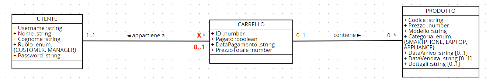

# Documento dei requisiti - EZElectronics attuale

Data:

Versione: V1 - descrizione di EZElectronics nella forma ATTUALE (come ricevuta dagli insegnanti)

| Numero di versione | Modifica |
| :----------------: | :------: |
|                    |          |

# Contenuti

- [Documento dei requisiti - EZElectronics attuale](#documento-dei-requisiti---ezelectronics-attuale)
- [Contenuti](#contenuti)
- [Descrizione informale](#descrizione-informale)
- [Stakeholders](#portatori-di-interesse)
- [Context Diagram e interfacce](#diagramma-di-contesto-e-interfacce)
  - [Context Diagram](#diagramma-di-contesto)
  - [Interfacce](#interfacce)
- [Storie e personas](#storie-e-personas)
- [Requisiti funzionali e non funzionali](#requisiti-funzionali-e-non-funzionali)
  - [Requisiti funzionali](#requisiti-funzionali)
  - [Requisiti non funzionali](#requisiti-non-funzionali)
- [Use Case Diagram e casi d'uso](#diagramma-dei-casi-duso-e-casi-duso)
  - [Use Case Diagram](#diagramma-dei-casi-duso)
    - [Caso d'uso 1, UC1](#caso-duso-1-uc1)
      - [Scenario 1.1](#scenario-11)
      - [Scenario 1.2](#scenario-12)
    - [Caso d'uso 2, UC2](#caso-duso-2-uc2)
      - [Scenario 2.1](#scenario-21)
      - [Scenario 2.2](#scenario-22)
    - [Caso d'uso 3, UC3](#caso-duso-3-uc3)
      - [Scenario 3.1](#scenario-31)
    - [Caso d'uso 4, UC4](#caso-duso-4-uc4)
      - [Scenario 4.1](#scenario-41)
      - [Scenario 4.2](#scenario-42)
    - [Caso d'uso 5, UC5](#caso-duso-5-uc5)
      - [Scenario 5.1](#scenario-51)
      - [Scenario 5.2](#scenario-52)
    - [Caso d'uso 6, UC6](#caso-duso-6-uc6)
      - [Scenario 6.1](#scenario-61)
    - [Caso d'uso 7, UC7](#caso-duso-7-uc7)
      - [Scenario 7.1](#scenario-71)
    - [Caso d'uso 8, UC8](#caso-duso-8-uc8)
      - [Scenario 8.1](#scenario-81)
    - [Caso d'uso 9, UC9](#caso-duso-9-uc9)
      - [Scenario 9.1](#scenario-91)
    - [Caso d'uso 10, UC10](#caso-duso-10-uc10)
      - [Scenario 10.1](#scenario-101)
      - [Scenario 10.2](#scenario-102)
    - [Caso d'uso 11, UC11](#caso-duso-11-uc11)
      - [Scenario 11.1](#scenario-111)
    - [Caso d'uso 12, UC12](#caso-duso-12-uc12)
      - [Scenario 12.1](#scenario-121)
    - [Caso d'uso 13, UC13](#caso-duso-13-uc13)
      - [Scenario 13.1](#scenario-131)
    - [Caso d'uso 14, UC14](#caso-duso-14-uc14)
      - [Scenario 14.1](#scenario-141)
      - [Scenario 14.2](#scenario-142)
    - [Caso d'uso 15, UC15](#caso-duso-15-uc15)
      - [Scenario 15.1](#scenario-151)
- [Glossario](#glossario)
- [System Design](#progettazione-del-sistema)
- [Deployment Diagram](#diagramma-di-distribuzione)

# Descrizione informale

EZElectronics (pronunciato EaSy Electronics) è un'applicazione software progettata per aiutare i gestori dei negozi di elettronica a gestire i loro prodotti e offrirli ai clienti attraverso un sito web dedicato. I gestori possono valutare i prodotti disponibili, registrarne di nuovi e confermare gli acquisti. I clienti possono visualizzare i prodotti disponibili, aggiungerli al carrello e visualizzare la cronologia dei loro acquisti passati.

# Stakeholders

| Nome dello stakeholder |                                                         Descrizione                                                         |
| :--------------------: | :-------------------------------------------------------------------------------------------------------------------------: |
| Utente non autenticato |           Utente non registrato presso la piattaforma, la sua attività principale riguarda registrazione e login            |
|        Cliente         |  Utente autenticato le cui attività principali sono l'acquisto e la visualizzazione di prodotti attraverso l'applicazione   |
|        Manager         | Utente autenticato la cui attività principale è la gestione dei prodotti, sia in entrata che in uscita dal negozio virtuale |
|       Produttore       |     Individuo, organizzazione o azienda che produce gli oggetti che verranno messi in vendita attraverso la piattaforma     |
|      Distributore      |          Individuo, organizzazione o azienda che distribuisce i prodotti, dal produttore al venditore (_Manager_)           |

# Context Diagram e interfacce

## Context Diagram

**Attori**:

- Utente non autenticato: può solamente effettuare login oppure registrarsi presso la piattaforma, se ancora non possiede un account;
- Cliente: ha la possibilità di visualizzare ed acquistare i prodotti, tenendo traccia delle proprie transazioni, attraverso la creazione dei carrelli virtuali;
- Manager: ha la possibilità di effettuare operazioni sui prodotti del negozio, tenendo traccia degli arrivi e delle quantità presenti e vendute.

## Interfacce

|         Attore         | Interfaccia logica | Interfaccia fisica |
| :--------------------: | :----------------: | :----------------: |
| Utente non autenticato |        GUI         |   PC/Smartphone    |
|        Cliente         |        GUI         |   PC/Smartphone    |
|        Manager         |        GUI         |   PC/Smartphone    |

Le GUI sono descritte graficamente nel documento [GUIPrototypeV1.md](/GUIPrototypeV1.md)

# Storie e personas

**Manager**

Persona: Franco, 45 anni, manager di un negozio online

- Franco vuole essere in grado di visionare la merce disponibile nel suo negozio
- Franco vuole monitorare l'arrivo degli ordini effettuati
- Franco vuole poter sapere quante della sua merce è stata venduta
- Franco vuole poter eliminare i prodotti dal proprio catalogo
- Franco vuole essere in grado di inserire più prodotti dello stesso modello nel proprio catalogo in poco tempo
- Franco vuole potersi disconnettere dal proprio account nel caso in cui lo desiderasse

**Cliente**

Persona: Giulia, 24 anni, cliente del negozio

- Giulia non vuole perdere troppo tempo nella fase di log in al negozio
- Giulia vuole acquistare ciò che più le piace in modo semplice e veloce
- Giulia vuole poter vedere che prodotti sta acquistando in modo intuitivo
- Giulia vuole gestire facilmente gli articoli nel suo carrello
- Giulia vuole tenere traccia dei suoi acquisti passati in modo da poterli visionare quando vuole

Persona: Valerio, 36 anni, cliente del negozio

- Valerio vuole poter filtrare facilmente i prodotti in base alla categoria e/o al modello
- Valerio vuole avere una visione chiara dei suoi acquisti precedenti
- Valerio vuole gestire facilmente le proprie credenziali
- Valerio vuole essere in grado di disconnettere il suo account quando non lo usa

Persona: Marta, 27 anni, cliente del negozio:

- Marta vuole aggiungere e togliere al proprio carrello tutti i prodotti che desidera
- Marta vuole poter eliminare tutti i prodotti dal proprio carrello con una semplice mossa
- Marta vuole accedere velocemente ai suoi acquisti
- Marta vuole essere in grado di trovare i prodotti tramite il loro codice identificativo

**Utente non registrato**

Persona: Fulvio, 65 anni, utente non registrato e pensionato:

- Fulvio vuole acquistare/visionare dei prodotti in modo semplice
- Fulvio vuole potersi registrare velocemente e con procedure semplici

# Requisiti funzionali e non funzionali

## Requisiti funzionali

|                                        ID                                        |                                                    Descrizione                                                    |
| :------------------------------------------------------------------------------: | :---------------------------------------------------------------------------------------------------------------: |
|                                       FR1                                        |                                              Gestione degli accessi                                               |
|                    &nbsp;&nbsp;&nbsp;&nbsp;&nbsp;&nbsp; FR1.1                    |                                                       Login                                                       |
|                    &nbsp;&nbsp;&nbsp;&nbsp;&nbsp;&nbsp; FR1.2                    |                                                      Logout                                                       |
|                                       FR2                                        |                                               Gestione degli utenti                                               |
|                    &nbsp;&nbsp;&nbsp;&nbsp;&nbsp;&nbsp; FR2.1                    |                                              Creazione nuovo utente                                               |
|                    &nbsp;&nbsp;&nbsp;&nbsp;&nbsp;&nbsp; FR2.2                    |                               Recupero delle informazioni dell' utente autenticato                                |
|                                       FR3                                        |                                               Gestione dei prodotti                                               |
|                    &nbsp;&nbsp;&nbsp;&nbsp;&nbsp;&nbsp; FR3.1                    |                                             Creazione nuovo prodotto                                              |
|                    &nbsp;&nbsp;&nbsp;&nbsp;&nbsp;&nbsp; FR3.2                    |                        Registrazione arrivo di un insieme di prodotti dello stesso modello                        |
|                    &nbsp;&nbsp;&nbsp;&nbsp;&nbsp;&nbsp; FR3.3                    |                                     Contrassegno di un prodotto come venduto                                      |
|                    &nbsp;&nbsp;&nbsp;&nbsp;&nbsp;&nbsp; FR3.4                    |                                                 Recupero prodotti                                                 |
| &nbsp;&nbsp;&nbsp;&nbsp;&nbsp;&nbsp;&nbsp;&nbsp;&nbsp;&nbsp;&nbsp;&nbsp; FR3.4.1 |                                    Recupero di un prodotto, dato il suo codice                                    |
| &nbsp;&nbsp;&nbsp;&nbsp;&nbsp;&nbsp;&nbsp;&nbsp;&nbsp;&nbsp;&nbsp;&nbsp; FR3.4.2 |                      Recupero prodotti, eventualmente solo se (non) venduti, dato il modello                      |
| &nbsp;&nbsp;&nbsp;&nbsp;&nbsp;&nbsp;&nbsp;&nbsp;&nbsp;&nbsp;&nbsp;&nbsp; FR3.4.3 |                     Recupero prodotti, eventualmente solo se (non) venduti, data la categoria                     |
| &nbsp;&nbsp;&nbsp;&nbsp;&nbsp;&nbsp;&nbsp;&nbsp;&nbsp;&nbsp;&nbsp;&nbsp; FR3.4.4 |                         Recupero di tutti i prodotti, eventualmente solo se (non) venduti                         |
|                    &nbsp;&nbsp;&nbsp;&nbsp;&nbsp;&nbsp; FR3.5                    |                                               Eliminazione prodotti                                               |
| &nbsp;&nbsp;&nbsp;&nbsp;&nbsp;&nbsp;&nbsp;&nbsp;&nbsp;&nbsp;&nbsp;&nbsp; FR3.5.1 |                                  Eliminazione di un prodotto, dato il suo codice                                  |
|                                       FR4                                        |                                               Gestione dei carrelli                                               |
|                    &nbsp;&nbsp;&nbsp;&nbsp;&nbsp;&nbsp; FR4.1                    |                                      Recupero carrello del cliente corrente                                       |
|                    &nbsp;&nbsp;&nbsp;&nbsp;&nbsp;&nbsp; FR4.2                    |                             Aggiunta di un prodotto al carrello del cliente corrente                              |
|                    &nbsp;&nbsp;&nbsp;&nbsp;&nbsp;&nbsp; FR4.3                    | Pagamento di un carrello, avente per prezzo la somma dei prezzi dei prodotti inseriti e per data la data corrente |
|                    &nbsp;&nbsp;&nbsp;&nbsp;&nbsp;&nbsp; FR4.4                    |                          Recupero dello storico dei carrelli pagati dal cliente corrente                          |
|                    &nbsp;&nbsp;&nbsp;&nbsp;&nbsp;&nbsp; FR4.5                    |                                               Eliminazione carrelli                                               |
| &nbsp;&nbsp;&nbsp;&nbsp;&nbsp;&nbsp;&nbsp;&nbsp;&nbsp;&nbsp;&nbsp;&nbsp; FR4.5.1 |                  Eliminazione di un prodotto dal carrello corrente, dato il codice del prodotto                   |
| &nbsp;&nbsp;&nbsp;&nbsp;&nbsp;&nbsp;&nbsp;&nbsp;&nbsp;&nbsp;&nbsp;&nbsp; FR4.5.2 |                            Eliminazione del carrello corrente dell'utente autenticato                             |

### Requisiti di test

Tutti i requisiti in questa sezione fanno riferimento a funzionalità utilizzate unicamente per test e che non hanno corrispettivo nei casi d'uso e nelle interfacce

|  ID  |              Descrizione              |
| :--: | :-----------------------------------: |
| TFR1 |     Recupero di tutti gli utenti      |
| TFR2 |    Recupero utenti, dato un ruolo     |
| TFR3 |   Recupero utente, dato lo username   |
| TFR4 | Eliminazione utente, dato lo username |
| TFR5 |   Eliminazione di tutti gli utenti    |
| TFR6 |   Eliminazione di tutti i prodotti    |
| TFR7 |   Eliminazione di tutti i carrelli    |

### Table of rights

| Requisiti | Utente non autenticato | Cliente | Manager |
| :-------: | :--------------------: | :-----: | :-----: |
|   FR1.1   |           x            |         |         |
|   FR1.2   |                        |    x    |    x    |
|   FR2.1   |           x            |         |         |
|   FR2.2   |                        |    x    |    x    |
|   FR3.1   |                        |         |    x    |
|   FR3.2   |                        |         |    x    |
|   FR3.3   |                        |         |    x    |
|   FR3.4   |                        |    x    |    x    |
|   FR3.5   |                        |         |    x    |
|    FR4    |                        |    x    |         |
|   TFR1    |           x            |    x    |    x    |
|   TFR2    |           x            |    x    |    x    |
|   TFR3    |           x            |    x    |    x    |
|   TFR4    |           x            |    x    |    x    |
|   TFR5    |           x            |    x    |    x    |
|   TFR6    |           x            |    x    |    x    |
|   TFR7    |           x            |    x    |    x    |

## Requisiti non funzionali

|  ID  | Tipo (efficienza, affidabilità, ..) |                                                 Descrizione                                                  |   Si riferisce a   |
| :--: | :---------------------------------: | :----------------------------------------------------------------------------------------------------------: | :----------------: |
| NFR1 |              Usabilità              |      Non deve essere necessario training per essere in grado di utilizzare l'applicazione in autonomia       | FR1, FR2, FR3, FR4 |
| NFR2 |            Disponibilità            |                                 L'uptime del server deve essere pari al 99%                                  | FR1, FR2, FR3, FR4 |
| NFR3 |              Security               | L'autenticazione deve essere gestita mediante librerie che utilizzano pratiche conformi allo stato dell'arte |      FR1, FR2      |

# Use Case Diagram e casi d'uso

## Use Case Diagram

\<Definire qui il Use Case Diagram UML che riassume tutti i casi d'uso e le loro relazioni>

\<Descrivere qui ogni caso d'uso nel Use Case Diagram>

### Caso d'uso 1, UC1

| Attori coinvolti  |                        Utente non autenticato                         |
| :---------------: | :-------------------------------------------------------------------: |
|   Precondizione   |                                                                       |
|  Postcondizione   |                                                                       |
| Scenario nominale | L'utente non autenticato inserisce i dati e registra una nuova utenza |
|     Varianti      |                                                                       |
|     Eccezioni     |                        username già esistente                         |

##### Scenario 1.1

|  Scenario 1.1  |                                                                                  |
| :------------: | :------------------------------------------------------------------------------: |
| Precondizione  |                                                                                  |
| Postcondizione |                                                                                  |
|     Passo#     |                                   Descrizione                                    |
|       1        |                     L'utente preme sul pulsante 'Registrati'                     |
|       2        | L'utente inserisce username, nome, cognome, password e ruolo (cliente o manager) |
|       3        |                      L'utente preme sul pulsante 'Conferma'                      |
|       4        |                Viene creata una nuova utenza con i dati inseriti                 |
|       5        |                      Viene mostrata una pagina di successo                       |

##### Scenario 1.2

|  Scenario 1.2  |                                                                                  |
| :------------: | :------------------------------------------------------------------------------: |
| Precondizione  |                                                                                  |
| Postcondizione |                                                                                  |
|     Passo#     |                                   Descrizione                                    |
|       1        |                     L'utente preme sul pulsante 'Registrati'                     |
|       2        | L'utente inserisce username, nome, cognome, password e ruolo (cliente o manager) |
|       3        |                      L'utente preme sul pulsante 'Conferma'                      |
|       4        |     Se esiste già un utente con lo stesso username, viene mostrato un errore     |

### Caso d'uso 2, UC2

| Attori coinvolti  |                                          Utente non autenticato                                           |
| :---------------: | :-------------------------------------------------------------------------------------------------------: |
|   Precondizione   |                                                                                                           |
|  Postcondizione   |                                          L'utente è autenticato                                           |
| Scenario nominale | L'utente inserisce i dati, il sistema ne verifica la correttezza e in caso positivo si effettua l'accesso |
|     Varianti      |                                                                                                           |
|     Eccezioni     |         Se i dati inseriti non sono corretti viene mostrato un errore e non si effettua l'accesso         |

##### Scenario 2.1

|  Scenario 2.1  |                                        |
| :------------: | :------------------------------------: |
| Precondizione  |                                        |
| Postcondizione |         L'utente è autenticato         |
|     Passo#     |              Descrizione               |
|       1        |  L'utente preme sul pulsante 'Login'   |
|       2        | L'utente inserisce username e password |
|       3        | L'utente preme sul pulsante 'Conferma' |
|       4        |       Viene effettuato l'accesso       |
|       5        | Viene mostrata una pagina di successo  |

##### Scenario 2.2

|  Scenario 2.2  |                                                                |
| :------------: | :------------------------------------------------------------: |
| Precondizione  |                                                                |
| Postcondizione |                   L'utente non è autenticato                   |
|     Passo#     |                          Descrizione                           |
|       1        |              L'utente preme sul pulsante 'Login'               |
|       2        |             L'utente inserisce username e password             |
|       3        |             L'utente preme sul pulsante 'Conferma'             |
|       4        | Se i dati di accesso sono incorretti, viene mostrato un errore |

### Caso d'uso 3, UC3

| Attori coinvolti  |                    Utente autenticato                    |
| :---------------: | :------------------------------------------------------: |
|   Precondizione   |                                                          |
|  Postcondizione   |                L'utente non è autenticato                |
| Scenario nominale | L'utente preme sul pulsante 'Logout' e viene disconnesso |
|     Varianti      |                                                          |
|     Eccezioni     |                                                          |

##### Scenario 3.1

|  Scenario 3.1  |                                         |
| :------------: | :-------------------------------------: |
| Precondizione  |                                         |
| Postcondizione |       L'utente non è autenticato        |
|     Passo#     |               Descrizione               |
|       1        |  L'utente preme sul pulsante 'Logout'   |
|       2        |       L'utente viene disconnesso        |
|       3        | Viene mostrato un messaggio di successo |

### Caso d'uso 4, UC4

| Attori coinvolti  |                     Cliente                     |
| :---------------: | :---------------------------------------------: |
|   Precondizione   |                                                 |
|  Postcondizione   |        Il cliente visualizza il carrello        |
| Scenario nominale | Il cliente visualizza il contenuto del carrello |
|     Varianti      |             Non esiste un carrello              |
|     Eccezioni     |                                                 |

##### Scenario 4.1

|  Scenario 4.1  |                                                                    |
| :------------: | :----------------------------------------------------------------: |
| Precondizione  |                                                                    |
| Postcondizione |                 Il cliente visualizza il carrello                  |
|     Passo#     |                            Descrizione                             |
|       1        | Il cliente clicca sul pulsante per la visualizzazione del carrello |
|       2        | Viene visualizzata una pagina che mostra il contenuto del carrello |

##### Scenario 4.2

|  Scenario 4.2  |                                                                                              |
| :------------: | :------------------------------------------------------------------------------------------: |
| Precondizione  |                                                                                              |
| Postcondizione |                           Il cliente visualizza un carrello vuoto                            |
|     Passo#     |                                         Descrizione                                          |
|       1        |              Il cliente clicca sul pulsante per la visualizzazione del carrello              |
|       2        | Se il carrello non esiste, viene visualizzata una pagina che riporta che il carrello è vuoto |

### Caso d'uso 5, UC5

| Attori coinvolti  |                            Cliente                            |
| :---------------: | :-----------------------------------------------------------: |
|   Precondizione   |     Il cliente deve avere almeno un prodotto nel carrello     |
|  Postcondizione   |                     L'ordine è confermato                     |
| Scenario nominale |   Il cliente esegue il pagamento dei prodotti con successo    |
|     Varianti      |                                                               |
|     Eccezioni     | In caso di errato inserimento dei dati, il pagamento fallisce |

##### Scenario 5.1

|  Scenario 5.1  |                                                                              |
| :------------: | :--------------------------------------------------------------------------: |
| Precondizione  |            Il cliente deve avere almeno un prodotto nel carrello             |
| Postcondizione |  L'ordine è confermato e il carrello corrente viene spostato nello storico   |
|     Passo#     |                                 Descrizione                                  |
|       1        |      Il cliente clicca sul pulsante per la visualizzazione del carrello      |
|       2        |            Il cliente clicca sul pulsante 'Procedi all'acquisto'             |
|       3        |    Viene visualizzata la schermata dell'inserimento dati per il pagamento    |
|       4        |              Il cliente inserisce i dati relativi al pagamento               |
|       5        |                  Il cliente clicca sul pulsante 'Acquista'                   |
|       6        | Il sistema mostra una pagina che conferma la corretta riuscita del pagamento |

##### Scenario 5.2

|  Scenario 5.2  |                                                                                                                            |
| :------------: | :------------------------------------------------------------------------------------------------------------------------: |
| Precondizione  |                                   Il cliente deve avere almeno un prodotto nel carrello                                    |
| Postcondizione |                                                 L'ordine non è finalizzato                                                 |
|     Passo#     |                                                        Descrizione                                                         |
|       1        |                             Il cliente clicca sul pulsante per la visualizzazione del carrello                             |
|       2        |                                   Il cliente clicca sul pulsante 'Procedi all'acquisto'                                    |
|       3        |                           Viene visualizzata la schermata dell'inserimento dati per il pagamento                           |
|       4        |                                     Il cliente inserisce i dati relativi al pagamento                                      |
|       5        |                                         Il cliente clicca sul pulsante 'Acquista'                                          |
|       6        | Se i dati inseriti risultano errati, viene visualizzata una pagina di errore che riporta la mancata riuscita del pagamento |

### Caso d'uso 6, UC6

| Attori coinvolti  |                   Cliente                    |
| :---------------: | :------------------------------------------: |
|   Precondizione   | Il cliente visualizza l'elenco dei prodotti  |
|  Postcondizione   | Il cliente visualizza il carrello aggiornato |
| Scenario nominale | Il cliente aggiunge un prodotto al carrello  |
|     Varianti      |                                              |
|     Eccezioni     |                                              |

##### Scenario 6.1

|  Scenario 6.1  |                                                                                    |
| :------------: | :--------------------------------------------------------------------------------: |
| Precondizione  |                    Il cliente visualizza l'elenco dei prodotti                     |
| Postcondizione |                    Il cliente visualizza il carrello aggiornato                    |
|     Passo#     |                                    Descrizione                                     |
|       1        |          Il cliente clicca sul prodotto che vuole aggiungere al carrello           |
|       2        |     Viene visualizzata la pagina dei dettagli relativi al prodotto selezionato     |
|       3        |               Il cliente clicca sul pulsante 'Aggiungi al carrello'                |
|       4        | Viene visualizzato il carrello con l'aggiunta del prodotto selezionato dal cliente |

### Caso d'uso 7, UC7

| Attori coinvolti  |                                       Cliente                                        |
| :---------------: | :----------------------------------------------------------------------------------: |
|   Precondizione   |                           Deve esistere un carrello attivo                           |
|  Postcondizione   |                          Il carrello attivo viene eliminato                          |
| Scenario nominale | Il cliente elimina i prodotti presenti all'interno del carrello e il carrello stesso |
|     Varianti      |                                                                                      |
|     Eccezioni     |                                                                                      |

##### Scenario 7.1

|  Scenario 7.1  |                                                                    |
| :------------: | :----------------------------------------------------------------: |
| Precondizione  |                  Deve esistere un carrello attivo                  |
| Postcondizione |                 Il carrello attivo viene eliminato                 |
|     Passo#     |                            Descrizione                             |
|       1        | Il cliente clicca sul pulsante per la visualizzazione del carrello |
|       2        |                Il sistema mostra il carrello attivo                |
|       3        |       Il cliente clicca sul pulsante "**Elimina carrello**"        |

### Caso d'uso 8, UC8

| Attori coinvolti  |                       Cliente                        |
| :---------------: | :--------------------------------------------------: |
|   Precondizione   |        Deve esserci almeno un carrello pagato        |
|  Postcondizione   |   Il sistema mostra lo storico dei carrelli pagati   |
| Scenario nominale | Il cliente visualizza lo storico dei carrelli pagati |
|     Varianti      |                                                      |
|     Eccezioni     |

##### Scenario 8.1

Il cliente può visualizzare lo storico dei carrelli pagati, nel caso in cui esistano.

|  Scenario 8.1  |                                                                                 |
| :------------: | :-----------------------------------------------------------------------------: |
| Precondizione  |                     Deve esserci almeno un carrello pagato                      |
| Postcondizione |                    Il sistema mostra lo storico dei carrelli                    |
|     Passo#     |                                   Descrizione                                   |
|       1        | Il cliente ha cliccato sul pulsante relativo alla visualizzazione dello storico |
|       2        |                Il sistema mostra lo storico dei carrelli pagati                 |

### Caso d'uso 9, UC9

| Attori coinvolti  |                               Cliente                               |
| :---------------: | :-----------------------------------------------------------------: |
|   Precondizione   |                  Deve esistere un carrello attivo                   |
|  Postcondizione   | Il prodotto selezionato non è più presente all'interno del carrello |
| Scenario nominale |      Il cliente rimuove un prodotto a sua scelta dal carrello       |
|     Varianti      |                                                                     |
|     Eccezioni     |                                                                     |

##### Scenario 9.1

|  Scenario 9.1  |                                                                                                    |
| :------------: | :------------------------------------------------------------------------------------------------: |
| Precondizione  |                                  Deve esistere un carrello attivo                                  |
| Postcondizione |                Il prodotto selezionato non è più presente all'interno del carrello                 |
|     Passo#     |                                            Descrizione                                             |
|       1        |                 Il cliente clicca sul pulsante per la visualizzazione del carrello                 |
|       2        |                                Il sistema mostra il carrello attivo                                |
|       3        | Il cliente clicca sul pulsante di rimozione dell'elemento relativo al prodotto che vuole eliminare |
|       4        |                  Il sistema mostra il carrello attivo senza l'elemento eliminato                   |

### Caso d'uso 10, UC10

| Attori coinvolti  |                   Manager                   |
| :---------------: | :-----------------------------------------: |
|   Precondizione   |                                             |
|  Postcondizione   |                                             |
| Scenario nominale |    Il manager aggiunge un nuovo prodotto    |
|     Varianti      |                                             |
|     Eccezioni     | Esiste già un prodotto con lo stesso codice |

#### Scenario 10.1

| Scenario 10.1  |                                                                   |
| :------------: | :---------------------------------------------------------------: |
| Precondizione  |                                                                   |
| Postcondizione |                                                                   |
|     Passo#     |                            Descrizione                            |
|       1        |   Il manager clicca sul pulsante per inserire un nuovo prodotto   |
|       2        |             Il sistema mostra il form di inserimento              |
|       3        | Il manager inserisce codice, prezzo, modello, categoria, dettagli |
|       4        |             Il manager preme sul pulsante di conferma             |
|       5        |            Il sistema mostra un messaggio di successo             |

#### Scenario 10.2

| Scenario 10.2  |                                                                   |
| :------------: | :---------------------------------------------------------------: |
| Precondizione  |            Esiste già un prodotto con lo stesso codice            |
| Postcondizione |                                                                   |
|     Passo#     |                            Descrizione                            |
|       1        |   Il manager clicca sul pulsante per inserire un nuovo prodotto   |
|       2        |             Il sistema mostra il form di inserimento              |
|       3        | Il manager inserisce codice, prezzo, modello, categoria, dettagli |
|       4        |             Il manager preme sul pulsante di conferma             |
|       5        |             Il sistema mostra un messaggio di errore              |

### Caso d'uso 11, UC11

| Attori coinvolti  |            Manager             |
| :---------------: | :----------------------------: |
|   Precondizione   |                                |
|  Postcondizione   |                                |
| Scenario nominale | Il manager rimuove un prodotto |
|     Varianti      |                                |
|     Eccezioni     |                                |

#### Scenario 11.1

| Scenario 11.1  |                                                            |
| :------------: | :--------------------------------------------------------: |
| Precondizione  |                 Esiste almeno un prodotto                  |
| Postcondizione |                                                            |
|     Passo#     |                        Descrizione                         |
|       1        | Il manager clicca sul pulsante di rimozione di un prodotto |
|       2        |           Il sistema mostra un popup di conferma           |
|       3        |         Il manager preme sul pulsante di conferma          |
|       4        |         Il sistema mostra un messaggio di successo         |

### Caso d'uso 12, UC12

| Attori coinvolti  |                     Manager                      |
| :---------------: | :----------------------------------------------: |
|   Precondizione   |      Esiste almeno un prodotto non venduto       |
|  Postcondizione   |                                                  |
| Scenario nominale | Il manager contrassegna un prodotto come venduto |
|     Varianti      |                                                  |
|     Eccezioni     |                                                  |

#### Scenario 12.1

| Scenario 12.1  |                                                          |
| :------------: | :------------------------------------------------------: |
| Precondizione  |          Esiste almeno un prodotto non venduto           |
| Postcondizione |                                                          |
|     Passo#     |                       Descrizione                        |
|       1        | Il manager clicca sul pulsante di vendita di un prodotto |
|       2        |        Il sistema mostra un messaggio di conferma        |

### Caso d'uso 13, UC13

| Attori coinvolti  |                    Manager                     |
| :---------------: | :--------------------------------------------: |
|   Precondizione   |           Esiste almeno un prodotto            |
|  Postcondizione   |                                                |
| Scenario nominale | Il manager aggiorna la quantità di un prodotto |
|     Varianti      |                                                |
|     Eccezioni     |                                                |

#### Scenario 13.1

| Scenario 13.1  |                                                           |
| :------------: | :-------------------------------------------------------: |
| Precondizione  |           Esiste almeno un prodotto non venduto           |
| Postcondizione |                                                           |
|     Passo#     |                        Descrizione                        |
|       1        | Il manager clicca sul pulsante di modifica di un prodotto |
|       2        |          Il manager inserisce la nuova quantità           |
|       3        |        Il sistema mostra un messaggio di conferma         |

### Caso d'uso 14, UC14

| Attori coinvolti  |                       Utente autenticato                       |
| :---------------: | :------------------------------------------------------------: |
|   Precondizione   |                L'utente deve essere autenticato                |
|  Postcondizione   |                                                                |
| Scenario nominale |          L'utente effettua una ricerca di un prodotto          |
|     Varianti      | È possibile filtrare per categoria, modello o prodotto venduto |
|     Eccezioni     |                                                                |

#### Scenario 14.1

| Scenario 14.1  |                                             |
| :------------: | :-----------------------------------------: |
| Precondizione  |      L'utente deve essere autenticato       |
| Postcondizione |                                             |
|     Passo#     |                 Descrizione                 |
|       1        |   L'utente scrive nella barra di ricerca    |
|       2        |   L'utente preme sul pulsante di ricerca    |
|       3        | Il sistema mostra i risultati della ricerca |

#### Scenario 14.2

| Scenario 14.2  |                                             |
| :------------: | :-----------------------------------------: |
| Precondizione  |      L'utente deve essere autenticato       |
| Postcondizione |                                             |
|     Passo#     |                 Descrizione                 |
|       1        |   L'utente scrive nella barra di ricerca    |
|       2        |     L'utente seleziona uno o più filtri     |
|       3        |   L'utente preme sul pulsante di ricerca    |
|       4        | Il sistema mostra i risultati della ricerca |

### Caso d'uso 15, UC15

#### Scenario 15.1

| Scenario 15.1  |                   Utente autenticato                   |
| :------------: | :----------------------------------------------------: |
| Precondizione  |            L'utente deve essere autenticato            |
| Postcondizione |                                                        |
|     Passo#     |                      Descrizione                       |
|       1        |         L'utente preme sul pulsante 'profilo'          |
|       2        | Il sistema mostra una schermata con i dati dell'utente |

# Glossario

# System Design

# Deployment Diagram

