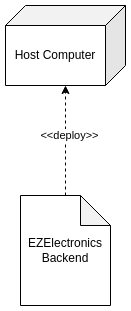

# Documento dei requisiti - EZElectronics attuale

Data:

Versione: V1 - descrizione di EZElectronics nella forma ATTUALE (come ricevuta dagli insegnanti)

| Numero di versione | Modifica |
| :----------------: | :------: |
|                    |          |

# Contenuti

- [Documento dei requisiti - EZElectronics attuale](#documento-dei-requisiti---ezelectronics-attuale)
- [Contenuti](#contenuti)
- [Descrizione informale](#descrizione-informale)
- [Stakeholders](#stakeholders)
- [Context Diagram e interfacce](#context-diagram-e-interfacce)
  - [Context Diagram](#context-diagram)
  - [Interfacce](#interfacce)
- [Storie e personas](#storie-e-personas)
- [Requisiti funzionali e non funzionali](#requisiti-funzionali-e-non-funzionali)
  - [Requisiti funzionali](#requisiti-funzionali)
  - [Requisiti di test](#requisiti-di-test)
  - [Table of rights](#table-of-rights)
  - [Requisiti non funzionali](#requisiti-non-funzionali)
- [Use Case Diagram e casi d'uso](#use-case-diagram-e-casi-duso)
  - [Use Case Diagram](#use-case-diagram)
    - [Caso d'uso 1, UC1](#sign-up-uc1)
      - [Scenario 1.1](#scenario-11)
      - [Scenario 1.2](#scenario-12)
    - [Caso d'uso 2, UC2](#log-in-uc2)
      - [Scenario 2.1](#scenario-21)
      - [Scenario 2.2](#scenario-22)
    - [Caso d'uso 3, UC3](#log-out-uc3)
      - [Scenario 3.1](#scenario-31)
    - [Caso d'uso 4, UC4](#visualizza-carrello-uc4)
      - [Scenario 4.1](#scenario-41)
      - [Scenario 4.2](#scenario-42)
    - [Caso d'uso 5, UC5](#paga-carrello-uc5)
      - [Scenario 5.1](#scenario-51)
    - [Caso d'uso 6, UC6](#aggiungi-un-prodotto-al-carrello-uc6)
      - [Scenario 6.1](#scenario-61)
    - [Caso d'uso 7, UC7](#elimina-il-carrello-corrente-uc7)
      - [Scenario 7.1](#scenario-71)
    - [Caso d'uso 8, UC8](#visualizza-storico-dei-carrelli-pagati-uc8)
      - [Scenario 8.1](#scenario-81)
      - [Scenario 8.2](#scenario-82)
    - [Caso d'uso 9, UC9](#rimuovi-un-prodotto-dal-carrello-uc9)
      - [Scenario 9.1](#scenario-91)
    - [Caso d'uso 10, UC10](#inserimento-nuovo-prodotto-uc10)
      - [Scenario 10.1](#scenario-101)
      - [Scenario 10.2](#scenario-102)
    - [Caso d'uso 11, UC11](#rimozione-prodotto-uc11)
      - [Scenario 11.1](#scenario-111)
    - [Caso d'uso 12, UC12](#contrassegna-un-prodotto-come-venduto-uc12)
      - [Scenario 12.1](#scenario-121)
      - [Scenario 12.2](#scenario-122)
    - [Caso d'uso 13, UC13](#aggiornamento-quantità-uc13)
      - [Scenario 13.1](#scenario-131)
    - [Caso d'uso 14, UC14](#ricerca-prodotti-uc14)
      - [Scenario 14.1](#scenario-141)
      - [Scenario 14.2](#scenario-142)
    - [Caso d'uso 15, UC15](#visualizza-il-profilo-uc15)
      - [Scenario 15.1](#scenario-151)
- [Glossario](#glossario)
- [System Design](#system-design)
- [Deployment Diagram](#deployment-diagram)

# Descrizione informale

EZElectronics (pronunciato EaSy Electronics) è un'applicazione software progettata per aiutare i gestori dei negozi di elettronica a gestire i loro prodotti e offrirli ai clienti attraverso un sito web dedicato. I gestori possono valutare i prodotti disponibili, registrarne di nuovi e confermare gli acquisti. I clienti possono visualizzare i prodotti disponibili, aggiungerli al carrello e visualizzare la cronologia dei loro acquisti passati.

# Stakeholders

| Nome dello stakeholder |                                                         Descrizione                                                         |
| :--------------------: | :-------------------------------------------------------------------------------------------------------------------------: |
| Utente non autenticato |                     Utente che non si è autenticato presso la piattaforma, indipendentemente dal fatto che possieda o meno un account |
|        Cliente         |              Utente autenticato, cliente del negozio  |
|        Manager         | Utente autenticato, gestore del negozio |
|       Produttore       |     Azienda che produce gli oggetti che verranno messi in vendita attraverso la piattaforma     |
|      Distributore      |          Azienda che distribuisce i prodotti, dal produttore al manager      |
| Servizio di spedizione | Azienda che si occupa del trasporto dei prodotti dal negozio fisico al cliente |

# Context Diagram e interfacce

## Context Diagram

## Interfacce

|         Attore         | Interfaccia logica | Interfaccia fisica |
| :--------------------: | :----------------: | :----------------: |
| Utente non autenticato |        GUI         |   PC/Smartphone    |
|        Cliente         |        GUI         |   PC/Smartphone    |
|        Manager         |        GUI         |   PC/Smartphone    |

Le GUI sono descritte graficamente nel documento [GUIPrototypeV1.md](/GUIPrototypeV1.md)

# Storie e personas

**Manager**

Persona: Franco, 45 anni, manager di un negozio online

- Franco vuole essere in grado di visionare la merce disponibile nel suo negozio
- Franco vuole monitorare l'arrivo degli ordini effettuati
- Franco vuole poter sapere quante della sua merce è stata venduta
- Franco vuole poter eliminare i prodotti dal proprio catalogo
- Franco vuole essere in grado di inserire più prodotti dello stesso modello nel proprio catalogo in poco tempo
- Franco vuole potersi disconnettere dal proprio account nel caso in cui lo desiderasse

**Cliente**

Persona: Giulia, 24 anni, cliente del negozio

- Giulia non vuole perdere troppo tempo nella fase di log in al negozio
- Giulia vuole acquistare ciò che più le piace in modo semplice e veloce
- Giulia vuole poter vedere che prodotti sta acquistando in modo intuitivo
- Giulia vuole gestire facilmente gli articoli nel suo carrello
- Giulia vuole tenere traccia dei suoi acquisti passati in modo da poterli visionare quando vuole

Persona: Valerio, 36 anni, cliente del negozio

- Valerio vuole poter filtrare facilmente i prodotti in base alla categoria e/o al modello
- Valerio vuole avere una visione chiara dei suoi acquisti precedenti
- Valerio vuole gestire facilmente le proprie credenziali
- Valerio vuole essere in grado di disconnettere il suo account quando non lo usa

Persona: Marta, 27 anni, cliente del negozio:

- Marta vuole aggiungere e togliere al proprio carrello tutti i prodotti che desidera
- Marta vuole poter eliminare tutti i prodotti dal proprio carrello con una semplice mossa
- Marta vuole accedere velocemente ai suoi acquisti
- Marta vuole essere in grado di trovare i prodotti tramite il loro codice identificativo

**Utente non autenticato**

Persona: Fulvio, 65 anni, utente non autenticato e pensionato:

- Fulvio vuole acquistare/visionare dei prodotti in modo semplice
- Fulvio vuole potersi registrare velocemente e con procedure semplici

# Requisiti funzionali e non funzionali

## Requisiti funzionali

|                                        ID                                        |                                                    Descrizione                                                    |
| :------------------------------------------------------------------------------: | :---------------------------------------------------------------------------------------------------------------: |
|                                       FR1                                        |                                              Gestione degli accessi                                               |
|                    &nbsp;&nbsp;&nbsp;&nbsp;&nbsp;&nbsp; FR1.1                    |                                                       Login                                                       |
|                    &nbsp;&nbsp;&nbsp;&nbsp;&nbsp;&nbsp; FR1.2                    |                                                      Logout                                                       |
|                                       FR2                                        |                                               Gestione degli utenti                                               |
|                    &nbsp;&nbsp;&nbsp;&nbsp;&nbsp;&nbsp; FR2.1                    |                                              Creazione nuovo utente                                               |
|                    &nbsp;&nbsp;&nbsp;&nbsp;&nbsp;&nbsp; FR2.2                    |                               Recupero delle informazioni dell' utente autenticato                                |
|                                       FR3                                        |                                               Gestione dei prodotti                                               |
|                    &nbsp;&nbsp;&nbsp;&nbsp;&nbsp;&nbsp; FR3.1                    |                                             Creazione nuovo prodotto                                              |
|                    &nbsp;&nbsp;&nbsp;&nbsp;&nbsp;&nbsp; FR3.2                    |                        Registrazione arrivo di un insieme di prodotti dello stesso modello                        |
|                    &nbsp;&nbsp;&nbsp;&nbsp;&nbsp;&nbsp; FR3.3                    |                                     Contrassegno di un prodotto come venduto                                      |
|                    &nbsp;&nbsp;&nbsp;&nbsp;&nbsp;&nbsp; FR3.4                    |                                                 Recupero prodotti                                                 |
| &nbsp;&nbsp;&nbsp;&nbsp;&nbsp;&nbsp;&nbsp;&nbsp;&nbsp;&nbsp;&nbsp;&nbsp; FR3.4.1 |                                    Recupero di un prodotto, dato il suo codice                                    |
| &nbsp;&nbsp;&nbsp;&nbsp;&nbsp;&nbsp;&nbsp;&nbsp;&nbsp;&nbsp;&nbsp;&nbsp; FR3.4.2 |                      Recupero prodotti, eventualmente solo se (non) venduti, dato il modello                      |
| &nbsp;&nbsp;&nbsp;&nbsp;&nbsp;&nbsp;&nbsp;&nbsp;&nbsp;&nbsp;&nbsp;&nbsp; FR3.4.3 |                     Recupero prodotti, eventualmente solo se (non) venduti, data la categoria                     |
| &nbsp;&nbsp;&nbsp;&nbsp;&nbsp;&nbsp;&nbsp;&nbsp;&nbsp;&nbsp;&nbsp;&nbsp; FR3.4.4 |                         Recupero di tutti i prodotti, eventualmente solo se (non) venduti                         |
|                    &nbsp;&nbsp;&nbsp;&nbsp;&nbsp;&nbsp; FR3.5                    |                                  Eliminazione di un prodotto, dato il suo codice                                  |
|                                       FR4                                        |                                               Gestione dei carrelli                                               |
|                    &nbsp;&nbsp;&nbsp;&nbsp;&nbsp;&nbsp; FR4.1                    |                                      Recupero carrello del cliente corrente                                       |
|                    &nbsp;&nbsp;&nbsp;&nbsp;&nbsp;&nbsp; FR4.2                    |                             Aggiunta di un prodotto al carrello del cliente corrente                              |
|                    &nbsp;&nbsp;&nbsp;&nbsp;&nbsp;&nbsp; FR4.3                    | Pagamento di un carrello, avente per prezzo la somma dei prezzi dei prodotti inseriti e per data la data corrente |
|                    &nbsp;&nbsp;&nbsp;&nbsp;&nbsp;&nbsp; FR4.4                    |                          Recupero dello storico dei carrelli pagati dal cliente corrente                          |
|                    &nbsp;&nbsp;&nbsp;&nbsp;&nbsp;&nbsp; FR4.5                    |                                               Eliminazione carrelli                                               |
| &nbsp;&nbsp;&nbsp;&nbsp;&nbsp;&nbsp;&nbsp;&nbsp;&nbsp;&nbsp;&nbsp;&nbsp; FR4.5.1 |                    Rimozione di un prodotto dal carrello corrente, dato il codice del prodotto                    |
| &nbsp;&nbsp;&nbsp;&nbsp;&nbsp;&nbsp;&nbsp;&nbsp;&nbsp;&nbsp;&nbsp;&nbsp; FR4.5.2 |                            Eliminazione del carrello corrente dell'utente autenticato                             |

### Requisiti di test

Tutti i requisiti in questa sezione fanno riferimento a funzionalità utilizzate unicamente per test e che non hanno corrispettivo nei casi d'uso e nelle interfacce

|  ID  |              Descrizione              |
| :--: | :-----------------------------------: |
| TFR1 |     Recupero di tutti gli utenti      |
| TFR2 |    Recupero utenti, dato un ruolo     |
| TFR3 |   Recupero utente, dato lo username   |
| TFR4 | Eliminazione utente, dato lo username |
| TFR5 |   Eliminazione di tutti gli utenti    |
| TFR6 |   Eliminazione di tutti i prodotti    |
| TFR7 |   Eliminazione di tutti i carrelli    |

### Table of rights

| Requisito | Utente non autenticato | Cliente | Manager |
| :-------: | :--------------------: | :-----: | :-----: |
|   FR1.1   |           x            |         |         |
|   FR1.2   |                        |    x    |    x    |
|   FR2.1   |           x            |         |         |
|   FR2.2   |                        |    x    |    x    |
|   FR3.1   |                        |         |    x    |
|   FR3.2   |                        |         |    x    |
|   FR3.3   |                        |         |    x    |
|   FR3.4   |                        |    x    |    x    |
|   FR3.5   |                        |         |    x    |
|    FR4    |                        |    x    |         |
|   TFR1    |           x            |    x    |    x    |
|   TFR2    |           x            |    x    |    x    |
|   TFR3    |           x            |    x    |    x    |
|   TFR4    |           x            |    x    |    x    |
|   TFR5    |           x            |    x    |    x    |
|   TFR6    |           x            |    x    |    x    |
|   TFR7    |           x            |    x    |    x    |

## Requisiti non funzionali

|  ID  | Tipo (efficienza, affidabilità, ..) |                                                 Descrizione                                                  |   Si riferisce a   |
| :--: | :---------------------------------: | :----------------------------------------------------------------------------------------------------------: | :----------------: |
| NFR1 |              Usabilità              |      Non deve essere necessario training per essere in grado di utilizzare l'applicazione in autonomia       | FR1, FR2, FR3, FR4 |
| NFR2 |            Disponibilità            |                                 L'uptime del server deve essere pari al 99%                                  | FR1, FR2, FR3, FR4 |
| NFR3 |              Security               | L'autenticazione deve essere gestita mediante librerie che utilizzano pratiche conformi allo stato dell'arte |      FR1, FR2      |

# Use Case Diagram e casi d'uso

## Use Case Diagram

Tutti i casi d'uso il cui attore principale è Cliente, Manager o Utente Autenticato hanno come precondizione che l'utente abbia fatto il login e sia correttamente autenticato, anche dove ciò non è esplicitamente indicato.

### Sign up, UC1

| Attori coinvolti  | Utente non autenticato |
| :---------------: | :-------------------------------------------------------------------: |
|  Precondizione    |  |
|  Postcondizione   | Esiste una nuova utenza nel sistema |
| Scenario nominale | L'utente non autenticato inserisce i dati e registra una nuova utenza |
|     Varianti      |  |
|     Eccezioni     | L'username inserito risulta già esistente, non vengono compilati tutti i campi del form |

#### Scenario 1.1

|  Scenario 1.1  |  |
| :------------: | :------------------------------------------------------------------------------: |
| Precondizione  |  |
| Postcondizione | Esiste la nuova utenza nel sistema  |
|     Passo#     | Descrizione  |
|       1        | L'utente clicca sul pulsante 'Registrati' |
|       2        | L'utente inserisce username, nome, cognome e password,  e seleziona un ruolo (cliente o manager) |
|       3        | L'utente clicca sul pulsante 'Conferma' |
|       4        | Il sistema verifica che tutti i campi siano stati compilati e l'unicità dell'username |
|       5        | Il sistema ottiene un riscontro positivo a tutte le precedenti verifiche |
|       6        | Viene creata una nuova utenza con i dati inseriti |
|       7        | Si viene riportati alla pagina di login, che mostra un messaggio di corretta riuscita della registrazione |

#### Scenario 1.2

|  Scenario 1.2  |  |
| :------------: | :------------------------------------------------------------------------------: |
| Precondizione  |  |
| Postcondizione | Non viene creata una nuova utenza nel sistema |
|     Passo#     | Descrizione |
|       1        |  L'utente clicca sul pulsante 'Registrati' |
|       2        | L'utente inserisce username, nome, cognome e password, e selezione un ruolo (cliente o manager) |
|       3        | L'utente clicca sul pulsante 'Conferma' |
|       4        | Il sistema verifica che tutti i campi siano stati compilati e l'unicità dell'username |
|       5        | Il sistema  ottiene un riscontro negativo ad almeno una delle precedenti verifiche |
|       6        | Il sistema mostra un messaggio di errore |

### Log in, UC2

| Attori coinvolti  | Utente non autenticato |
| :---------------: | :-------------------------------------------------------------------------------------------------------: |
|   Precondizione   |  |
|  Postcondizione   | L'utente è autenticato |
| Scenario nominale | L'utente inserisce i dati, il sistema ne verifica la correttezza e in caso positivo effettua l'accesso |
|     Varianti      |  |
|     Eccezioni     | Se i dati inseriti non sono corretti o non vengono compilati tutti i campi del form, viene mostrato un errore e non si effettua l'accesso |

#### Scenario 2.1

|  Scenario 2.1  |                                             |
| :------------: | :-----------------------------------------: |
| Precondizione  |                                             |
| Postcondizione |           L'utente è autenticato            |
|     Passo#     |                 Descrizione                 |
|       2        |   L'utente inserisce username e password    |
|       3        |   L'utente clicca sul pulsante 'Login'      |
|       4        | Il sistema verifica che tutti i campi siano stati compilati e la correttezza dei dati |
|       5        | Il sistema ottiene un riscontro positivo a tutte le precedenti verifiche |
|       6        |    Viene mostrata l'homepage dell'utente    |

#### Scenario 2.2

|  Scenario 2.2  |  |
| :------------: | :----------------------------------------------------------------------: |
| Precondizione  |  |
| Postcondizione | L'utente non è autenticato |
|     Passo#     | Descrizione |
|       2        | L'utente inserisce username e password |
|       3        | L'utente clicca sul pulsante 'Login' |
|       4        | Il sistema verifica che tutti i campi siano stati compilati e la correttezza dei dati |
|       5        | Il sistema ottiene un riscontro negativo ad almeno una delle precedenti verifiche |
|       6        | Viene mostrato un messaggio errore |

### Log out, UC3

| Attori coinvolti  | Utente autenticato |
| :---------------: | :------------------------------------------------------: |
|   Precondizione   |  |
|  Postcondizione   | L'utente non è autenticato |
| Scenario nominale | L'utente clicca sul pulsante 'Logout' e viene disconnesso |
|     Varianti      |  |
|     Eccezioni     |  |

#### Scenario 3.1

|  Scenario 3.1  |                                        |
| :------------: | :------------------------------------: |
| Precondizione  |                                        |
| Postcondizione |       L'utente non è autenticato       |
|     Passo#     |              Descrizione               |
|       1        |  L'utente clicca sul pulsante 'Logout' |
|       2        |       L'utente viene disconnesso       |
|       3        | Il sistema mostra la pagina di accesso |

### Visualizza carrello, UC4

| Attori coinvolti  |                     Cliente                     |
| :---------------: | :---------------------------------------------: |
|   Precondizione   |                                                 |
|  Postcondizione   |           Viene mostrato il carrello            |
| Scenario nominale | Il cliente visualizza il contenuto del carrello |
|     Varianti      |             Non esiste un carrello              |
|     Eccezioni     |                                                 |

#### Scenario 4.1

|  Scenario 4.1  |  |
| :------------: | :----------------------------------------------------------------: |
| Precondizione  | Esiste un carrello attivo associato al cliente |
| Postcondizione | Viene mostrato il contenuto del carrello |
|     Passo#     | Descrizione |
|       1        | Il cliente clicca sul pulsante 'Vai al carrello' |
|       2        | Viene visualizzata una pagina che mostra il contenuto del carrello |

#### Scenario 4.2

|  Scenario 4.2  |  |
| :------------: | :------------------------------------------------------------------------------------------: |
| Precondizione  | Non esiste un carrello attivo associato al cliente |
| Postcondizione | Il sistema mostra un carrello vuoto |
|     Passo#     | Descrizione |
|       1        | Il cliente clicca sul pulsante 'Vai al carrello' |
|       2        | Viene visualizzata una pagina che riporta che il carrello è vuoto |

### Paga carrello, UC5

| Attori coinvolti  | Cliente |
| :---------------: | :-----------------------------------------------------------: |
|   Precondizione   | Il cliente deve avere almeno un prodotto nel carrello |
|  Postcondizione   | L'ordine è confermato |
| Scenario nominale | Il cliente acquista i prodotti nel carrello |
|     Varianti      |  |
|     Eccezioni     |  |

#### Scenario 5.1

|  Scenario 5.1  |  |
| :------------: | :--------------------------------------------------------------------------: |
| Precondizione  | Il cliente deve avere almeno un prodotto nel carrello |
| Postcondizione | L'ordine è confermato e il carrello corrente viene spostato nello storico |
|     Passo#     | Descrizione  |
|       1        | Il cliente clicca sul pulsante 'Vai al carrello' |
|       2        | Il cliente visualizza il contenuto del carrello |
|       3        |    Il cliente clicca sul pulsante 'Acquista'    |
|       4        | Il sistema mostra la homepage del cliente con un messaggio che conferma la corretta riuscita dell'acquisto |

### Aggiungi un prodotto al carrello, UC6

| Attori coinvolti  |                   Cliente                    |
| :---------------: | :------------------------------------------: |
|   Precondizione   | Il cliente visualizza l'elenco dei prodotti  |
|  Postcondizione   | Il cliente visualizza il carrello aggiornato |
| Scenario nominale | Il cliente aggiunge un prodotto al carrello  |
|     Varianti      |                                              |
|     Eccezioni     |                                              |

#### Scenario 6.1

|  Scenario 6.1  |  |
| :------------: | :--------------------------------------------------------------------------------: |
| Precondizione  | Il cliente visualizza l'elenco dei prodotti |
| Postcondizione | Il cliente visualizza il carrello aggiornato |
|     Passo#     | Descrizione |
|       1        | Il cliente clicca sul pulsante 'Aggiungi al carrello' relativo al prodotto che intende acquistare |
|       2        | Viene visualizzato il carrello con l'aggiunta del prodotto selezionato dal cliente |

### Elimina il carrello corrente, UC7

| Attori coinvolti  | Cliente |
| :---------------: | :----------------------------------------------------------------------------------: |
|   Precondizione   | Esiste un carrello attivo associato al cliente |
|  Postcondizione   | Non esiste un carrello attivo associato al cliente |
| Scenario nominale | Il cliente elimina i prodotti presenti all'interno del carrello e quindi il carrello stesso |
|     Varianti      |  |
|     Eccezioni     |  |

#### Scenario 7.1

|  Scenario 7.1  |  |
| :------------: | :----------------------------------------------------------------: |
| Precondizione  | Esiste un carrello attivo associato al cliente |
| Postcondizione | Non esiste un carrello attivo associato al cliente |
|     Passo#     | Descrizione |
|       1        | Il cliente clicca sul pulsante 'Vai al carrello' |
|       2        | Il sistema mostra il carrello attivo |
|       3        | Il cliente clicca sul pulsante 'Elimina carrello' |
|       4        | Il sistema mostra una pagina che riporta che il carrello è vuoto |

### Visualizza storico dei carrelli pagati, UC8

| Attori coinvolti  |                       Cliente                        |
| :---------------: | :--------------------------------------------------: |
|   Precondizione   |  |
|  Postcondizione   |   Il sistema mostra lo storico dei carrelli pagati   |
| Scenario nominale | Il cliente visualizza lo storico dei carrelli pagati |
|     Varianti      |       Non esiste un carrello pagato                                             |
|     Eccezioni     |

#### Scenario 8.1 

|  Scenario 8.1  |  |
| :------------: | :-----------------------------------------------------------------------------: |
| Precondizione  | Esiste almeno un carrello pagato                     |
| Postcondizione | Viene mostrato lo storico dei carrelli pagati |
|     Passo#     | Descrizione  |
|       1        | Il cliente clicca sul pulsante 'Storico carrelli' |
|       2        | Il sistema mostra lo storico dei carrelli pagati |

#### Scenario 8.2

|  Scenario 8.2  | |
| :------------: | :-----------------------------------------------------------------------------: |
| Precondizione  | Non esistono carrelli pagati |
| Postcondizione | Il sistema mostra uno storico vuoto |
|     Passo#     | Descrizione |
|       1        | Il cliente clicca sul pulsante 'Storico carrelli' |
|       2        | Il sistema mostra una pagina che riporta che non ci sono carrelli pagati |

### Rimuovi un prodotto dal carrello, UC9

| Attori coinvolti  | Cliente |
| :---------------: | :-----------------------------------------------------------------: |
|   Precondizione   | Esiste un carrello attivo |
|  Postcondizione   | Il prodotto selezionato non è più presente all'interno del carrello |
| Scenario nominale | Il cliente rimuove un prodotto dal carrello |
|     Varianti      |  |
|     Eccezioni     |  |

#### Scenario 9.1

|  Scenario 9.1  |  |
| :------------: | :------------------------------------------------------------------------------------------------: |
| Precondizione  |  Esiste un carrello attivo  |
| Postcondizione | Il prodotto selezionato non è più presente all'interno del carrello  |
|     Passo#     | Descrizione |
|       1        | Il cliente clicca sul pulsante 'Vai al carrello' |
|       2        | Il sistema mostra il carrello attivo |
|       3        | Il cliente clicca sul pulsante 'Rimuovi' relativo al prodotto che vuole eliminare dal carrello |
|       4        | Il sistema mostra il carrello privo del prodotto rimosso  |

### Inserimento nuovo prodotto, UC10

| Attori coinvolti  |                   Manager                   |
| :---------------: | :-----------------------------------------: |
|   Precondizione   |                                             |
|  Postcondizione   |      Un nuovo prodotto è stato aggiunto     |
| Scenario nominale |    Il manager aggiunge un nuovo prodotto    |
|     Varianti      |                                             |
|     Eccezioni     | Esiste già un prodotto con lo stesso codice, non vengono compilati tutti i campi del form |

#### Scenario 10.1

| Scenario 10.1  |  |
| :------------: | :---------------------------------------------------------------: |
| Precondizione  |  |
| Postcondizione | Un nuovo prodotto è stato aggiunto |
|     Passo#     | Descrizione |
|       1        | Il manager compila il form 'Nuovo prodotto' inserendo il prezzo, data di arrivo, modello, categoria e dettagli relativi al nuovo prodotto |
|       2        | Il manager clicca sul pulsante 'Inserisci' |
|       3        | Il sistema verifica che tutti i campi siano stati compilati e che il codice sia univoco e di almeno 6 caratteri |
|       4        | Il sistema  ottiene un riscontro positivo a tutte le precedenti verifiche |
|       5        | Il sistema mostra un messaggio di corretta riuscita dell'operazione |

#### Scenario 10.2

| Scenario 10.2  |  |
| :------------: | :---------------------------------------------------------------: |
| Precondizione  | Esiste già un prodotto con lo stesso codice del nuovo prodotto |
| Postcondizione | Il nuovo prodotto non viene aggiunto |
|     Passo#     |   Descrizione |
|       1        |   Il manager compila il form 'Nuovo prodotto' inserendo il prezzo, data di arrivo, modello, categoria e dettagli relativi al nuovo prodotto   |
|       2        | Il manager clicca sul pulsante 'Inserisci' |
|       3        | Il sistema verifica che tutti i campi siano stati compilati e che il codice sia univoco e di almeno 6 caratteri|
|       4        | Il sistema ottiene un riscontro negativo ad almeno una delle precedenti verifiche |
|       5        | Il sistema mostra un messaggio di mancata riuscita dell'operazione |

### Rimozione prodotto, UC11

| Attori coinvolti  |            Manager             |
| :---------------: | :----------------------------: |
|   Precondizione   | Esiste almeno un prodotto |
|  Postcondizione   | Il prodotto eliminato non è più disponibile per la visualizzazione |
| Scenario nominale | Il manager rimuove un prodotto |
|     Varianti      |                                |
|     Eccezioni     |                                |

#### Scenario 11.1

| Scenario 11.1  |  |
| :------------: | :--------------------------------------------------------: |
| Precondizione  | Esiste almeno un prodotto |
| Postcondizione |  Il prodotto eliminato non è più disponibile per la visualizzazione  |
|     Passo#     | Descrizione |
|       1        | Il manager visualizza l'elenco dei prodotti |
|       2        | Il manager clicca sul pulsante 'Elimina' relativo al prodotto che vuole rimuovere |
|       3        | Il sistema mostra l'elenco dei prodotti senza il prodotto eliminato |

### Contrassegna un prodotto come venduto, UC12

| Attori coinvolti  |                     Manager                      |
| :---------------: | :----------------------------------------------: |
|   Precondizione   |      Esiste almeno un prodotto non venduto       |
|  Postcondizione   |      Il prodotto selezionato risulta venduto     |
| Scenario nominale | Il manager contrassegna un prodotto come venduto |
|     Varianti      | Il codice inserito non corrisponde a nessun prodotto disponibile |
|     Eccezioni     |                                                  |

#### Scenario 12.1

| Scenario 12.1  |                                                          |
| :------------: | :------------------------------------------------------: |
| Precondizione  | Esiste almeno un prodotto non venduto |
| Postcondizione | Il prodotto selezionato risulta venduto  |
|     Passo#     |                       Descrizione                        |
|       1        | Il manager compila il form 'Registra vendita' inserendo il codice del prodotto e la data di vendita |
|       2        |        Il manager clicca sul pulsante 'Vendi'        |
|       3        | Il sistema verifica che il codice inserito corrisponda a un prodotto disponibile e ottiene un riscontro positivo |
|       4        | Il sistema mostra un messaggio di avvenuta riuscita dell'operazione |

#### Scenario 12.2

| Scenario 12.2  |  |
| :------------: | :------------------------------------------------------: |
| Precondizione  |          Esiste almeno un prodotto non venduto          |
| Postcondizione | Il prodotto selezionato non risulta venduto  |
|     Passo#     |  Descrizione |
|       1        | Il manager compila il form 'Registra vendita' inserendo il codice del prodotto e la data di vendita |
|       2        |        Il manager clicca sul pulsante 'Vendi'        |
|       3        |  Il sistema verifica che il codice inserito corrisponda a un prodotto disponibile e ottiene un riscontro negativo |
|       4        |        Il sistema mostra un messaggio di errore        |

### Aggiornamento quantità, UC13

| Attori coinvolti  |                    Manager                     |
| :---------------: | :--------------------------------------------: |
|   Precondizione   |                       |
|  Postcondizione   | L'arrivo di un nuovo set di prodotti è stato registrato  |
| Scenario nominale | Il manager registra l'arrivo di un nuovo set di prodotti |
|     Varianti      |                                                |
|     Eccezioni     |   Non vengono compilati tutti i campi del form    |

#### Scenario 13.1

| Scenario 13.1  |          |
| :------------: | :-------------------------------------------------------: |
| Precondizione  |           Esiste almeno un prodotto           |
| Postcondizione | L'arrivo di un nuovo set di prodotti è stato registrato |
|     Passo#     |    Descrizione   |
|       1        | Il manager compila il form 'Nuovo arrivo' inserendo modello, categoria, quantità, data di arrivo, prezzo e dettagli  |
|       2        |    Il manager clicca sul pulsante 'Registra'    |
|       3        |        Il sistema verifica che tutti i campi siano stati compilati e ottiene un riscontro positivo         |
|       4        |        Il sistema mostra un messaggio di corretta riuscita dell'operazione         |

#### Scenario 13.2

| Scenario 13.2  |          |
| :------------: | :-------------------------------------------------------: |
| Precondizione  |           Esiste almeno un prodotto           |
| Postcondizione | L'arrivo di un nuovo set di prodotti è stato registrato |
|     Passo#     |    Descrizione   |
|       1        | Il manager compila il form 'Nuovo arrivo' inserendo modello, categoria, quantità, data di arrivo, prezzo e dettagli  |
|       2        |    Il manager clicca sul pulsante 'Registra'    |
|       3        |        Il sistema verifica che tutti i campi siano stati compilati e ottiene un riscontro negativo         |
|       4        |        Il sistema mostra un messaggio di errore che confera la mancata riuscita dell'operazione         |

### Ricerca prodotti, UC14

| Attori coinvolti  |     Utente autenticato                       |
| :---------------: | :------------------------------------------------------------: |
|   Precondizione   |                                |
|  Postcondizione   | L'utente visualizza una lista di prodotti          |
| Scenario nominale |  L'utente effettua una ricerca di un prodotto  |
|     Varianti      | Non ci sono prodotti corrispondenti alla ricerca effetuata |
|     Eccezioni     |                                                                |

#### Scenario 14.1

| Scenario 14.1  |                                             |
| :------------: | :-----------------------------------------: |
| Precondizione  |     Sono presenti prodotti corrispondenti ai filtri di ricerca applicati        |
| Postcondizione |                    L'utente visualizza una lista di prodotti                         |
|     Passo#     |                 Descrizione                 |
|       1        |   L'utente seleziona uno o più filtri nel form 'Cerca Prodotti'    |
|       2        |   L'utente clicca sul pulsante 'Cerca'    |
|       3        | Il sistema mostra l'elenco dei prodotti corrispondenti ai filtri di ricerca applicati |

#### Scenario 14.2

| Scenario 14.2  |                                             |
| :------------: | :-----------------------------------------: |
| Precondizione  |     Non sono presenti prodotti corrispondenti ai filtri di ricerca applicati        |
| Postcondizione |   L'utente visualizza una lista vuota                                          |
|     Passo#     |                 Descrizione                 |
|       1        |   L'utente seleziona uno o più filtri nel form 'Cerca Prodotti'    |
|       2        |   L'utente clicca sul pulsante 'Cerca'    |
|       3        | Il sistema mostra una pagina che riporta che non ci sono prodotti corrispondenti ai filtri di ricerca applicati |

### Visualizza il profilo, UC15

| Attori coinvolti  |                       Utente autenticato                       |
| :---------------: | :------------------------------------------------------------: |
|   Precondizione   |                               |
|  Postcondizione   |    Vengono mostrati i dettagli relativi al profilo dell'utente autenticato                                                            |
| Scenario nominale |          L'utente visualizza i dettagli del proprio profilo          |
|     Varianti      |  |
|     Eccezioni     |                                                                |

#### Scenario 15.1

| Scenario 15.1  |                   Utente autenticato                   |
| :------------: | :----------------------------------------------------: |
| Precondizione  |                        |
| Postcondizione |     Vengono mostrati i dettagli relativi al profilo dell'utente autenticato                                                    |
|     Passo#     |                      Descrizione                       |
|       1        |         L'utente clicca sul pulsante 'Profilo'          |
|       2        | Il sistema mostra una schermata con i dati relativi all'utente |

# Glossario

__Utente__:
- Username: stringa non vuota, univoca all'interno del sistema, in relazione agli utenti presenti;
- Password: stringa non vuota;
- Nome: stringa non vuota;
- Cognome: stringa non vuota;
- Ruolo: stringa i cui valori possibili sono "Customer" oppure "Manager".

__Prodotto__:
- Codice: stringa lunga almeno 6 caratteri, univoca all'interno del sistema, in relazione ai prodotti presenti;
- Prezzo: numero decimale, strettamente positivo;
- Modello: stringa non vuota;
- Categoria: stringa i cui valori possibili sono "Laptop", "Smartphone" oppure "Appliance";
- DataArrivo: stringa opzionale in formato YYYY-MM-DD;
- DataVendita: stringa opzionale in formato YYYY-MM-DD;
- Dettagli: stringa opzionale.

__Carrello__:
- ID: numero;
- Pagato: può assumere valore vero o falso;
- DataPagamento: stringa opzionale in formato YYYY-MM-DD;
- Prezzo totale: numero decimale, dato dalla somma dei prezzi dei prodotti acquistati.

# System Design

# Deployment Diagram

