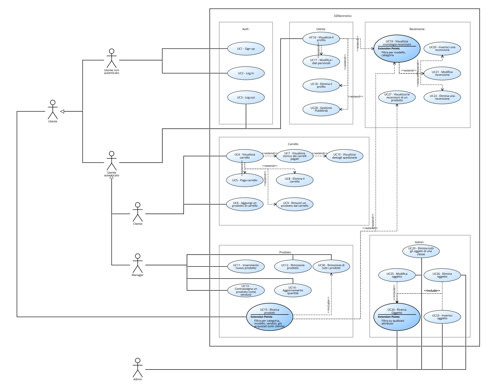
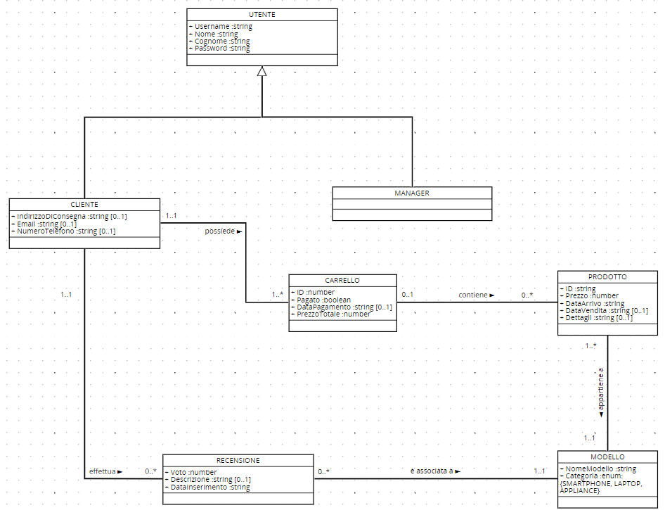

# Requirements Document - future EZElectronics

Date:

Version: V1 - description of EZElectronics in FUTURE form (as proposed by the team)

| Version number | Change |
| :------------: | :----: |
|                |        |

# Contents

- [Requirements Document - future EZElectronics](#requirements-document---future-ezelectronics)
- [Contents](#contents)
- [Informal description](#informal-description)
- [Stakeholders](#stakeholders)
- [Context Diagram and interfaces](#context-diagram-and-interfaces)
  - [Context Diagram](#context-diagram)
  - [Interfaces](#interfaces)
- [Stories and personas](#stories-and-personas)
- [Functional and non functional requirements](#functional-and-non-functional-requirements)
  - [Functional Requirements](#functional-requirements)
  - [Table of rights](#table-of-rights)
  - [Non Functional Requirements](#non-functional-requirements)
- [Use case diagram and use cases](#use-case-diagram-and-use-cases)
  - [Use case diagram](#use-case-diagram)
    - [Use case 1, UC1](#sign-up-uc1)
      - [Scenario 1.1](#scenario-11)
      - [Scenario 1.2](#scenario-12)
    - [Use case 2, UC2](#log-in-uc2)
      - [Scenario 2.1](#scenario-21)
      - [Scenario 2.2](#scenario-22)
    - [Use case 3, UC3](#log-out-uc3)
      - [Scenario 3.1](#scenario-31)
    - [Use case 4, UC4](#visualizza-carrello-uc4)
      - [Scenario 4.1](#scenario-41)
      - [Scenario 4.2](#scenario-42)
    - [Use case 5, UC5](#paga-carrello-uc5)
      - [Scenario 5.1](#scenario-51)
      - [Scenario 5.2](#scenario-52)
    - [Use case 6, UC6](#aggiungi-un-prodotto-al-carrello-uc6)
      - [Scenario 6.1](#scenario-61)
      - [Scenario 6.2](#scenario-62)
    - [Use case 7, UC7](#elimina-il-carrello-corrente-uc7)
      - [Scenario 7.1](#scenario-71)
    - [Use case 8, UC8](#visualizza-storico-dei-carrelli-pagati-uc8)
      - [Scenario 8.1](#scenario-81)
      - [Scenario 8.2](#scenario-82)
    - [Use case 9, UC9](#rimuovi-un-prodotto-dal-carrello-uc9)
      - [Scenario 9.1](#scenario-91)
    - [Use case 10, UC10](#inserimento-nuovo-prodotto-uc10)
      - [Scenario 10.1](#scenario-101)
      - [Scenario 10.2](#scenario-102)
    - [Use case 11, UC11](#rimozione-prodotto-uc11)
      - [Scenario 11.1](#scenario-111)
    - [Use case 12, UC12](#contrassegna-un-prodotto-come-venduto-uc12)
      - [Scenario 12.1](#scenario-121)
    - [Use case 13, UC13](#aggiornamento-quantità-uc13)
      - [Scenario 13.1](#scenario-131)
    - [Use case 14, UC14](#ricerca-prodotti-uc14)
      - [Scenario 14.1](#scenario-141)
      - [Scenario 14.2](#scenario-142)
    - [Use case 15, UC15](#visualizza-il-profilo-uc15)
      - [Scenario 15.1](#scenario-151)
- [Glossary](#glossary)
- [System Design](#system-design)
- [Deployment Diagram](#deployment-diagram)

# Informal description

EZElectronics (read EaSy Electronics) is a software application designed to help managers of electronics stores to manage their products and offer them to customers through a dedicated website. Managers can assess the available products, record new ones, and confirm purchases. Customers can see available products, add them to a cart and see the history of their past purchases.

# Stakeholders

|    Stakeholder name     |                                                    Description                                                    |
| :---------------------: | :---------------------------------------------------------------------------------------------------------------: |
| Utente non autenticato  | Utente che non si è autenticato presso la piattaforma, indipendentemente dal fatto che possieda o meno un account |
|         Cliente         |                                      Utente autenticato, cliente del negozio                                      |
|         Manager         |                                      Utente autenticato, gestore del negozio                                      |
|          Admin          |                     Utente autenticato, amministratore del sistema di gestione EZElectronics                      |
|       Produttore        |              Azienda che produce gli oggetti che verranno messi in vendita attraverso la piattaforma              |
|      Distributore       |                          Azienda che distribuisce i prodotti, dal produttore al manager                           |
| Fornitori di pubblicità |            Aziende i cui prodotti sono pubblicizzati nei banner presenti all'interno dell'applicazione            |
|  Servizio di pagamento  |        Azienda che si occupa di gestire garantire il corretto funzionamento delle transazioni di pagamento        |
| Servizio di spedizione  |                  Azienda che si occupa del trasporto dei prodotti dal negozio fisico al cliente                   |

# Context Diagram and interfaces

## Context Diagram

## Interfacce

|         Attore         | Interfaccia logica | Interfaccia fisica |
| :--------------------: | :----------------: | :----------------: |
| Utente non autenticato |        GUI         |   PC/Smartphone    |
|        Cliente         |        GUI         |   PC/Smartphone    |
|        Manager         |        GUI         |   PC/Smartphone    |
|         Admin          |     Terminale      |         PC         |
| Servizio di pagamento  |        API         |      Internet      |
| Servizio di pubblicità |        API         |      Internet      |
| Servizio di spedizione |        API         |      Internet      |

# Stories and personas

**Manager**

Persona: Franco, 45 anni, manager di un negozio online

- Franco vuole essere in grado di visionare la merce disponibile nel suo negozio
- Franco vuole monitorare l'arrivo degli ordini effettuati
- Franco vuole poter sapere quante della sua merce è stata venduta
- Franco vuole poter eliminare i prodotti dal proprio catalogo
- Franco vuole essere in grado di inserire più prodotti dello stesso modello nel proprio catalogo in poco tempo
- Franco vuole potersi disconnettere dal proprio account nel caso in cui lo desiderasse
- Franco vuole gestire gli annunci pubblicitari presenti nel suo negozio online
- Franco vuole poter cercare la merce non venduta di uno stessa tipologia
- Franco vuole avere una visione generale di tutte le recensioni lasciate ai prodotti che vende
- Franco vuole trovare velocemente le recensioni di un prodotto

**Cliente**

Persona: Giulia, 24 anni, cliente del negozio

- Giulia non vuole perdere troppo tempo nella fase di log in al negozio
- Giulia vuole acquistare ciò che più le piace in modo semplice e veloce
- Giulia vuole poter vedere che prodotti sta acquistando in modo intuitivo
- Giulia vuole gestire facilmente gli articoli nel suo carrello
- Giulia vuole tenere traccia dei suoi acquisti passati in modo da poterli visionare quando vuole
- Giulia vuole poter recensire i prodotti che ha acquistato in modo da lasciare la propria opinione
- Giulia vorrebbe avere più indirizzi di consegna salvati in modo da poter farsi spedire gli acquisti dove le sembri più comodo

Persona: Valerio, 36 anni, cliente del negozio

- Valerio vuole poter filtrare facilmente i prodotti in base alla categoria e/o al modello
- Valerio vuole avere una visione chiara dei suoi acquisti precedenti
- Valerio vuole gestire facilmente le proprie credenziali
- Valerio vuole essere in grado di disconnettere il suo account quando non lo usa
- Valerio vuole poter visionare le sue precedenti spedizioni
- Valerio preferirebbe scrivere salvare il suo indirizzo di consegna in modo da non doverlo riscriverlo ogni volta che effettua un acquisto

Persona: Marta, 27 anni, cliente del negozio:

- Marta vuole aggiungere e togliere al proprio carrello tutti i prodotti che desidera
- Marta vuole poter eliminare tutti i prodotti dal proprio carrello con una semplice mossa
- Marta vuole accedere velocemente ai suoi acquisti
- Marta vuole tenere traccia delle sue spedizioni in corso

Persona: Giancarlo, 30 anni, cliente del negozio:

- Giancarlo vuole poter salvare il suo metodo di pagamento così da averlo pronto in tutte le occasioni
- Giancarlo vuole poter lasciare un voto al prodotto che ha acquistato in modo da essere d'aiuto agli altri utenti
- Giancarlo vuole cercare le recensioni che ha lasciato sui prodotti
- Giancarlo vuole poter essere in grado di modificare o di eliminare una recensione che ha lasciato
- Giancarlo vuole cercare i prodotti di uno stessa categoria in modo semplice e intuitivo

**Utente non autenticato**

Persona: Fulvio, 65 anni, utente non registrato e pensionato:

- Fulvio vuole acquistare/visionare dei prodotti in modo semplice
- Fulvio vuole potersi registrare velocemente e con procedure semplice
- Fulvio vuole poter cercare i prodotti disponibili in modo agile

# Functional and non functional requirements

## Functional Requirements

|                                         ID                                         |                                                     Descrizione                                                     |
| :--------------------------------------------------------------------------------: | :-----------------------------------------------------------------------------------------------------------------: |
|                                        FR1                                         |                                               Gestione degli accessi                                                |
|                     &nbsp;&nbsp;&nbsp;&nbsp;&nbsp;&nbsp; FR1.1                     |                                                        Login                                                        |
|                     &nbsp;&nbsp;&nbsp;&nbsp;&nbsp;&nbsp; FR1.2                     |                                                       Logout                                                        |
|                                        FR2                                         |                                                Gestione degli utenti                                                |
|                     &nbsp;&nbsp;&nbsp;&nbsp;&nbsp;&nbsp; FR2.1                     |                                                  Gestione account                                                   |
|  &nbsp;&nbsp;&nbsp;&nbsp;&nbsp;&nbsp;&nbsp;&nbsp;&nbsp;&nbsp;&nbsp;&nbsp; FR2.1.1  |                                               Creazione nuovo profilo                                               |
|  &nbsp;&nbsp;&nbsp;&nbsp;&nbsp;&nbsp;&nbsp;&nbsp;&nbsp;&nbsp;&nbsp;&nbsp; FR2.1.2  |                                 Recupero delle informazioni dell'utente autenticato                                 |
|  &nbsp;&nbsp;&nbsp;&nbsp;&nbsp;&nbsp;&nbsp;&nbsp;&nbsp;&nbsp;&nbsp;&nbsp; FR2.1.3  |                                                  Modifica password                                                  |
|  &nbsp;&nbsp;&nbsp;&nbsp;&nbsp;&nbsp;&nbsp;&nbsp;&nbsp;&nbsp;&nbsp;&nbsp; FR2.1.4  |                                          Gestione informazioni di contatto (email)                                          |
|  &nbsp;&nbsp;&nbsp;&nbsp;&nbsp;&nbsp;&nbsp;&nbsp;&nbsp;&nbsp;&nbsp;&nbsp; FR2.1.5  |                                     Gestione indirizzo di consegna predefinito                                      |
|  &nbsp;&nbsp;&nbsp;&nbsp;&nbsp;&nbsp;&nbsp;&nbsp;&nbsp;&nbsp;&nbsp;&nbsp; FR2.1.6  |                                      Gestione metodo di pagamento predefinito                                       |
|  &nbsp;&nbsp;&nbsp;&nbsp;&nbsp;&nbsp;&nbsp;&nbsp;&nbsp;&nbsp;&nbsp;&nbsp; FR2.1.7  |                                                Eliminazione account                                                 |
|                     &nbsp;&nbsp;&nbsp;&nbsp;&nbsp;&nbsp; FR2.2                     |                                                   Ricerca utenti                                                    |
|  &nbsp;&nbsp;&nbsp;&nbsp;&nbsp;&nbsp;&nbsp;&nbsp;&nbsp;&nbsp;&nbsp;&nbsp; FR2.2.1  |                                            Recupero di tutti gli utenti                                             |
|  &nbsp;&nbsp;&nbsp;&nbsp;&nbsp;&nbsp;&nbsp;&nbsp;&nbsp;&nbsp;&nbsp;&nbsp; FR2.2.2  |                                            Ricerca utenti, dato un ruolo                                            |
|  &nbsp;&nbsp;&nbsp;&nbsp;&nbsp;&nbsp;&nbsp;&nbsp;&nbsp;&nbsp;&nbsp;&nbsp; FR2.2.3  |                                          Ricerca utente, dato lo username                                           |
|                     &nbsp;&nbsp;&nbsp;&nbsp;&nbsp;&nbsp; FR2.3                     |                                                 Eliminazione utenti                                                 |
|  &nbsp;&nbsp;&nbsp;&nbsp;&nbsp;&nbsp;&nbsp;&nbsp;&nbsp;&nbsp;&nbsp;&nbsp; FR2.3.1  |                                        Eliminazione utente, dato lo username                                        |
|  &nbsp;&nbsp;&nbsp;&nbsp;&nbsp;&nbsp;&nbsp;&nbsp;&nbsp;&nbsp;&nbsp;&nbsp; FR2.3.2  |                                          Eliminazione di tutti gli utenti                                           |
|                     &nbsp;&nbsp;&nbsp;&nbsp;&nbsp;&nbsp; FR2.4                     |                                Creazione nuovo account, relativo ad un altro utente                                 |
|                                        FR3                                         |                                                Gestione dei prodotti                                                |
|                     &nbsp;&nbsp;&nbsp;&nbsp;&nbsp;&nbsp; FR3.1                     |                                              Creazione nuovo prodotto                                               |
|                     &nbsp;&nbsp;&nbsp;&nbsp;&nbsp;&nbsp; FR3.2                     |                         Registrazione arrivo di un insieme di prodotti dello stesso modello                         |
|                     &nbsp;&nbsp;&nbsp;&nbsp;&nbsp;&nbsp; FR3.3                     |                                      Contrassegno di un prodotto come venduto                                       |
|                     &nbsp;&nbsp;&nbsp;&nbsp;&nbsp;&nbsp; FR3.4                     |                                                  Ricerca prodotti                                                   |
|  &nbsp;&nbsp;&nbsp;&nbsp;&nbsp;&nbsp;&nbsp;&nbsp;&nbsp;&nbsp;&nbsp;&nbsp; FR3.4.1  |                                     Ricerca di un prodotto, dato il suo codice                                      |
|  &nbsp;&nbsp;&nbsp;&nbsp;&nbsp;&nbsp;&nbsp;&nbsp;&nbsp;&nbsp;&nbsp;&nbsp; FR3.4.2  |                       Ricerca dei prodotti disponibili, eventualmente per modello o categoria                       |
|  &nbsp;&nbsp;&nbsp;&nbsp;&nbsp;&nbsp;&nbsp;&nbsp;&nbsp;&nbsp;&nbsp;&nbsp; FR3.4.3  |             Ricerca dei prodotti, eventualmente solo se (non) venduti, filtrati per modello o categoria             |
|  &nbsp;&nbsp;&nbsp;&nbsp;&nbsp;&nbsp;&nbsp;&nbsp;&nbsp;&nbsp;&nbsp;&nbsp; FR3.4.4  |         Ricerca di tutti i prodotti, eventualmente solo se (non) venduti, senza l'utilizzo di altri filtri          |
|  &nbsp;&nbsp;&nbsp;&nbsp;&nbsp;&nbsp;&nbsp;&nbsp;&nbsp;&nbsp;&nbsp;&nbsp; FR3.4.5  |       Recupero dei prodotti acquistati dall'utente corrente, filtrati eventualmente per categoria e/o modello       |
|                     &nbsp;&nbsp;&nbsp;&nbsp;&nbsp;&nbsp; FR3.5                     |                                                Eliminazione prodotti                                                |
|  &nbsp;&nbsp;&nbsp;&nbsp;&nbsp;&nbsp;&nbsp;&nbsp;&nbsp;&nbsp;&nbsp;&nbsp; FR3.5.1  |                                   Eliminazione di un prodotto, dato il suo codice                                   |
|  &nbsp;&nbsp;&nbsp;&nbsp;&nbsp;&nbsp;&nbsp;&nbsp;&nbsp;&nbsp;&nbsp;&nbsp; FR3.5.2  |                                          Eliminazione di tutti i prodotti                                           |
|                                        FR4                                         |                                                Gestione dei carrelli                                                |
|                     &nbsp;&nbsp;&nbsp;&nbsp;&nbsp;&nbsp; FR4.1                     |                                    Visualizzazione carrello del cliente corrente                                    |
|                     &nbsp;&nbsp;&nbsp;&nbsp;&nbsp;&nbsp; FR4.2                     |                    Aggiunta di un prodotto al carrello del cliente corrente, dato il suo modello                    |
|                     &nbsp;&nbsp;&nbsp;&nbsp;&nbsp;&nbsp; FR4.3                     |                                              Pagamento di un carrello                                               |
|                     &nbsp;&nbsp;&nbsp;&nbsp;&nbsp;&nbsp; FR4.4                     |                       Visualizzazione dello storico dei carrelli pagati dal cliente corrente                        |
|                     &nbsp;&nbsp;&nbsp;&nbsp;&nbsp;&nbsp; FR4.5                     |                                             Operazioni di eliminazione                                              |
|  &nbsp;&nbsp;&nbsp;&nbsp;&nbsp;&nbsp;&nbsp;&nbsp;&nbsp;&nbsp;&nbsp;&nbsp; FR4.5.1  |                                   Rimozione di un prodotto dal carrello corrente                                    |
|  &nbsp;&nbsp;&nbsp;&nbsp;&nbsp;&nbsp;&nbsp;&nbsp;&nbsp;&nbsp;&nbsp;&nbsp; FR4.5.2  |                               Eliminazione di tutti i prodotti dal carrello corrente                                |
|  &nbsp;&nbsp;&nbsp;&nbsp;&nbsp;&nbsp;&nbsp;&nbsp;&nbsp;&nbsp;&nbsp;&nbsp; FR4.5.3  |                                          Eliminazione di tutti i carrelli                                           |
|                                        FR5                                         |                                                 Gestione recensioni                                                 |
|                     &nbsp;&nbsp;&nbsp;&nbsp;&nbsp;&nbsp; FR5.1                     |                          Inserimento recensione, per il modello di un prodotto acquistato                           |
|                     &nbsp;&nbsp;&nbsp;&nbsp;&nbsp;&nbsp; FR5.2                     |                                        Modifica di una recensione effettuata                                        |
|                     &nbsp;&nbsp;&nbsp;&nbsp;&nbsp;&nbsp; FR5.3                     |                                               Eliminazione recensioni                                               |
|  &nbsp;&nbsp;&nbsp;&nbsp;&nbsp;&nbsp;&nbsp;&nbsp;&nbsp;&nbsp;&nbsp;&nbsp; FR5.3.1  |                           Eliminazione di una recensione effettuata dall'utente corrente                            |
|  &nbsp;&nbsp;&nbsp;&nbsp;&nbsp;&nbsp;&nbsp;&nbsp;&nbsp;&nbsp;&nbsp;&nbsp; FR5.3.2  |        Eliminazione di una recensione qualsiasi, eventualmente filtrata per modello o categoria del prodotto        |
|  &nbsp;&nbsp;&nbsp;&nbsp;&nbsp;&nbsp;&nbsp;&nbsp;&nbsp;&nbsp;&nbsp;&nbsp; FR5.3.3  |          Eliminazione di tutte le recensioni, eventualmente filtrate per modello o categoria del prodotto           |
|                     &nbsp;&nbsp;&nbsp;&nbsp;&nbsp;&nbsp; FR5.4                     |                                                 Ricerca recensioni                                                  |
|  &nbsp;&nbsp;&nbsp;&nbsp;&nbsp;&nbsp;&nbsp;&nbsp;&nbsp;&nbsp;&nbsp;&nbsp; FR5.4.1  | Ricerca recensioni effettuate dall'utente corrente, eventualmente filtrate per modello e/o categoria del prodotto a cui si riferiscono |
|  &nbsp;&nbsp;&nbsp;&nbsp;&nbsp;&nbsp;&nbsp;&nbsp;&nbsp;&nbsp;&nbsp;&nbsp; FR5.4.2  |                                  Ricerca recensioni effettuate da tutti gli utenti                                  |
| &nbsp;&nbsp;&nbsp;&nbsp;&nbsp;&nbsp;&nbsp;&nbsp;&nbsp;&nbsp;&nbsp;&nbsp; FR5.4.2.1 |               Visualizzazione recensioni effettuate da tutti gli utenti, dato un modello di prodotto                |
| &nbsp;&nbsp;&nbsp;&nbsp;&nbsp;&nbsp;&nbsp;&nbsp;&nbsp;&nbsp;&nbsp;&nbsp; FR5.4.2.2 | Ricerca recensioni effettuate da tutti gli utenti, eventualmente filtrate per categoria e/o modello di un prodotto  |
|                                        FR6                                         |                                                 Gestione pubblicità                                                 |
|                     &nbsp;&nbsp;&nbsp;&nbsp;&nbsp;&nbsp; FR6.1                     |                                Ricezione annuncio pubblicitario da servizio esterno                                 |
|                     &nbsp;&nbsp;&nbsp;&nbsp;&nbsp;&nbsp; FR6.2                     |              Gestione possibilità di nascondere gli annunci pubblicitari all'interno della piattaforma              |
|                                        FR7                                         |                                                 Gestione pagamento                                                  |
|                     &nbsp;&nbsp;&nbsp;&nbsp;&nbsp;&nbsp; FR7.1                     |                                           Gestione richiesta di pagamento                                           |
|                     &nbsp;&nbsp;&nbsp;&nbsp;&nbsp;&nbsp; FR7.2                     |                              Invio esito di pagamento al cliente (successo/fallimento)                              |
|                                        FR8                                         |                                                 Gestione spedizione                                                 |
|                     &nbsp;&nbsp;&nbsp;&nbsp;&nbsp;&nbsp; FR8.1                     |                                             Creazione nuova spedizione                                              |
|                     &nbsp;&nbsp;&nbsp;&nbsp;&nbsp;&nbsp; FR8.2                     |         Ricerca spedizioni di tutti gli utenti, eventualmente per stato (non iniziate, in corso, concluse)          |
|                     &nbsp;&nbsp;&nbsp;&nbsp;&nbsp;&nbsp; FR8.3                     |                                              Tracking della spedizione                                              |
|  &nbsp;&nbsp;&nbsp;&nbsp;&nbsp;&nbsp;&nbsp;&nbsp;&nbsp;&nbsp;&nbsp;&nbsp; FR8.3.1  |                                       Recupero stato e luogo della spedizione                                       |
|  &nbsp;&nbsp;&nbsp;&nbsp;&nbsp;&nbsp;&nbsp;&nbsp;&nbsp;&nbsp;&nbsp;&nbsp; FR8.3.2  |                                   Visualizzazione stato e luogo della spedizione                                    |

### Table of rights

| Requisito | Utente non autenticato | Cliente | Manager | Admin |
| :-------: | :--------------------: | :-----: | :-----: | :---: |
|   FR1.1   |           x            |         |         |       |
|   FR1.2   |                        |    x    |    x    |   x   |
|  FR2.1.1  |           x            |         |         |       |
|  FR2.1.2  |                        |    x    |    x    |   x   |
|  FR2.1.3  |                        |    x    |    x    |   x   |
|  FR2.1.4  |                        |    x    |         |   x   |
|  FR2.1.5  |                        |    x    |         |   x   |
|  FR2.1.6  |                        |    x    |         |   x   |
|  FR2.1.7  |                        |    x    |    x    |   x   |
|   FR2.2   |                        |         |         |   x   |
|   FR2.3   |                        |         |         |   x   |
|   FR2.4   |                        |         |         |   x   |
|   FR3.1   |                        |         |    x    |   x   |
|   FR3.2   |                        |         |    x    |   x   |
|   FR3.3   |                        |         |    x    |   x   |
|  FR3.4.1  |                        |         |    x    |   x   |
|  FR3.4.2  |           x            |    x    |    x    |   x   |
|  FR3.4.3  |                        |         |    x    |   x   |
|  FR3.4.4  |                        |         |    x    |   x   |
|  FR3.4.5  |                        |    x    |         |   x   |
|   FR3.5   |                        |         |    x    |   x   |
|   FR4.1   |                        |    x    |         |   x   |
|   FR4.2   |                        |    x    |         |   x   |
|   FR4.3   |                        |    x    |         |   x   |
|   FR4.4   |                        |    x    |         |   x   |
|  FR4.5.1  |                        |    x    |         |   x   |
|  FR4.5.2  |                        |    x    |         |   x   |
|  FR4.5.3  |                        |         |         |   x   |
|   FR5.1   |                        |    x    |         |   x   |
|   FR5.2   |                        |    x    |         |   x   |
|  FR5.3.1  |                        |    x    |         |   x   |
|  FR5.3.2  |                        |         |         |   x   |
|  FR5.3.3  |                        |         |         |   x   |
|  FR5.4.1  |                        |    x    |         |   x   |
| FR5.4.2.1 |                        |    x    |         |   x   |
| FR5.4.2.2 |                        |         |    x    |   x   |
|   FR6.1   |                        |         |         |   x   |
|   FR6.2   |                        |         |    x    |   x   |
|    FR7    |                        |         |         |   x   |
|   FR8.1   |                        |         |         |   x   |
|   FR8.2   |                        |         |         |   x   |
|  FR8.3.1  |                        |         |         |   x   |
|  FR8.3.2  |                        |    x    |         |   x   |

## Non Functional Requirements

\<Describe constraints on functional requirements>

|  ID  | Tipo (efficienza, affidabilità, ..) |                                                 Descrizione                                                  |   Si riferisce a   |
| :--: | :---------------------------------: | :----------------------------------------------------------------------------------------------------------: | :----------------: |
| NFR1 |              Usabilità              |      Non deve essere necessario training per essere in grado di utilizzare l'applicazione in autonomia       | FR1, FR2.1, FR3, FR4.1, FR4.2, FR4.3, FR4.4, FR4.5.2, FR4.5.3, FR5.1, FR5.2, FR5.3.1, FR5.4, FR6.2, FR8.3.2   |
| NFR2 |            Disponibilità            |                                 L'uptime del server deve essere pari al 99%                                  | All |
| NFR3 |              Security               | L'autenticazione deve essere gestita mediante librerie che utilizzano pratiche conformi allo stato dell'arte |      FR1, FR2.1      |
| NFR4 |              Security               | Il software non deve essere vulnerabile ad attacchi XSS e SQL injection |     All       |
| NFR5 |              Security               | Le dipendenze con vulnerabilità critiche (CVSS rating >= 6) devono essere aggiornate entro 1 settimana |    All        |
| NFR6 |              Security               | Le dipendenze con vulnerabilità note di qualsiasi tipo devono essere aggiornate entro 2 mesi |    All        |
| NFR7 |              Affidabilità               | Ogni utente non deve segnalare più di 2 bug all'anno |      FR1, FR2.1, FR3, FR4.1, FR4.2, FR4.3, FR4.4, FR4.5.2, FR4.5.3, FR5.1, FR5.2, FR5.3.1, FR5.4, FR6.2, FR8.3.2      |
| NFR8 |              Efficienza               | Il tempo di risposta deve essere pari o inferiore a 500 millisecondi |    All        |
| NFR9 |              Correttezza               | L'applicazione deve essere in grado di gestire un aumento del traffico senza degrado delle prestazioni (tempo di risposta inferiore a 500 ms) |    All        |
| NFR10 |              Manutenibilità               | Risolvere un problema software deve richiedere un effort massimo di 7 person/hours |   All         |
| NFR11 |              Manutenibilità               | Modificare una funzionalità esistente deve richiedere un effort massimo di 7 person/hours |     All       |
| NFR12 |              Manutenibilità               | Eliminare una funzionalità esistente deve richiedere un effort massimo di 3 person/hours |     All       |
| NFR13 |              Manutenibilità               | Aggiungere una nuova funzionalità deve richiedere un effort massimo di 35 person/hours |      All      |
| NFR14 |              Portabilità               | Modificare il DBMS su cui memorizzare i dati deve richiedere un effort massimo di 35 person/hours |     FR1, FR2, FR3, FR4, FR5, FR7, FR8       |
| NFR15 |              Portabilità               | L'applicazione web deve essere disponibile sui browser Chrome, Firefox, Edge, Safari e Opera |     All       |

# Use case diagram and use cases

## Use case diagram

## Anche se non indicato nel diagramma per questioni di chiarezza visiva, l'admin può effettuare ogni operazione di aggiunta, modifica o rimozione di qualsiasi oggetto.

### Sign up, UC1

| Attori coinvolti  |                                 Utente non autenticato                                  |
| :---------------: | :-------------------------------------------------------------------------------------: |
|   Precondizione   |                                                                                         |
|  Postcondizione   |                           Esiste una nuova utenza nel sistema                           |
| Scenario nominale |          L'utente non autenticato inserisce i dati e registra una nuova utenza          |
|     Varianti      |                                                                                         |
|     Eccezioni     | L'username inserito risulta già esistente, non vengono compilati tutti i campi del form |

#### Scenario 1.1

|  Scenario 1.1  |                                                                                                           |
| :------------: | :-------------------------------------------------------------------------------------------------------: |
| Precondizione  |                                                                                                           |
| Postcondizione |                                    Esiste la nuova utenza nel sistema                                     |
|     Passo#     |                                                Descrizione                                                |
|       1        |                                 L'utente clicca sul pulsante 'Registrati'                                 |
|       2        |      L'utente inserisce username, nome, cognome e password, e seleziona un ruolo (cliente o manager)      |
|       3        |                                  L'utente clicca sul pulsante 'Conferma'                                  |
|       4        |           Il sistema verifica che tutti i campi siano stati compilati e l'unicità dell'username           |
|       5        |                 Il sistema ottiene un riscontro positivo a tutte le precedenti verifiche                  |
|       6        |                             Viene creata una nuova utenza con i dati inseriti                             |
|       7        | Si viene riportati alla pagina di login, che mostra un messaggio di corretta riuscita della registrazione |

#### Scenario 1.2

|  Scenario 1.2  |                                                                                                 |
| :------------: | :---------------------------------------------------------------------------------------------: |
| Precondizione  |                                                                                                 |
| Postcondizione |                          Non viene creata una nuova utenza nel sistema                          |
|     Passo#     |                                           Descrizione                                           |
|       1        |                            L'utente clicca sul pulsante 'Registrati'                            |
|       2        | L'utente inserisce username, nome, cognome e password, e selezione un ruolo (cliente o manager) |
|       3        |                             L'utente clicca sul pulsante 'Conferma'                             |
|       4        |      Il sistema verifica che tutti i campi siano stati compilati e l'unicità dell'username      |
|       5        |        Il sistema ottiene un riscontro negativo ad almeno una delle precedenti verifiche        |
|       6        |                            Il sistema mostra un messaggio di errore                             |

### Log in, UC2

| Attori coinvolti  |                                                            Utente non autenticato                                                            |
| :---------------: | :------------------------------------------------------------------------------------------------------------------------------------------: |
|   Precondizione   |                                                                                                                                              |
|  Postcondizione   |                                                            L'utente è autenticato                                                            |
| Scenario nominale |                    L'utente inserisce i dati, il sistema ne verifica la correttezza e in caso positivo effettua l'accesso                    |
|     Varianti      |                                                                                                                                              |
|     Eccezioni     | Se i dati inseriti non sono corretti o non tutti i campi del form sono stati compilati, viene mostrato un errore e non si effettua l'accesso |

#### Scenario 2.1

|  Scenario 2.1  |                                                                                       |
| :------------: | :-----------------------------------------------------------------------------------: |
| Precondizione  |                                                                                       |
| Postcondizione |                                L'utente è autenticato                                 |
|     Passo#     |                                      Descrizione                                      |
|       2        |                        L'utente inserisce username e password                         |
|       3        |                         L'utente clicca sul pulsante 'Login'                          |
|       4        | Il sistema verifica che tutti i campi siano stati compilati e la correttezza dei dati |
|       5        |       Il sistema ottiene un riscontro positivo a tutte le precedenti verifiche        |
|       6        |                         Viene mostrata l'homepage dell'utente                         |

#### Scenario 2.2

|  Scenario 2.2  |                                                                                       |
| :------------: | :-----------------------------------------------------------------------------------: |
| Precondizione  |                                                                                       |
| Postcondizione |                              L'utente non è autenticato                               |
|     Passo#     |                                      Descrizione                                      |
|       2        |                        L'utente inserisce username e password                         |
|       3        |                         L'utente clicca sul pulsante 'Login'                          |
|       4        | Il sistema verifica che tutti i campi siano stati compilati e la correttezza dei dati |
|       5        |   Il sistema ottiene un riscontro negativo ad almeno una delle precedenti verifiche   |
|       6        |                          Viene mostrato un messaggio errore                           |

### Log out, UC3

| Attori coinvolti  |                    Utente autenticato                     |
| :---------------: | :-------------------------------------------------------: |
|   Precondizione   |                                                           |
|  Postcondizione   |                L'utente non è autenticato                 |
| Scenario nominale | L'utente clicca sul pulsante 'Logout' e viene disconnesso |
|     Varianti      |                                                           |
|     Eccezioni     |                                                           |

#### Scenario 3.1

|  Scenario 3.1  |                                        |
| :------------: | :------------------------------------: |
| Precondizione  |                                        |
| Postcondizione |       L'utente non è autenticato       |
|     Passo#     |              Descrizione               |
|       1        |  L'utente preme sul pulsante 'Logout'  |
|       2        |       L'utente viene disconnesso       |
|       3        | Il sistema mostra la pagina di accesso |

### Visualizza carrello, UC4

| Attori coinvolti  |                     Cliente                     |
| :---------------: | :---------------------------------------------: |
|   Precondizione   |                                                 |
|  Postcondizione   |           Viene mostrato il carrello            |
| Scenario nominale | Il cliente visualizza il contenuto del carrello |
|     Varianti      |             Non esiste un carrello              |
|     Eccezioni     |                                                 |

#### Scenario 4.1

|  Scenario 4.1  |                                                                    |
| :------------: | :----------------------------------------------------------------: |
| Precondizione  |           Esiste un carrello attivo associato al cliente           |
| Postcondizione |              Viene mostrato il contenuto del carrello              |
|     Passo#     |                            Descrizione                             |
|       1        |             Il cliente clicca sull'icona del carrello              |
|       2        | Viene visualizzata una pagina che mostra il contenuto del carrello |

#### Scenario 4.2

|  Scenario 4.2  |                                                                   |
| :------------: | :---------------------------------------------------------------: |
| Precondizione  |         Non siste un carrello attivo associato al cliente         |
| Postcondizione |                Il sistema mostra un carrello vuoto                |
|     Passo#     |                            Descrizione                            |
|       1        |             Il cliente clicca sull'icona del carrello             |
|       2        | Viene visualizzata una pagina che riporta che il carrello è vuoto |

### Paga Carrello, UC5

| Attori coinvolti  |                    Cliente                    |
| :---------------: | :-------------------------------------------: |
|   Precondizione   | Il cliente ha almeno un prodotto nel carrello |
|  Postcondizione   |             L'ordine è confermato             |
| Scenario nominale |  Il cliente acquista i prodotti nel carrello  |
|     Varianti      |                                               |
|     Eccezioni     |                                               |

#### Scenario 5.1

|  Scenario 5.1  |                                                                                                                               |
| :------------: | :---------------------------------------------------------------------------------------------------------------------------: |
| Precondizione  | Il cliente ha almeno un prodotto nel carrello, e ha impostato un metodo predefinito di pagamento e un indirizzo di spedizione |
| Postcondizione |                          L'acquisto è confermato e il carrello corrente viene spostato nello storico                          |
|     Passo#     |                                                          Descrizione                                                          |
|       1        |                                           Il cliente clicca sull'icona del carrello                                           |
|       2        |                                        Il cliente visualizza il contenuto del carrello                                        |
|       3        |                                           Il cliente clicca sul pulsante 'Acquista'                                           |
|       4        |          Il sistema mostra la homepage del cliente con un messaggio che conferma la corretta riuscita dell'acquisto           |

#### Scenario 5.2

|  Scenario 5.2  |                                                                                                                                      |
| :------------: | :----------------------------------------------------------------------------------------------------------------------------------: |
| Precondizione  | Il cliente ha almeno un prodotto nel carrello, ma non ha impostato un metodo predefinito di pagamento e/o un indirizzo di spedizione |
| Postcondizione |                                                   L'acquisto non viene confermato                                                    |
|     Passo#     |                                                             Descrizione                                                              |
|       1        |                                              Il cliente clicca sull'icona del carrello                                               |
|       2        |                                           Il cliente visualizza il contenuto del carrello                                            |
|       3        |                                              Il cliente clicca sul pulsante 'Acquista'                                               |
|       4        |                        Il sistema mostra un messaggio di errore che segnala la mancata riuscita dell'acquisto                        |

### Aggiungi un prodotto al carrello, UC6

| Attori coinvolti  |                   Cliente                   |
| :---------------: | :-----------------------------------------: |
|   Precondizione   | Il cliente visualizza l'elenco dei prodotti |
|  Postcondizione   |        Il carrello viene aggiornato         |
| Scenario nominale | Il cliente aggiunge un prodotto al carrello |
|     Varianti      |                                             |
|     Eccezioni     |                                             |

#### Scenario 6.1

|  Scenario 6.1  |                                                                                                        |
| :------------: | :----------------------------------------------------------------------------------------------------: |
| Precondizione  |                              Il cliente visualizza l'elenco dei prodotti                               |
| Postcondizione |                                      Il carrello viene aggiornato                                      |
|     Passo#     |                                              Descrizione                                               |
|       1        |   Il cliente clicca sul pulsante 'Aggiungi al carrello' relativo al prodotto che intende acquistare    |
|       3        | Il sistema verifica che il prodotto selezionato sia ancora disponibile e ottiene un riscontro positivo |
|       2        |                  Il sistema mostra un messaggio di corretta riuscita dell'operazione                   |

#### Scenario 6.2

|  Scenario 6.2  |                                                                                                        |
| :------------: | :----------------------------------------------------------------------------------------------------: |
| Precondizione  |                              Il cliente visualizza l'elenco dei prodotti                               |
| Postcondizione |                                    Il carrello non viene aggiornato                                    |
|     Passo#     |                                              Descrizione                                               |
|       1        |   Il cliente clicca sul pulsante 'Aggiungi al carrello' relativo al prodotto che intende acquistare    |
|       3        | Il sistema verifica che il prodotto selezionato sia ancora disponibile e ottiene un riscontro negativo |
|       2        |                   Il sistema mostra un messaggio di mancata riuscita dell'operazione                   |

### Visualizza storico dei carrelli pagati, UC7

| Attori coinvolti  |                       Cliente                        |
| :---------------: | :--------------------------------------------------: |
|   Precondizione   |                                                      |
|  Postcondizione   |   Il sistema mostra lo storico dei carrelli pagati   |
| Scenario Nominale | Il cliente visualizza lo storico dei carrelli pagati |
|     Varianti      |  Non esiste un carrello pagato associato al cliente  |
|     Eccezioni     |                                                      |

#### Scenario 7.1

|  Scenario 7.1  |                                                                       |
| :------------: | :-------------------------------------------------------------------: |
| Precondizione  |         Esiste almeno un carrello pagato associato al cliente         |
| Postcondizione | Il sistema mostra lo storico dei carrelli pagati associati al cliente |
|     Step#      |                              Descrizione                              |
|       1        |               Il cliente clicca sull'icona del carrello               |
|       2        |   Il sistema mostra il contenuto del carrello associato al cliente    |
|       3        |                Il cliente clicca su 'Storico carrelli'                |
|       4        |           Il sistema mostra lo storico dei carrelli pagati            |

#### Scenario 7.2

|  Scenario 7.2  |                                                                                          |
| :------------: | :--------------------------------------------------------------------------------------: |
| Precondizione  |                    Non esiste un carrello pagato associato al cliente                    |
| Postcondizione |                           Il sistema mostra uno storico vuoto                            |
|     Step#      |                                       Descrizione                                        |
|       1        |                        Il cliente clicca sull'icona del carrello                         |
|       2        |             Il sistema mostra il contenuto del carrello associato al cliente             |
|       3        |                         Il cliente clicca su 'Storico carrelli'                          |
|       4        | Il sistema mostra una pagina che riporta che non ci sono carrelli già pagati dal cliente |

### Elimina il carrello corrente, UC8

| Attori coinvolti  |                                         Cliente                                          |
| :---------------: | :--------------------------------------------------------------------------------------: |
|   Precondizione   |                      Esiste un carrello attivo associato al cliente                      |
|  Postcondizione   |                    Non esiste un carrello attivo associato al cliente                    |
| Scenario Nominale | Il cliente elimina i prodotti presenti all'interno del carrello e quindi carrello stesso |
|     Varianti      |                                                                                          |
|     Eccezioni     |                                                                                          |

#### Scenario 8.1

|  Scenario 8.1  |                                                                   |
| :------------: | :---------------------------------------------------------------: |
| Precondizione  |          Esiste un carrello attivo associato al cliente           |
| Postcondizione |        Non esiste un carrello attivo associato al cliente         |
|     Step#      |                            Descrizione                            |
|       1        |             Il cliente clicca sull'icona del carrello             |
|       2        |               Il sistema mostra il carrello attivo                |
|       3        |         Il cliente clicca sul pulsante 'Svuota carrello'          |
|       4        | Viene visualizzata una pagina che riporta che il carrello è vuoto |

### Rimuovi un prodotto dal carrello, UC9

| Attori coinvolti  |                                     Cliente                                     |
| :---------------: | :-----------------------------------------------------------------------------: |
|   Precondizione   |             Almeno un prodotto è presente nel carrello del cliente              |
|  Postcondizione   | Il prodotto selezionato non è più presente all'interno del carrello del cliente |
| Scenario Nominale |                   Il cliente rimuove un prodotto dal carrello                   |
|     Varianti      |                                                                                 |
|     Eccezioni     |                                                                                 |

#### Scenario 9.1

|  Scenario 9.1  |                                                                                                                                           |
| :------------: | :---------------------------------------------------------------------------------------------------------------------------------------: |
| Precondizione  |                                          Almeno un prodotto è presente nel carrello del cliente                                           |
| Postcondizione |                              Il prodotto selezionato non è più presente all'interno del carrello del cliente                              |
|     Step#      |                                                                Descrizione                                                                |
|       1        |                                                 Il cliente clicca sull'icona del carrello                                                 |
|       2        |                                                Il sistema mostra il contenuto del carrello                                                |
|       3        |                     Il cliente clicca sul pulsante 'Rimuovi' relativo al prodotto che intende eliminare dal carrello                      |
|       4        | Il sistema mostra il contenuto del carrello privo del prodotto eliminato e un messaggio che conferma la corretta riuscita dell'operazione |

### Visualizza dettagli spedizione, UC10

| Attori coinvolti  |                                       Cliente                                        |
| :---------------: | :----------------------------------------------------------------------------------: |
|   Precondizione   |                     Almeno un carrello è presente nello storico                      |
|  Postcondizione   |                                                                                      |
| Scenario Nominale | Il sistema mostra informazioni dettagliate sulla spedizione del carrello selezionato |
|     Varianti      |                                                                                      |
|     Eccezioni     |                                                                                      |

#### Scenario 10.1

| Scenario 10.1  |                                                                            |
| :------------: | :------------------------------------------------------------------------: |
| Precondizione  |                Almeno un carrello è presente nello storico                 |
| Postcondizione |                                                                            |
|     Step#      |                                Descrizione                                 |
|       1        |       Il cliente si trova sulla schermata dello storico dei carrelli       |
|       2        |               Il cliente clicca sullo stato della spedizione               |
|       3        | Il sistema mostra la schermata di dettaglio dell'ordine e della spedizione |

### Inserimento nuovo prodotto, UC11

| Attori coinvolti  |                                          Manager                                          |
| :---------------: | :---------------------------------------------------------------------------------------: |
|   Precondizione   |                                                                                           |
|  Postcondizione   |                            Un nuovo prodotto è stato aggiunto                             |
| Scenario Nominale |                           Il manager aggiunge un nuovo prodotto                           |
|     Varianti      |                                                                                           |
|     Eccezioni     | Esiste già un prodotto con lo stesso codice, non vengono compilati tutti i campi del form |

#### Scenario 11.1

| Scenario 11.1  |  |
| :------------: | :---------------------------------------------------------------: |
| Precondizione  |  |
| Postcondizione | Un nuovo prodotto è stato aggiunto |
|     Passo#     | Descrizione |
|       1        | Il manager compila il form 'Nuovo prodotto' inserendo il prezzo, data di arrivo, modello, categoria e dettagli relativi al nuovo prodotto |
|       2        | Il manager clicca sul pulsante 'Inserisci' |
|       3        | Il sistema verifica che tutti i campi siano stati compilati e che il codice sia univoco e di almeno 6 caratteri|
|       4        | Il sistema  ottiene un riscontro positivo a tutte le precedenti verifiche |
|       5        | Il sistema mostra un messaggio di corretta riuscita dell'operazione |

#### Scenario 11.2

| Scenario 11.2  |  |
| :------------: | :---------------------------------------------------------------: |
| Precondizione  | Esiste già un prodotto con lo stesso codice del nuovo prodotto |
| Postcondizione | Il nuovo prodotto non viene aggiunto |
|     Passo#     |   Descrizione |
|       1        |   Il manager compila il form 'Nuovo prodotto' inserendo il prezzo, data di arrivo, modello, categoria e dettagli relativi al nuovo prodotto   |
|       2        | Il manager clicca sul pulsante 'Inserisci' |
|       3        | Il sistema verifica che tutti i campi siano stati compilati e che il codice sia univoco e di almeno 6 caratteri |
|       4        | Il sistema ottiene un riscontro negativo ad almeno una delle precedenti verifiche |
|       5        | Il sistema mostra un messaggio di mancata riuscita dell'operazione |

### Rimozione prodotto, UC12

| Attori coinvolti  |                              Manager                               |
| :---------------: | :----------------------------------------------------------------: |
|   Precondizione   |                     Esiste almeno un prodotto                      |
|  Postcondizione   | Il prodotto eliminato non è più disponibile per la visualizzazione |
| Scenario Nominale |                   Il manager rimuove un prodotto                   |
|     Varianti      |                                                                    |
|     Eccezioni     |                                                                    |

#### Scenario 12.1

| Scenario 12.1  |                                                                                   |
| :------------: | :-------------------------------------------------------------------------------: |
| Precondizione  |                             Esiste almeno un prodotto                             |
| Postcondizione |        Il prodotto eliminato non è più disponibile per la visualizzazione         |
|     Step#      |                                    Descrizione                                    |
|       1        |                    Il manager visualizza l'elenco dei prodotti                    |
|       2        | Il manager clicca sul pulsante 'Elimina' relativo al prodotto che vuole rimuovere |
|       3        |        Il sistema mostra l'elenco dei prodotti senza il prodotto eliminato        |

### Contrassegna un prodotto come venduto, UC13

| Attori coinvolti  |                     Manager                      |
| :---------------: | :----------------------------------------------: |
|   Precondizione   |      Esiste almeno un prodotto non venduto       |
|  Postcondizione   |     Il prodotto selezionato risulta venduto      |
| Scenario Nominale | Il manager contrassegna un prodotto come venduto |
|     Varianti      |                                                  |
|     Eccezioni     |                                                  |

#### Scenario 13.1

| Scenario 13.1  |                                                                                                     |
| :------------: | :-------------------------------------------------------------------------------------------------: |
| Precondizione  |                                Esiste almeno un prodotto non venduto                                |
| Postcondizione |                               Il prodotto selezionato risulta venduto                               |
|     Passo#     |                                             Descrizione                                             |
|       1        |                             Il manager visualizza la lista dei prodotti                             |
|       2        | Il manager clicca sul pulsante 'Vendi' relativo al prodotto che intende contrassegnare come venduto |
|       4        |                 Il sistema mostra un messaggio di avvenuta riuscita dell'operazione                 |

### Aggiornamento quantità, UC14

| Attori coinvolti  |                         Manager                          |
| :---------------: | :------------------------------------------------------: |
|   Precondizione   |                                                          |
|  Postcondizione   |       Un nuovo set di prodotti è stato registrato        |
| Scenario Nominale | Il manager registra l'arrivo di un nuovo set di prodotti |
|     Varianti      |                                                          |
|     Eccezioni     |       Non vengono compilati tutti i campi del form       |

#### Scenario 14.1

| Scenario 14.1  |                                                                                                                     |
| :------------: | :-----------------------------------------------------------------------------------------------------------------: |
| Precondizione  |                                              Esiste almeno un prodotto                                              |
| Postcondizione |                               L'arrivo di un nuovo set di prodotti è stato registrato                               |
|     Passo#     |                                                     Descrizione                                                     |
|       1        | Il manager compila il form 'Nuovo arrivo' inserendo modello, categoria, quantità, data di arrivo, prezzo e dettagli |
|       2        |                                      Il manager clicca sul pulsante 'Registra'                                      |
|       3        |             Il sistema verifica che tutti i campi siano stati compilati e ottiene un riscontro positivo             |
|       4        |                         Il sistema mostra un messaggio di corretta riuscita dell'operazione                         |

#### Scenario 14.2

| Scenario 14.2  |                                                                                                                     |
| :------------: | :-----------------------------------------------------------------------------------------------------------------: |
| Precondizione  |                                              Esiste almeno un prodotto                                              |
| Postcondizione |                               L'arrivo di un nuovo set di prodotti è stato registrato                               |
|     Passo#     |                                                     Descrizione                                                     |
|       1        | Il manager compila il form 'Nuovo arrivo' inserendo modello, categoria, quantità, data di arrivo, prezzo e dettagli |
|       2        |                                      Il manager clicca sul pulsante 'Registra'                                      |
|       3        |             Il sistema verifica che tutti i campi siano stati compilati e ottiene un riscontro negativo             |
|       4        |              Il sistema mostra un messaggio di errore che confera la mancata riuscita dell'operazione               |

### Ricerca prodotti, UC15

| Attori coinvolti  |                           Utente                           |
| :---------------: | :--------------------------------------------------------: |
|   Precondizione   |                                                            |
|  Postcondizione   |         L'utente visualizza una lista di prodotti          |
| Scenario nominale |        L'utente effettua una ricerca di un prodotto        |
|     Varianti      | Non ci sono prodotti corrispondenti alla ricerca effetuata |
|     Eccezioni     |                                                            |

#### Scenario 15.1

| Scenario 15.1  |                                                                                                                                                                                                                                              |
| :------------: | :------------------------------------------------------------------------------------------------------------------------------------------------------------------------------------------------------------------------------------------: |
| Precondizione  |                                                                                     Sono presenti prodotti corrispondenti ai filtri di ricerca applicati                                                                                     |
| Postcondizione |                                                                                                  L'utente visualizza una lista di prodotti                                                                                                   |
|     Passo#     |                                                                                                                 Descrizione                                                                                                                  |
|       1        | Se l'utente è un cliente o un utente non autenticato deve selezionare uno o più filtri dal form 'Cerca prodotti'. Se l'utente è un manager deve spuntare la checkbox 'Prodotti' del form 'Cerca nel negozio' e selezionare uno o più filtri. |
|       2        |                                                                                                     L'utente clicca sul pulsante 'Cerca'                                                                                                     |
|       3        |                                                                            Il sistema mostra l'elenco dei prodotti corrispondenti ai filtri di ricerca applicati                                                                             |

#### Scenario 15.2

| Scenario 15.2  |                                                                                                                                                                                                                                              |
| :------------: | :------------------------------------------------------------------------------------------------------------------------------------------------------------------------------------------------------------------------------------------: |
| Precondizione  |                                                                                   Non sono presenti prodotti corrispondenti ai filtri di ricerca applicati                                                                                   |
| Postcondizione |                                                                                                     L'utente visualizza una lista vuota                                                                                                      |
|     Passo#     |                                                                                                                 Descrizione                                                                                                                  |
|       1        | Se l'utente è un cliente o un utente non autenticato deve selezionare uno o più filtri dal form 'Cerca prodotti'. Se l'utente è un manager deve spuntare la checkbox 'Prodotti' del form 'Cerca nel negozio' e selezionare uno o più filtri. |
|       2        |                                                                                                     L'utente clicca sul pulsante 'Cerca'                                                                                                     |
|       3        |                                                               Il sistema mostra una pagina che riporta che non ci sono prodotti corrispondenti ai filtri di ricerca applicati                                                                |

### Visualizza il profilo, UC16

| Attori coinvolti  |                           Utente autenticato                            |
| :---------------: | :---------------------------------------------------------------------: |
|   Precondizione   |                                                                         |
|  Postcondizione   | Vengono mostrati i dettagli relativi al profilo dell'utente autenticato |
| Scenario nominale |           L'utente visualizza i dettagli del proprio profilo            |
|     Varianti      |                                                                         |
|     Eccezioni     |                                                                         |

#### Scenario 16.1

| Scenario 16.1  |                           Utente autenticato                            |
| :------------: | :---------------------------------------------------------------------: |
| Precondizione  |                                                                         |
| Postcondizione | Vengono mostrati i dettagli relativi al profilo dell'utente autenticato |
|     Passo#     |                               Descrizione                               |
|       1        |                   L'utente clicca su 'Il mio account'                   |
|       2        |     Il sistema mostra una schermata con i dati relativi all'utente      |

### Modifica i dati personali, UC17

| Attori coinvolti  |                   Utente autenticato                    |
| :---------------: | :-----------------------------------------------------: |
|   Precondizione   |                                                         |
|  Postcondizione   | Le informazioni del profilo dell'utente sono aggiornate |
| Scenario Nominale |  L'utente aggiorna le informazioni del proprio profilo  |
|     Varianti      |                                                         |
|     Eccezioni     |                                                         |

### Modifica password, UC17a

| Attori coinvolti  |                   Utente autenticato                    |
| :---------------: | :-----------------------------------------------------: |
|   Precondizione   |                                                         |
|  Postcondizione   | La password per l'accesso al profilo risulta aggiornata |
| Scenario Nominale |  L'utente aggiorna le informazioni del proprio profilo  |
|     Varianti      |                                                         |
|     Eccezioni     |      Non vengono compilati tutti i campi del form       |

#### Scenario 17a.1

| Scenario 17a.1 |                                                                                                                                                                             |
| :------------: | :-------------------------------------------------------------------------------------------------------------------------------------------------------------------------: |
| Precondizione  |                                                                                                                                                                             |
| Postcondizione |                                                           La password per l'accesso al profilo risulta aggiornata                                                           |
|     Step#      |                                                                                 Descrizione                                                                                 |
|       1        |                                                                   L'utente visualizza il proprio profilo                                                                    |
|       2        |                                                      L'utente clicca sul 'Modifica' corrispondente alla voce password                                                       |
|       3        |                                                        Il sistema mostra una pagina con il form 'Modifica password'                                                         |
|       4        |                                              L'utente inserisce la password corrente e la nuova password nei rispettivi campi                                               |
|       5        |                                                                   L'utente clicca sul pulsante 'Conferma'                                                                   |
|       6        | Il sistema verifica che tutti i campi siano stati compilati, che la password corrente inserita sia corretta e che i campi 'Nuova password' e 'Conferma password' sia uguali |
|       7        |                                                  Il sistema ottiene un riscontro positivo a tutte le precedenti verifiche                                                   |
|       8        |                                  Il sistema mostra una pagina che riporta un messaggio di corretta riuscita della modifica della password                                   |

#### Scenario 17a.2

| Scenario 17a.1 |                                                                                                                                                                             |
| :------------: | :-------------------------------------------------------------------------------------------------------------------------------------------------------------------------: |
| Precondizione  |                                                                                                                                                                             |
| Postcondizione |                                                         La password per l'accesso al profilo non risulta aggiornata                                                         |
|     Step#      |                                                                                 Descrizione                                                                                 |
|       1        |                                                                   L'utente visualizza il proprio profilo                                                                    |
|       2        |                                                     L'utente clicca sul 'Modifica' corrispondente alla voce 'Password'                                                      |
|       3        |                                                        Il sistema mostra una pagina con il form 'Modifica password'                                                         |
|       4        |                                              L'utente inserisce la password corrente e la nuova password nei rispettivi campi                                               |
|       5        |                                                                   L'utente clicca sul pulsante 'Conferma'                                                                   |
|       6        | Il sistema verifica che tutti i campi siano stati compilati, che la password corrente inserita sia corretta e che i campi 'Nuova password' e 'Conferma password' sia uguali |
|       7        |                                              Il sistema ottiene un riscontro negativo ad almeno una delle precedenti verifiche                                              |
|       8        |                                             Il sistema mostra un messaggio di errore che riporta il fallimento dell'operazione                                              |

### Aggiungi informazione cliente, UC17b

| Attori coinvolti  |                                                        Cliente                                                         |
| :---------------: | :--------------------------------------------------------------------------------------------------------------------: |
|   Precondizione   |                          Il profilo risulta privo dell'informazione che si intende aggiungere                          |
|  Postcondizione   | Un'informazione tra indirizzo di consegna, metodo di pagamento predefinito, email e telefono viene aggiunta al profilo |
| Scenario Nominale |                                 Il cliente aggiunge un'informazione al proprio profilo                                 |
|     Varianti      |                                                                                                                        |
|     Eccezioni     |                                      Non vengono compilati tutti i campi del form                                      |

#### Scenario 17b.1

| Scenario 17b.1 |                                                                                                                        |
| :------------: | :--------------------------------------------------------------------------------------------------------------------: |
| Precondizione  |                          Il profilo risulta privo dell'informazione che si intende aggiungere                          |
| Postcondizione | Un'informazione tra indirizzo di consegna, metodo di pagamento predefinito, email e telefono viene aggiunta al profilo |
|     Step#      |                                                      Descrizione                                                       |
|       1        |                                        Il cliente visualizza il proprio profilo                                        |
|       2        |               Il cliente clicca sul pulsante 'Aggiungi' relativo all'informazione che intende registrare               |
|       3        |                                  Il sistema mostra un form di compilazione del campo                                   |
|       4        |                         Il cliente compila il campo con l'informazione che intende aggiungere                          |
|       5        |                                       Il cliente clicca sul pulsante 'Conferma'                                        |
|       6        |                  Il sistema verifica che il campo sia stato compilato e ottiene un riscontro positivo                  |
|       7        |                      Il sistema mostra la pagina del cliente aggiornata con la nuova informazione                      |

#### Scenario 17b.2

| Scenario 17b.2 |                                                                                            |
| :------------: | :----------------------------------------------------------------------------------------: |
| Precondizione  |            Il profilo risulta privo dell'informazione che si intende aggiungere            |
| Postcondizione |                            Nessuna informazione viene aggiunta                             |
|     Step#      |                                        Descrizione                                         |
|       1        |                          Il cliente visualizza il proprio profilo                          |
|       2        | Il cliente clicca sul pulsante 'Aggiungi' relativo all'informazione che intende registrare |
|       3        |                    Il sistema mostra un form di compilazione del campo                     |
|       4        |           Il cliente compila il campo con l'informazione che intende aggiungere            |
|       5        |                         Il cliente clicca sul pulsante 'Conferma'                          |
|       6        |    Il sistema verifica che il campo sia stato compilato e ottiene un riscontro negativo    |
|       7        |                   Il sistema mostra la pagina del cliente non aggiornata                   |

### Modifica informazione cliente, UC17c

| Attori coinvolti  |                                                    Cliente                                                    |
| :---------------: | :-----------------------------------------------------------------------------------------------------------: |
|   Precondizione   |                 Il profilo non deve essere privo dell'informazione che si intende modificare                  |
|  Postcondizione   | Un'informazione tra indirizzo di consegna, metodo di pagamento predefinito, email e telefono viene modificata |
| Scenario Nominale |                            Il cliente modifica un'informazione del proprio profilo                            |
|     Varianti      |                                                                                                               |
|     Eccezioni     |                                 Non vengono compilati tutti i campi del form                                  |

#### Scenario 17c.1

| Scenario 17c.1 |                                                                                                               |
| :------------: | :-----------------------------------------------------------------------------------------------------------: |
| Precondizione  |                 Il profilo non deve essere privo dell'informazione che si intende modificare                  |
| Postcondizione | Un'informazione tra indirizzo di consegna, metodo di pagamento predefinito, email e telefono viene modificata |
|     Step#      |                                                  Descrizione                                                  |
|       1        |                                   Il cliente visualizza il proprio profilo                                    |
|       2        |          Il cliente clicca sul pulsante 'Modifica' relativo all'informazione che intende aggiornare           |
|       3        |                              Il sistema mostra un form di compilazione del campo                              |
|       4        |                     Il cliente compila il campo con l'informazione che intende aggiungere                     |
|       5        |                                   Il cliente clicca sul pulsante 'Conferma'                                   |
|       6        |             Il sistema verifica che il campo sia stato compilato e ottiene un riscontro positivo              |
|       7        |                 Il sistema mostra la pagina del cliente aggiornata con la nuova informazione                  |

#### Scenario 17c.2

| Scenario 17c.2 |                                                                                            |
| :------------: | :----------------------------------------------------------------------------------------: |
| Precondizione  |        Il profilo non deve essere privo dell'informazione che si intende modificare        |
| Postcondizione |                           Nessuna informazione viene modificata                            |
|     Step#      |                                        Descrizione                                         |
|       1        |                          Il cliente visualizza il proprio profilo                          |
|       2        | Il cliente clicca sul pulsante 'Modifica' relativo all'informazione che intende aggiornare |
|       3        |                    Il sistema mostra un form di compilazione del campo                     |
|       4        |           Il cliente compila il campo con l'informazione che intende aggiungere            |
|       5        |                         Il cliente clicca sul pulsante 'Conferma'                          |
|       6        |    Il sistema verifica che il campo sia stato compilato e ottiene un riscontro negativo    |
|       7        |                   Il sistema mostra la pagina del cliente non aggiornata                   |

### Elimina informazione cliente, UC17d

| Attori coinvolti  |                                                   Cliente                                                    |
| :---------------: | :----------------------------------------------------------------------------------------------------------: |
|   Precondizione   |                 Il profilo non deve essere privo dell'informazione che si intende eliminare                  |
|  Postcondizione   | Un'informazione tra indirizzo di consegna, metodo di pagamento predefinito, email e telefono viene eliminata |
| Scenario Nominale |                            Il cliente elimina un'informazione dal proprio profilo                            |
|     Varianti      |                                                                                                              |
|     Eccezioni     |                                                                                                              |

#### Scenario 17d.1

| Scenario 17d.1 |                                                                                                              |
| :------------: | :----------------------------------------------------------------------------------------------------------: |
| Precondizione  |                 Il profilo non deve essere privo dell'informazione che si intende modificare                 |
| Postcondizione | Un'informazione tra indirizzo di consegna, metodo di pagamento predefinito, email e telefono viene eliminata |
|     Step#      |                                                 Descrizione                                                  |
|       1        |                                   Il cliente visualizza il proprio profilo                                   |
|       2        |           Il cliente clicca sul pulsante 'Elimina' relativo all'informazione che intende rimuovere           |
|       3        |                  Il sistema mostra la pagina del cliente priva dell'informazione eliminata                   |

### Gestione visibilità pubblicità, UC17e

| Attori coinvolti  |                                 Manager                                  |
| :---------------: | :----------------------------------------------------------------------: |
|   Precondizione   |                                                                          |
|  Postcondizione   |  La visibilità della pubblicità da parte degli utenti viene modificata   |
| Scenario Nominale | Il manager modifica la visibilità della pubblicità da parte degli utenti |
|     Varianti      |                                                                          |
|     Eccezioni     |                                                                          |

#### Scenario 17e.1

| Scenario 17e.1 |                                                                                                                                 |
| :------------: | :-----------------------------------------------------------------------------------------------------------------------------: |
| Precondizione  |                                                                                                                                 |
| Postcondizione |                              La visibilità della pubblicità da parte degli utenti viene modificata                              |
|     Step#      |                                                           Descrizione                                                           |
|       1        |                                            Il manager visualizza il proprio profilo                                             |
|       2        | Il manager clicca sulla checkbox 'Mostra annunci pubblicitari agli utenti' per rendere visibile o meno gli annunci pubblicitari |

### Elimina il profilo, UC18

| Attori coinvolti  |                   Utente autenticato                   |
| :---------------: | :----------------------------------------------------: |
|   Precondizione   |                                                        |
|  Postcondizione   | L'utente autenticato diventa un utente non autenticato |
| Scenario Nominale |       L'utente annulla la propria registrazione        |
|     Varianti      |                                                        |
|     Eccezioni     |                                                        |

#### Scenario 18.1

| Scenario 18.1  |                                                                     |
| :------------: | :-----------------------------------------------------------------: |
| Precondizione  |                                                                     |
| Postcondizione |       L'utente autenticato diventa un utente non autenticato        |
|     Step#      |                             Descrizione                             |
|       1        |               L'utente visualizza il proprio profilo                |
|       2        |           L'utente clicca sul pulsante 'Elimina account'            |
|       3        | Il sistema elimina i dati dell'utente annullandone la registrazione |
|       4        |               Il sistema mostra la homepage del sito                |

### Visualizza cronologia recensioni, UC19

| Attori coinvolti  |                              Cliente                              |
| :---------------: | :---------------------------------------------------------------: |
|   Precondizione   |                                                                   |
|  Postcondizione   | Viene visualizzata una lista di recensioni effettuate dal cliente |
| Scenario Nominale |     Il cliente visualizza una lista delle proprie recensioni      |
|     Varianti      |                                                                   |
|     Eccezioni     |                                                                   |

#### Scenario 19.1

| Scenario 19.1  |                                                                                                                                      |
| :------------: | :----------------------------------------------------------------------------------------------------------------------------------: |
| Precondizione  |                          Esiste almeno una recensione relativa a un prodotto conforme ai criteri di ricerca                          |
| Postcondizione |                                  Viene visualizzata una lista di recensioni effettuate dal cliente                                   |
|     Step#      |                                                             Descrizione                                                              |
|       1        |                                               Il cliente clicca su 'Le mie recensioni'                                               |
|       2        | Il sistema mostra una pagina che mostra dei filtri di ricerca e un messaggio che riporta dove cliccare per aggiungere una recensione |
|       3        |                                                Il cliente seleziona uno o più filtri                                                 |
|       4        |                                                Il cliente clicca sul pulsante 'Cerca'                                                |
|       5        |                  Il sistema mostra una lista di recensioni relative a prodotti che rispettano i criteri di ricerca                   |

#### Scenario 19.2

| Scenario 19.2  |                                                                                                                                      |
| :------------: | :----------------------------------------------------------------------------------------------------------------------------------: |
| Precondizione  |                        Non esiste almeno una recensione relativa a un prodotto conforme ai criteri di ricerca                        |
| Postcondizione |                                                  Viene visualizzata una lista vuota                                                  |
|     Step#      |                                                             Descrizione                                                              |
|       1        |                                               Il cliente clicca su 'Le mie recensioni'                                               |
|       2        | Il sistema mostra una pagina che mostra dei filtri di ricerca e un messaggio che riporta dove cliccare per aggiungere una recensione |
|       3        |                                                Il cliente seleziona uno o più filtri                                                 |
|       4        |                                                Il cliente clicca sul pulsante 'Cerca'                                                |
|       5        |        Il sistema mostra una pagina che riporta che non ci sono recensioni relative a prodotti conformi ai criteri di ricerca        |

### Inserisci una recensione, UC20

| Attori coinvolti  |                                 Cliente                                 |
| :---------------: | :---------------------------------------------------------------------: |
|   Precondizione   |           Il cliente deve aver effettuato almeno un acquisto            |
|  Postcondizione   |          Una recensione viene aggiunta al prodotto selezionato          |
| Scenario Nominale | Il cliente aggiunge una recensione a uno dei prodotti che ha acquistato |
|     Varianti      |                                                                         |
|     Eccezioni     |              Non vengono compilati tutti i campi del form               |

#### Scenario 20.1

| Scenario 20.1  |                                                                                                                                                     |
| :------------: | :-------------------------------------------------------------------------------------------------------------------------------------------------: |
| Precondizione  |                                                 Il cliente deve aver effettuato almeno un acquisto                                                  |
| Postcondizione |                                                Una recensione viene aggiunta al prodotto selezionato                                                |
|     Step#      |                                                                     Descrizione                                                                     |
|       1        |                                                      Il cliente clicca su 'Le mie recensioni'                                                       |
|       2        |        Il sistema mostra una pagina che mostra dei filtri di ricerca e un messaggio che riporta dove cliccare per aggiungere una recensione         |
|       3        |                                                 Il cliente clicca sulla parola 'qui' del messaggio                                                  |
|       4        |                                           Il sistema mostra una lista dei prodotti acquistati dal cliente                                           |
|       5        |                               Il cliente clicca sul 'Scrivi una recensione' relativo al prodotto che vuole recensire                                |
|       6        |                                      Il sistema mostra una pagina per l'inserimento dei dati della recensione                                       |
|       7        |                                   Il cliente seleziona un voto e inserisce la recensione nel campo 'Descrizione'                                    |
|       8        |                                                           Il cliente clicca su 'Conferma'                                                           |
|       9        |                             Il sistema verifica che tutti i campi siano stati compilati e ottiene un riscontro positivo                             |
|       10       | Il sistema alla pagina con la lista di prodotti acquistati dal cliente, che mostra un messaggio di conferma della corretta riuscita dell'operazione |

#### Scenario 20.2

| Scenario 20.2  |                                                                                                                                      |
| :------------: | :----------------------------------------------------------------------------------------------------------------------------------: |
| Precondizione  |                                          Il cliente deve aver effettuato almeno un acquisto                                          |
| Postcondizione |                                      Nessuna recensione viene aggiunta al prodotto selezionato                                       |
|     Step#      |                                                             Descrizione                                                              |
|       1        |                                               Il cliente clicca su 'Le mie recensioni'                                               |
|       2        | Il sistema mostra una pagina che mostra dei filtri di ricerca e un messaggio che riporta dove cliccare per aggiungere una recensione |
|       3        |                                          Il cliente clicca sulla parola 'qui' del messaggio                                          |
|       4        |                                   Il sistema mostra una lista dei prodotti acquistati dal cliente                                    |
|       5        |                     Il cliente clicca sul link 'Scrivi una recensione' relativo al prodotto che vuole recensire                      |
|       6        |                               Il sistema mostra una pagina per l'inserimento dei dati della recensione                               |
|       7        |                            Il cliente seleziona un voto e inserisce la recensione nel campo 'Descrizione'                            |
|       8        |                                                   Il cliente clicca su 'Conferma'                                                    |
|       9        |                     Il sistema verifica che tutti i campi siano stati compilati e ottiene un riscontro negativo                      |
|       10       |                      Il sistema mostra un messaggio di errore che conferma la mancata riuscita dell'operazione                       |

### Modifica una recensione, UC21

| Attori coinvolti  |                          Cliente                           |
| :---------------: | :--------------------------------------------------------: |
|   Precondizione   |  Il cliente visualizza la lista delle proprie recensioni   |
|  Postcondizione   | Il cliente visualizza la recensione con le nuove modifiche |
| Scenario Nominale |        Il cliente modifica una delle sue recensioni        |
|     Varianti      |                                                            |
|     Eccezioni     |                                                            |

#### Scenario 21.1

| Scenario 21.1  |                                                                     |
| :------------: | :-----------------------------------------------------------------: |
| Precondizione  |       Il cliente visualizza la lista delle proprie recensioni       |
| Postcondizione |     Il cliente visualizza la recensione con le nuove modifiche      |
|     Step#      |                             Descrizione                             |
|       1        |             Il cliente clicca sul pulsante di modifica              |
|       2        | Il sistema mostra la pagina relativa alla modifica della recensione |
|       3        |            Il cliente effettua le modifiche che desidera            |
|       4        |              Il cliente clicca il pulsante di conferma              |
|       5        |         Il sistema mostra un messaggio di avvenuta conferma         |

### Elimina una recensione, UC22

| Attori coinvolti  |                          Cliente                          |
| :---------------: | :-------------------------------------------------------: |
|   Precondizione   |   Il cliente deve aver registrato almeno una recensione   |
|  Postcondizione   | Una recensione di un determinato prodotto viene eliminata |
| Scenario Nominale |        Il cliente elimina una delle sue recensioni        |
|     Varianti      |                                                           |
|     Eccezioni     |                                                           |

#### Scenario 22.1

| Scenario 22.1  |                                                                                         |
| :------------: | :-------------------------------------------------------------------------------------: |
| Precondizione  |                  Il cliente deve aver registrato almeno una recensione                  |
| Postcondizione |                Una recensione di un determinato prodotto viene eliminata                |
|     Step#      |                                       Descrizione                                       |
|       1        |                   Il cliente visualizza la lista delle sue recensioni                   |
|       2        | Il cliente clicca sul pulsante 'Elimina' relativo alla recensione che intende eliminare |
|       3        |      Il sistema mostra la lista delle recensioni priva di quella appena eliminata       |

### Inserisci Oggetto, UC23

| Attori coinvolti  |                  Admin                   |
| :---------------: | :--------------------------------------: |
|   Precondizione   |                                          |
|  Postcondizione   | Presenza di un nuovo oggetto nel sistema |
| Scenario Nominale |   L'admin ha aggiunto un nuovo oggetto   |
|     Varianti      |                                          |
|     Eccezioni     |                                          |

#### Scenario 23.1

|  Scenario .1   |                                                                                      |
| :------------: | :----------------------------------------------------------------------------------: |
| Precondizione  |                                                                                      |
| Postcondizione |                       Presenza di un nuovo oggetto nel negozio                       |
|     Step#      |                                     Descrizione                                      |
|       1        |          L'admin digita la classe dell'oggetto che vuole inserire         |
|       2        |             L'admin digita 'Inserimento'  per inserirlo   |
|       3        | L'admin completa i campi richiesti dal sistema riguardo le informazioni dell'oggetto |
|       4        |            L'admin conferma le sue scelte premendo invio            |
|       5        |           Il sistema aggiunge al sistema l'oggetto compilato dall'admin             |

### Ricerca Oggetto, UC24

| Attori coinvolti  |                               Admin                               |
| :---------------: | :---------------------------------------------------------------: |
|   Precondizione   |                                                                   |
|  Postcondizione   |                            |
| Scenario Nominale | L'admin effettua la ricerca di un oggetto all'interno del sistema |
|     Varianti      | Non sono presenti oggetti corrispondenti alla ricerca effettuata  |
|     Eccezioni     |                                                                   |

#### Scenario 24.1

| Scenario 24.1  |                                                                                                                                       |
| :------------: | :-----------------------------------------------------------------------------------------------------------------------------------: |
| Precondizione  |                                  Sono presenti oggetti corrispondenti ai filtri di ricerca applicati                                  |
| Postcondizione |       L'admin visualizza una lista di oggetti    |
|     Step#      | Descrizione                                                              |
|       1        |          L'admin digita la classe dell'oggetto che vuole inserire         |
|       2        | L'admin accede alla sezione di ricerca digitando 'Ricerca' |
| 3 | L'admin digita zero o più parole chiave relative a ciò che vuole cercare |
|       3        |        L'admin clicca invio per procedere con la ricerca   |
|       4        |  Il sistema mostra l'elenco di oggetti che corrispondono ai parametri di ricera inseriti                        |

#### Scenario 24.2 - Eccezione e Variante?

| Scenario 24.2  |                                                                                                                                       |
| :------------: | :-----------------------------------------------------------------------------------------------------------------------------------: |
| Precondizione  |                                   Non sono presenti oggetti corrispondenti alla ricerca effettuata                                    |
| Postcondizione |                                                 L'admin non visualizza alcun oggetto                                                  |
|     Step#      |                                                              Descrizione                                                              |
|       1        |          L'admin digita la classe dell'oggetto che vuole cercare         |
|       2        | L'admin accede alla sezione di ricerca digitando 'Ricerca' |
| 3 | L'admin digita zero o più parole chiave relative a ciò che vuole cercare |
|       3        |        L'admin clicca invio per procedere con la ricerca   |
|       3        |            Il sistema mostra una pagina che riporta che non ci sono oggetti corrispondenti ai parametri di ricerca forniti            |

### Modifica oggetto, UC25

| Attori coinvolti  |                         Admin                          |
| :---------------: | :----------------------------------------------------: |
|   Precondizione   |  L'admin visualizza l'oggetto che desidera modificare  |
|  Postcondizione   |   Il sistema salva le modifiche apportate dall'admin   |
| Scenario Nominale |    L'admin modifica un oggetto presente nel sistema    |
|     Varianti      |                                                        |
|     Eccezioni     | Il sistema non salva le modifiche apportate dall'admin |

#### Scenario 25.1

| Scenario 25.1  |                                                                                                        |
| :------------: | :----------------------------------------------------------------------------------------------------: |
| Precondizione  |                  |
| Postcondizione |                           Il sistema salva le modifiche apportate dall'admin                           |
|     Step#      |                                              Descrizione                                               |
|       1        |          L'admin digita la classe dell'oggetto che vuole modificare         |
|       2        | L'admin accede alla sezione di modifica digitando 'Modifica' |
|       3       |                                  L'admin cerca, digitando una o più keyword, l'elemento che vuole modificare     |
|       4        |                                L'admin clicca il pulsante di invio per confermare la ricerca   |
| 5 | L'admin seleziona il prodotto da modificare nella lista proposta dal sistema |
| 6 | L'admin apporta le modifiche che desidera all'oggetto selezionato |
|       7       |                            Il sistema verifica la validità delle modifiche                             |
|       8        |                Il sistema ottiene riscontro positivo relativo alle modifiche apportate                 |
|       9        | Il sistema mostra una pagina che riporta un messaggio di corretta riuscita della modifica dell'oggetto |

### Elimina oggetto, UC26

| Attori coinvolti  |                              Admin                               |
| :---------------: | :--------------------------------------------------------------: |
|   Precondizione   |  |
|  Postcondizione   | L'oggetto selezionato non è più presente all'interno del sistema |
| Scenario Nominale |              L'admin rimuove dal sistema un oggetto              |
|     Varianti      |                                                                  |
|     Eccezioni     |                                                                  |

#### Scenario 26.1

| Scenario 26.1  |                                                                  |
| :------------: | :--------------------------------------------------------------: |
| Precondizione  |   |
| Postcondizione | L'oggetto selezionato non è più presente all'interno del sistema |
|     Step#      |                           Descrizione                            |
|       1        |          L'admin digita la classe dell'oggetto che vuole eliminare         |
|       2        | L'admin accede alla sezione relativa all'eliminazione di un oggetto digitando 'Rimuovi' |
|       3       |                                  L'admin cerca, digitando una o più keyword, l'elemento che vuole eliminare     |
|       4        |                                L'admin clicca il pulsante di invio per confermare la ricerca   |
| 5 | L'admin seleziona il prodotto da eliminare nella lista proposta dal sistema |
| 6 | L'admin conferma la sua scelta digitando "y" in caso di scelta positiva e "n" nel caso volesse annullare l'operazione |
| 7 | Il sistema rimuove l'oggetto |

### Visualizza le recensioni di un prodotto, UC27

| Attori coinvolti  |                      Utente                      |
| :---------------: | :----------------------------------------------: |
|   Precondizione   |                                                  |
|  Postcondizione   |  Vengono mostrate le recensioni di un prodotto   |
| Scenario Nominale | L'utente visualizza le recensioni di un prodotto |
|     Varianti      |                                                  |
|     Eccezioni     |                                                  |

#### Scenario 27.1

| Scenario 27.1  |                                                                                                                 |
| :------------: | :-------------------------------------------------------------------------------------------------------------: |
| Precondizione  |                           C'è almeno una recensione relativa al prodotto selezionato                            |
| Postcondizione |                                  Vengono mostrate le recensioni di un prodotto                                  |
|     Step#      |                                                   Descrizione                                                   |
|       1        |                                         L'utente visualizza i prodotti                                          |
|       2        | L'utente clicca sul link 'Visualizza recensioni' relativo al prodotto di cui intende visualizzare le recensioni |
|       3        |              Il sistema mostra una pagina con la lista di recensioni disponibili per quel prodotto              |

#### Scenario 27.2

| Scenario 27.2  |                                                                                                                 |
| :------------: | :-------------------------------------------------------------------------------------------------------------: |
| Precondizione  |                         Non c'è almeno una recensione relativa al prodotto selezionato                          |
| Postcondizione |                                         Non vengono mostrate recensioni                                         |
|     Step#      |                                                   Descrizione                                                   |
|       1        |                                         L'utente visualizza i prodotti                                          |
|       2        | L'utente clicca sul link 'Visualizza recensioni' relativo al prodotto di cui intende visualizzare le recensioni |
|       3        |        Il sistema mostra una pagina che riporta che non ci sono recensioni disponibili per quel prodotto        |

### Gestione Pubblicità, UC28

| Attori coinvolti  |                                  Manager                                   |
| :---------------: | :------------------------------------------------------------------------: |
|   Precondizione   |           Il sistema mostra la pagina del profilo di un manager            |
|  Postcondizione   | Il sistema inverte il funzionamento degli annunci pubblicitari agli utenti |
| Scenario Nominale |       Il manger decide di mostrare annunci pubblicitari agli utenti        |
|     Varianti      |                                                                            |
|     Eccezioni     |                                                                            |

#### Scenario 28.1

| Scenario 28.1  |                                                                          |
| :------------: | :----------------------------------------------------------------------: |
| Precondizione  |     Il box "Mostra annunci pubblicitari agli utenti" non è spuntato      |
| Postcondizione |         Il sistema mostrerà gli annunci pubblicitari agli utenti         |
|     Step#      |                               Descrizione                                |
|       1        | Il manager clicca sul checkbox "Mostra annunci pubblicitari agli utenti" |

#### Scenario 28.2

| Scenario 28.2  |                                                                          |
| :------------: | :----------------------------------------------------------------------: |
| Precondizione  |       Il box "Mostra annunci pubblicitari agli utenti" è spuntato        |
| Postcondizione |       Il sistema non mostrerà gli annunci pubblicitari agli utenti       |
|     Step#      |                               Descrizione                                |
|       1        | Il manager clicca sul checkbox "Mostra annunci pubblicitari agli utenti" |

# Glossary

__Utente__:
- Username: stringa non vuota, univoca all'interno del sistema, in relazione a tutti gli utenti presenti;
- Password: stringa non vuota;
- Nome: stringa non vuota;
- Cognome: stringa non vuota.

__Cliente__: specializzazione di *Utente*:
- IndirizzoDiConsegna: stringa opzionale;
- MetodoDiPagamento: stringa opzionale;
- Email: stringa opzionale;
- NumeroTelefono: stringa opzionale.

__Manager__: specializzazione di *Utente*: non possiede attributi specifici.

__Modello__:
- NomeModello: stringa non vuota, univoca all'interno del sistema, in relazione ai modelli presenti;
- Categoria: stringa i cui valori possibili sono "Laptop", "Smartphone" oppure "Appliance".

__Prodotto__:
- ID: stringa lunga almeno 6 caratteri, univoca all'interno del sistema, in relazione ai prodotti presenti;
- Prezzo: numero decimale, strettamente positivo;
- DataArrivo: stringa in formato YYYY-MM-DD;
- DataVendita: stringa opzionale in formato YYYY-MM-DD;
- Dettagli: stringa opzionale.

__Carrello__:
- ID: numero;
- Pagato: può assumere valore vero o falso;
- DataPagamento: stringa opzionale in formato YYYY-MM-DD;
- Prezzo totale: numero decimale, dato dalla somma dei prezzi dei prodotti inseriti nel carrello;
- StatoSpedizione: stringa opzionale i cui valori possibili sono "Presa in carico", "In corso", "Conclusa".

__Recensione__:
- Voto: numero intero, può assumere valori compresi tra 1 e 5, estremi inclusi;
- Descrizione: stringa opzionale;
- DataInserimento: stringa in formato YYYY-MM-DD.

_Nota_: l'amministratore di sistema (__admin__) non è modellato nel glossario in quanto è presente in unica istanza nel sistema.

# System Design

# Deployment Diagram

