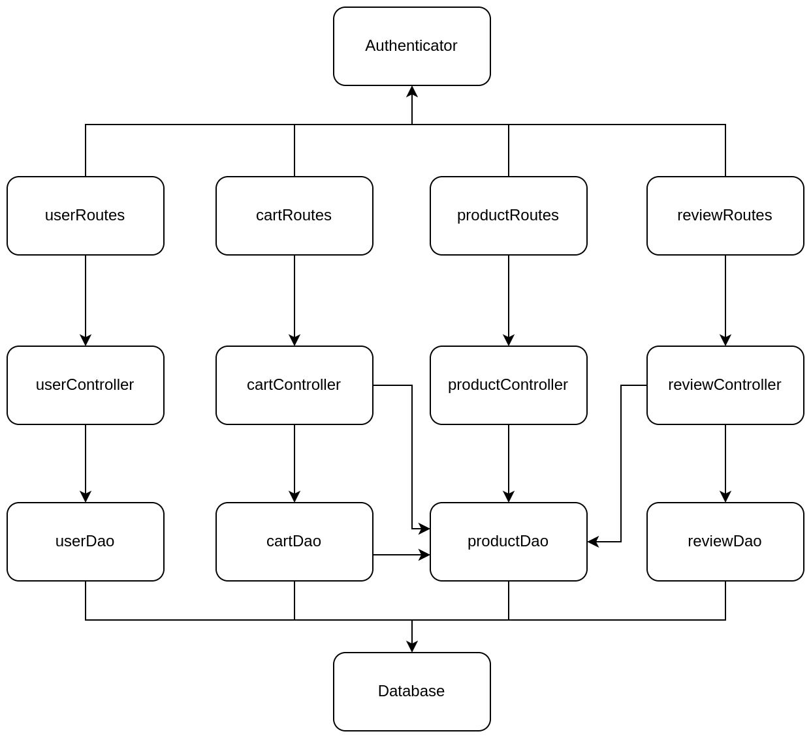

# Test Report

<The goal of this document is to explain how the application was tested, detailing how the test cases were defined and what they cover>

# Contents

- [Test Report](#test-report)
- [Contents](#contents)
- [Dependency graph](#dependency-graph)
- [Integration approach](#integration-approach)
- [Tests](#tests)
- [Coverage](#coverage)
  - [Coverage of FR](#coverage-of-fr)
  - [Coverage white box](#coverage-white-box)

# Dependency graph

# Integration approach

    1. DAO + DB
    2. Controller + DAO + DB
    3. Route + Controller + DAO + DB

# Tests

<in the table below list the test cases defined For each test report the object tested, the test level (API, integration, unit) and the technique used to define the test case (BB/ eq partitioning, BB/ boundary, WB/ statement coverage, etc)> <split the table if needed>

=====MICHELE
| Test case name | Object(s) tested | Test level | Technique used |
| :------------: | :--------------: | :--------: | :------------: |
| TC1: CartDAO - Get current cart | getCurrentCart (CartDAO) | unit | WB (statement coverage) |
| TC2: CartDAO - Get product | getProduct (CartDAO) | unit | WB (statement coverage) |
| TC3: CartDAO - Create cart | createCart (CartDAO) | unit | WB (statement coverage) |
| TC4: CartDAO - Checkout cart | checkoutCart (CartDAO) | unit | WB (statement coverage) |
| TC5: CartDAO - Add product to cart | addProductToCart (CartDAO) | unit | WB (statement coverage) |
| TC6: CartDAO - Fetch paid carts | fetchPaidCarts (CartDAO) | unit | WB (statement coverage) |
| TC7: CartDAO - Get current cart id | getCurrentCartId (CartDAO) | unit | WB (statement coverage) |
| TC8: CartDAO - Remove product from cart | removeProductFromCart (CartDAO) | unit | WB (statement coverage) |
| TC9: CartDAO - Clear cart | clearCart (CartDAO) | unit | WB (statement coverage) |
| TC10: CartDAO - Delete all carts | deleteAllCarts (CartDAO) | unit | WB (statement coverage) |
| TC11: CartDAO - Fetch all carts | fetchAllCarts (CartDAO) | unit | WB (statement coverage) |
| TC12: CartDAO - Fetch products | fetchProducts (CartDAO) | unit | WB (statement coverage) |
| TC13: CartController - Get cart | getCart (CartController) | unit | WB (statement coverage) |
| TC14: CartController - Get all customer carts | getCustomerCarts (CartController) | unit | WB (statement coverage) |
| TC15: CartController - Get all carts | getAllCarts (CartController) | unit | WB (statement coverage) |
| TC16: CartController - Add product to cart | addToCart (CartController) | unit | WB (statement coverage) |
| TC17: CartController - Checkout cart | checkoutCart (CartController) | unit | WB (statement coverage) |
| TC18: CartController - Clear cart | clearCart (CartController) | unit | WB (statement coverage) |
| TC19: CartController - Remove product from cart | removeProductFromCart (CartController) | unit | WB (statement coverage) |
| TC20: CartController - Delete all carts | deleteAllCarts (CartController) | unit | WB (statement coverage) |
| TC21: CartController - Contains product utility function | containsProduct (CartController) | unit | WB (statement coverage) |
| TC22: CartRoutes - Get current cart | GET ezelectronics/carts (CartRoutes) | unit | WB (statement coverage) |
| TC23: CartRoutes - Add product to cart | POST ezelectronics/carts (CartRoutes) | unit | WB (statement coverage) |
| TC24: CartRoutes - Checkout cart | PATCH ezelectronics/carts (CartRoutes) | unit | WB (statement coverage) |
| TC25: CartRoutes - Get paid carts | GET ezelectronics/carts/history (CartRoutes) | unit | WB (statement coverage) |
| TC26: CartRoutes - Remove product from cart | DELETE ezelectronics/carts/products/:model (CartRoutes) | unit | WB (statement coverage) |
| TC27: CartRoutes - Empty current cart | DELETE ezelectronics/carts/current (CartRoutes) | unit | WB (statement coverage) |
| TC28: CartRoutes - Delete all carts | DELETE ezelectronics/carts (CartRoutes) | unit | WB (statement coverage) |
| TC29: CartRoutes - Get all carts | GET ezelectronics/carts/all (CartRoutes) | unit | WB (statement coverage) |
| TC30: CartDAO - Create cart | createCart (CartDAO) | integration | BB (equivalent classes partitioning) |
| TC31: CartDAO - Add product to cart | addProductToCart (CartDAO) | integration | BB (equivalent classes partitioning) |
| TC32: CartDAO - Get current cart | getCurrentCart (CartDAO) | integration | BB (equivalent classes partitioning) |
| TC33: CartDAO - Get product | getProduct (CartDAO) | integration | BB (equivalent classes partitioning) |
| TC34: CartDAO - Get current cart id | getCurrentCartId (CartDAO) | integration | BB (equivalent classes partitioning) |
| TC35: CartDAO - Checkout cart | checkoutCart (CartDAO) | integration | BB (equivalent classes partitioning) |
| TC36: CartDAO - Get paid carts | fetchPaidCarts (CartDAO) | integration | BB (equivalent classes partitioning) |
| TC37: CartDAO - Remove product from cart | removeProductFromCart (CartDAO) | integration | BB (equivalent classes partitioning) |
| TC38: CartDAO - Clear cart | clearCart (CartDAO) | integration | BB (equivalent classes partitioning) |
| TC39: CartDAO - Delete all carts | deleteAllCarts (CartDAO) | integration | BB (equivalent classes partitioning) |
| TC40: CartDAO - Get all carts | fetchAllCarts (CartDAO) | integration | BB (equivalent classes partitioning) |
| TC41: CartDAO - Fetch product in cart | fetchProducts (CartDAO) | integration | BB (equivalent classes partitioning) |
| TC42: CartController - Add product to cart | addToCart (CartController) | integration | BB (equivalent classes partitioning) |
| TC43: CartController - Get cart | getCart (CartController) | integration | BB (equivalent classes partitioning) |
| TC44: CartController - Checkout cart | checkoutCart (CartController) | integration | BB (equivalent classes partitioning) |
| TC45: CartController - Clear current cart | clearCart (CartController) | integration | BB (equivalent classes partitioning) |
| TC46: CartController - Remove product from cart | removeProductFromCart (CartController) | integration | BB (equivalent classes partitioning) |
| TC47: CartController - Get all customer carts | getCustomerCarts (CartController) | integration | BB (equivalent classes partitioning) |
| TC48: CartController - Get all carts | getAllCarts (CartController) | integration | BB (equivalent classes partitioning) |
| TC49: CartController - Delete all carts | deleteAllCarts (CartController) | integration | BB (equivalent classes partitioning) |
| TC50: CartRoutes - Add product to cart | POST ezelectronics/carts (CartRoutes) | API | BB (equivalent classes partitioning) |
| TC51: CartRoutes - Get current cart | GET ezelectronics/carts (CartRoutes) | API | BB (equivalent classes partitioning) |
| TC52: CartRoutes - Checkout cart | PATCH ezelectronics/carts (CartRoutes) | API | BB (equivalent classes partitioning) |
| TC53: CartRoutes - Get paid carts | GET ezelectronics/carts/history (CartRoutes) | API | BB (equivalent classes partitioning) |
| TC54: CartRoutes - Remove product from cart | DELETE ezelectronics/carts/products/:model (CartRoutes) | API | BB (equivalent classes partitioning) |
| TC54.1: CartRoutes - Remove product from cart failed - Model string empty | DELETE ezelectronics/carts/products/:model (CartRoutes) | API | WB (statement coverage) |
| TC55: CartRoutes - Empty current cart | DELETE ezelectronics/carts/current (CartRoutes) | API | BB (equivalent classes partitioning) |
| TC56: CartRoutes - Delete all carts | DELETE ezelectronics/carts (CartRoutes) | API | BB (equivalent classes partitioning) |
| TC57: CartRoutes - Get all carts | GET ezelectronics/carts/all (CartRoutes) | API | BB (equivalent classes partitioning) |

=====FRANCESCO
| Test case name | Object(s) tested | Test level | Technique used |
| :------------: | :--------------: | :--------: | :------------: |
| TR1: ReviewDAO - Add a Review | ReviewDAO.addReview | unit | WB (statement coverage) |
| TR2: ReviewDAO - Get a Product's Reviews | ReviewDAO.getProductReviews | unit | WB (statement coverage) |
| TR3: ReviewDAO - Delete a Review | ReviewDAO.deleteReview | unit | WB (statement coverage) |
| TR4: ReviewDAO - Delete all Reviews of a Product | ReviewDAO.deleteReviewsOfProduct | unit | WB (statement coverage) |
| TR5: ReviewDAO - Delete all Reviews | ReviewDAO.deleteAllReviews | unit | WB (statement coverage) |
| TR6: ReviewController - Add a Review | ReviewController.addReview | unit | WB (statement coverage) |
| TR7: ReviewController - Get Product Reviews | ReviewController.getProductReviews | unit | WB (statement coverage) |
| TR8: ReviewController - Delete Product Review | ReviewController.deleteReview | unit | WB (statement coverage) |
| TR9: ReviewController - Delete All Reviews of a Product | ReviewController.deleteReviewsOfProduct | unit | WB (statement coverage) |
| TR10: ReviewController - Delete All Reviews | ReviewController.deleteAllReviews | unit | WB (statement coverage) |
| TR11: ReviewRoute - Add a Review | POST ezelectronics/reviews/:model | unit | WB (statement coverage) |
| TR12: ReviewRoute - Get a Product's Reviews | GET ezelectronics/reviews/:model | unit | WB (statement coverage) |
| TR13: ReviewRoute - Delete a Review | DELETE ezelectronics/reviews/:model | unit | WB (statement coverage) |
| TR14: ReviewRoute - Delete All Reviews of a Product | DELETE ezelectronics/reviews/:model/all | unit | WB (statement coverage) |
| TR15: ReviewRoute - Delete All Reviews | DELETE ezelectronics/reviews/ | unit | WB (statement coverage) |
| TR16: ReviewDAO - Add a Review | ReviewDAO.addReview | integration | BB (eq partitioning) |
| TR17: ReviewDAO - Get a Product's Reviews | ReviewDAO.getProductReviews | integration | BB (eq partitioning) |
| TR18: ReviewDAO - Delete a Review | ReviewDAO.deleteReview | integration | BB (eq partitioning) |
| TR19: ReviewDAO - Delete all Reviews of a Product | ReviewDAO.deleteReviewsOfProduct | integration | BB (eq partitioning) |
| TR20: ReviewDAO - Delete all Reviews | ReviewDAO.deleteAllReviews | integration | BB (eq partitioning) |
| TR21: ReviewController - Add a Review | ReviewController.addReview | integration | BB (eq partitioning) |
| TR22: ReviewController - Get Product Reviews | ReviewController.getProductReviews | integration | BB (eq partitioning) |
| TR23: ReviewController - Delete Product Review | ReviewController.deleteReview | integration | BB (eq partitioning) |
| TR24: ReviewController - Delete All Reviews of a Product | ReviewController.deleteReviewsOfProduct | integration | BB (eq partitioning) |
| TR25: ReviewController - Delete All Reviews | ReviewController.deleteAllReviews | integration | BB (eq partitioning) |
| TR26: ReviewRoute - Add a Review | POST ezelectronics/reviews/:model | integration | BB (eq partitioning) |
| TR27: ReviewRoute - Get a Product's Reviews | GET ezelectronics/reviews/:model | integration | BB (eq partitioning) |
| TR28: ReviewRoute - Delete a Review | DELETE ezelectronics/reviews/:model | integration | BB (eq partitioning) |
| TR29: ReviewRoute - Delete All Reviews of a Product | DELETE ezelectronics/reviews/:model/all | integration | BB (eq partitioning) |
| TR30: ReviewRoute - Delete All Reviews | DELETE ezelectronics/reviews/ | integration | BB (eq partitioning) |

=====GIUSEPPE
| Test case name | Object(s) tested | Test level | Technique used |
| :------------: | :--------------: | :--------: | :------------: |
| TP1: ProductDAO - createProduct test | createProduct (ProductDAO) | unit | WB (statement coverage) |
| TP2: ProductDAO - existsProduct test | existProduct (ProductDAO) | unit | WB (statement coverage) |
| TP3: ProductDAO - getProductByModel test | getProductByModel (ProductDAO) | unit | WB (statement coverage) |
| TP4: ProductDAO - increaseQuantity tests | increaseQuantity (ProductDAO) | unit | WB (statement coverage) |
| TP5: ProductDAO - decreaseQuantity test | decreaseQuantity (ProductDAO) | unit | WB (statement coverage) |
| TP6: ProductDAO - getAllProducts test| getAllProducts (ProductDAO) | unit | WB (statement coverage) |
| TP7: ProductDAO - getAllAvailableProducts test | getAllAvailableProducts (ProductDAO) | unit | WB (statement coverage) |
| TP8: ProductDAO - deleteProducts test| deleteProducts (ProductDAO) | unit | WB (statement coverage) |
| TP8: ProductDAO - deleteProductByModel test| deleteProductByModel (ProductDAO) | unit | WB (statement coverage) |
| TP9: ProductDAO - getProductQuantity test| getProductQuantity (ProductDAO) | unit | WB (statement coverage) |
| TP10: ProductController - registerProducts tests| registerProducts (ProductController) | unit | WB (statement coverage) |
| TP11: ProductController - productExist test | productExist (ProductController) | unit | WB (statement coverage) |
| TP12: ProductController - productByModel test | productByModel (ProductController) | unit | WB (statement coverage) |
| TP13: ProductController - changeProductquantity test| changeProductQuantity (ProductController) | unit | WB (statement coverage) |
| TP14: ProductController - sellProducts test| sellProduct (ProductController) | unit | WB (statement coverage) |
| TP15: ProductController - getProducts tests| getProducts (ProductController) | unit | WB (statement coverage) |
| TP16: ProductController - getAvailableProducts test | getAllAvailableProducts (ProductController) | unit | WB (statement coverage) |
| TP17: ProductController - deleteAllProducts test | deleteAllProducts (ProductController) | unit | WB (statement coverage) |
| TP18: ProductController - deleteProduct test | deleteProduct (ProductController) | unit | WB (statement coverage) |
| TP19: ProductRoute - POST - Testing of the Route for registering the arrival of a set of product | POST ezelectronics/products (ProductRoute) | unit | WB (statement coverage) |
| TP20: ProductRoute - Testing body content | POST ezelectronics/products (ProductRoute) | unit | WB (statement coverage) |
| TP21: ProductRoute - PATCH - Testing of the Route for registering the increase in quantity of a product | PATCH ezelectronics/products/:model (ProductRoute) | unit | WB (statement coverage) |
| TP22: ProductRoute - Date validation testing | PATCH ezelectronics/products/:model (ProductRoute) | unit | WB (statement coverage) |
| TP23: ProductRoute - PATCH - Testing of the Route for selling a product| PATCH ezelectronics/products/:model/sell (ProductRoute) | unit | WB (statement coverage) |
| TP24: ProductRoute - Date validation testing | PATCH ezelectronics/products/:model/sell (ProductRoute) | unit | WB (statement coverage) |
| TP25: ProductRoute - GET - Testing of Route for retrieving all products | GET ezelectronics/products (ProductRoute) | unit | WB (statement coverage) |
| TP26: ProductRoute - It should return a 422 error if `grouping` is null and any of `category` or `model` is not null | GET ezelectronics/products (ProductRoute) | unit | WB (statement coverage) |
| TP27: ProductRoute - It should return a 422 error if `grouping` is `category` and `category` is null OR `model` is not null | GET ezelectronics/products (ProductRoute) | unit | WB (statement coverage) |
| TP28: ProductRoute - It should return a 422 error if `grouping` is `model` and `model` is null OR `category` is not null | GET ezelectronics/products (ProductRoute) | unit | WB (statement coverage) |
| TP29: ProductRoute - GET - Testing of the Route for retrieving all available products | GET ezelectronics/products/available (ProductRoute) | unit | WB (statement coverage) |
| TP30: ProductRoute - It should return a 422 error if `grouping` is null and any of `category` or `model` is not null | GET ezelectronics/products/available (ProductRoute) | unit | WB (statement coverage) |
| TP31: ProductRoute - It should return a 422 error if `grouping` is `category` and `category` is null OR `model` is not null | GET ezelectronics/products/available (ProductRoute) | unit | WB (statement coverage) |
| TP32: ProductRoute - It should return a 422 error if `grouping` is `model` and `model` is null OR `category` is not null | GET ezelectronics/products/available (ProductRoute) | unit | WB (statement coverage) |
| TP33: ProductRoute - DELETE - Testing of the Route for deleting all products | DELETE ezelectronics/products (ProductRoute) | unit | WB (statement coverage) |
| TP33: ProductRoute - DELETE - Testing of the Route for deleting a product | DELETE ezelectronics/products/:model (ProductRoute) | unit | WB (statement coverage) |
| TP34: ProductDao - createProduct test  | createProduct (ProductDao) | integration | BB (equivalent classes partitioning) |
| TP35: ProductDao - existProducts tests  | existsProduct (ProductDao) | integration | BB (equivalent classes partitioning) |
| TP36: ProductDao - getProductByModel tests | getProductByModel (ProductDao) | integration | BB (equivalent classes partitioning) |
| TP37: ProductDao - increaseQuantity Test  | increaseQuantity (ProductDao) | integration | BB (equivalent classes partitioning) |
| TP38: ProductDao - decreaseQuantity test | decreaseQuantity (ProductDao) | integration | BB (equivalent classes partitioning) |
| TP39: ProductDao - getAllProducts test | getAllProducts  (ProductDao) | integration | BB (equivalent classes partitioning) |
| TP40: ProductDao - getAllAvailableProducts test | getAllAvailableProducts (ProductDao) | integration | BB (equivalent classes partitioning) |
| TP41: ProductDao - deleteProducts test | deleteProducts (ProductDao) | integration | BB (equivalent classes partitioning) |
| TP42: ProductDao - deleteProductByModel tests | deleteProductByModel (ProductDao) | integration | BB (equivalent classes partitioning) |
| TP43: ProductDao - getProductQuantity test | getProductQuantity (ProductDao) | integration | BB (equivalent classes partitioning) |
| TP44: ProductController - registerProduct test | registerProducts (ProductController) | integration | BB (equivalent classes partitioning) |
| TP45: ProductController - productExist test | productExist (ProductController) | integration | BB (equivalent classes partitioning) |
| TP46: ProductController - productByModel test | productByModel (ProductController) | integration | BB (equivalent classes partitioning) |
| TP47: ProductController - changeProductQuantity test | changeProductQuantity (ProductController) | integration | BB (equivalent classes partitioning) |
| TP48: ProductController - sellProduct test | sellProduct (ProductController) | integration | BB (equivalent classes partitioning) |
| TP49: ProductController - getProducts test | getProducts (ProductController) | integration | BB (equivalent classes partitioning) |
| TP50: ProductController - getAvailableProducts test| getAvailableProducts (ProductController) | integration | BB (equivalent classes partitioning) |
| TP51: ProductController - deleteAllProducts test | deleteAllProducts (ProductController) | integration | BB (equivalent classes partitioning) |
| TP52: ProductController - deleteProduct test | deleteProduct (ProductController) | integration | BB (equivalent classes partitioning) |
| TP53: ProductRoute - POST -  Route for registering the arrival of a set of products | POST ezelectronics/products (ProductRoute) | integration | BB (equivalent classes partitioning) |
| TP54: ProductRoute - PATCH - Route for registering the increase in quantity of a product | PATCH ezelectronics/products/:model (ProductRoute) | integration | BB (equivalent classes partitioning) |
| TP55: ProductRoute - PATCH -  Route for selling a product | PATCH ezelectronics/products/:model/sell (ProductRoute) | integration | BB (equivalent classes partitioning) |
| TP56: ProductRoute - GET - Route for retrieving all products | GET ezelectronics/products (ProductRoute) | integration | BB (equivalent classes partitioning) |
| TP57: ProductRoute - GET - Route for retrieving all Available products | GET ezelectronics/products/available (ProductRoute) | integration | BB (equivalent classes partitioning) |
| TP58: ProductRoute - DELETE - Deletes one product from the database | DELETE ezelectronics/products/:model (ProductRoute) | integration | BB (equivalent classes partitioning) |
| TP59: ProductRoute - DELETE - Deletes all products from the database | DELETE ezelectronics/products (ProductRoute) | integration | BB (equivalent classes partitioning) |

=====FLAVIANA
| Test case name | Object(s) tested | Test level | Technique used |
| :------------: | :--------------: | :--------: | :------------: |
| TU1: UserDAO - Check login information | getIsUserAuthenticated (UserDAO) | unit | WB (statement coverage) |
| TU2: UserDAO - Create a new user | createUser (UserDAO) | unit | WB (statement coverage) |
| TU3: UserDAO - Get a specific user | getUserByUsername (UserDAO) | unit | WB (statement coverage) |
| TU4: UserDAO - Get users | getUser (UserDAO) | unit | WB (statement coverage) |
| TU5: UserDAO - Get all users with a specific role | getUserByRole (UserDAO) | unit | WB (statement coverage) |
| TU6: UserDAO - Delete a specific user | deleteUser (UserDAO) | unit | WB (statement coverage) |
| TU7: UserDAO - Delete all users | deleteAll (UserDAO) | unit | WB (statement coverage) |
| TU8: UserDAO - Check if the role of the user is Admin | isAdminByUsername (UserDAO) | unit | WB (statement coverage) |
| TU9: UserDAO - Update user information | updateUserInformation (UserDAO) | unit | WB (statement coverage) |
| TU10: UserController - Create a new user | createUser (UserController) | unit | WB (statement coverage) |
| TU11: UserController - Get all users | getUsers (UserController) | unit | WB (statement coverage) |
| TU12: UserController - Get all users with a specific role | getUsersByRole (UserController) | unit | WB (statement coverage) |
| TU13: UserController - Get a specific user | getUsersByUsername (UserController) | unit | WB (statement coverage) |
| TU14: UserController - Delete a specific user | deleteUser (UserController) | unit | WB (statement coverage) |
| TU15: UserController - Delete all users | deleteAll (UserController) | unit | WB (statement coverage) |
| TU16: UserController - Update user information | updateUserInfo (UserController) | unit | WB (statement coverage) |
| TU17: UserRoutes - Create a new user | POST ezelectronics/users (UserRoutes) | unit | WB (statement coverage) |
| TU18: UserRoutes - Get all users | GET ezelectronics/users (UserRoutes) | unit | WB (statement coverage) |
| TU19: UserRoutes - Get all users with a specific role | GET ezelectronics/users/roles/:role (UserRoutes) | unit | WB (statement coverage) |
| TU20: UserRoutes - Get a user by its username | GET ezelectronics/users/:username (UserRoutes) | unit | WB (statement coverage) |
| TU21: UserRoutes - Delete a user | DELETE ezelectronics/users/:username (UserRoutes) | unit | WB (statement coverage) |
| TU22: UserRoutes - Delete all users | DELETE ezelectronics/users (UserRoutes) | unit | WB (statement coverage) |
| TU23: UserRoutes - Update user information | PATCH ezelectronics/users/:username (UserRoutes) | unit | WB (statement coverage) |
| TU24: UserRoutes - Log in a user | POST ezelectronics/sessions (UserRoutes) | unit | WB (statement coverage) |
| TU25: UserRoutes - Log out the currently logged in user | DELETE ezelectronics/sessions/current (UserRoutes) | unit | WB (statement coverage) |
| TU26: UserRoutes - Get the currently logged in user | GET ezelectronics/sessions/current (UserRoutes) | unit | WB (statement coverage) |
| TU27: UserDAO - Check login information | getIsUserAuthenticated (UserDAO) | integration | BB (equivalent classes partitioning) |
| TU28: UserDAO - Create a new user | createUser (UserDAO) | unit | BB (equivalent classes partitioning) |
| TU29: UserDAO - Get a specific user | getUserByUsername (UserDAO) | integration | BB (equivalent classes partitioning) |
| TU30: UserDAO - Get users | getUser (UserDAO) | integration | BB (equivalent classes partitioning) |
| TU31: UserDAO - Get all users with a specific role | getUserByRole (UserDAO) | integration | BB (equivalent classes partitioning) |
| TU32: UserDAO - Delete a specific user | deleteUser (UserDAO) | integration | BB (equivalent classes partitioning) |
| TU33: UserDAO - Delete all users | deleteAll (UserDAO) | integration | BB (equivalent classes partitioning) |
| TU34: UserDAO - Check if the role of the user is Admin | isAdminByUsername (UserDAO) | integration | BB (equivalent classes partitioning) |
| TU35: UserDAO - Update user information | updateUserInformation (UserDAO) | integration | BB (equivalent classes partitioning) |
| TU36: UserController - Create a new user | createUser (UserController) | integration | BB (equivalent classes partitioning) |
| TU37: UserController - Get all users | getUsers (UserController) | integration | BB (equivalent classes partitioning) |
| TU38: UserController - Get all users with a specific role | getUsersByRole (UserController) | integration | BB (equivalent classes partitioning) |
| TU39: UserController - Get a specific user | getUsersByUsername (UserController) | integration | BB (equivalent classes partitioning) |
| TU40: UserController - Delete a specific user | deleteUser (UserController) | integration | BB (equivalent classes partitioning) |
| TU41: UserController - Delete all users | deleteAll (UserController) | integration | BB (equivalent classes partitioning) |
| TU42: UserController - Update user information | updateUserInfo (UserController) | integration | BB (equivalent classes partitioning) |
| TU43: UserRoutes - Create a new user | POST ezelectronics/users (UserRoutes) | API | BB (equivalent classes partitioning) |
| TU44: UserRoutes - Get all users | GET ezelectronics/users (UserRoutes) | API | BB (equivalent classes partitioning) |
| TU45: UserRoutes - Get all users with a specific role | GET ezelectronics/users/roles/:role (UserRoutes) | API | BB (equivalent classes partitioning) |
| TU46: UserRoutes - Get a user by its username | GET ezelectronics/users/:username (UserRoutes) | API | BB (equivalent classes partitioning) |
| TU47: UserRoutes - Delete a user | DELETE ezelectronics/users/:username (UserRoutes) | API | BB (equivalent classes partitioning) |
| TU48: UserRoutes - Delete all users | DELETE ezelectronics/users (UserRoutes) | API | BB (equivalent classes partitioning) |
| TU49: UserRoutes - Update user information | PATCH ezelectronics/users/:username (UserRoutes) | API | BB (equivalent classes partitioning) |
| TU50: UserRoutes - Log in a user | POST ezelectronics/sessions (UserRoutes) | API | BB (equivalent classes partitioning)|
| TU51: UserRoutes - Log out the currently logged in user | DELETE ezelectronics/sessions/current (UserRoutes) | API | BB (equivalent classes partitioning) |
| TU52: UserRoutes - Get the currently logged in user | GET ezelectronics/sessions/current (UserRoutes) | API | BB (equivalent classes partitioning) |

=====END

# Coverage

## Coverage of FR

<Report in the following table the coverage of functional requirements and scenarios(from official requirements) >

| Functional Requirement |                            Test(s)                             |
| :--------------------: | :------------------------------------------------------------: |
|        **FR1**         |     TU1, TU2, TU10, TU17, TU24-TU28, TU36, TU43, TU50-TU52     |
|         FR1.1          |               TU1, TU24, TU26, TU27, TU50, TU52                |
|         FR1.2          |                           TU25, TU51                           |
|         FR1.3          |               TU2, TU10, TU17, TU28, TU36, TU43                |
|        **FR2**         | TU3-TU9, TU11-TU16, TU18-TU23, TU29-TU35, TU37-TU42, TU44-TU49 |
|         FR2.1          |               TU4, TU11, TU18, TU30, TU37, TU44                |
|         FR2.2          |               TU5, TU12, TU19, TU31, TU38, TU45                |
|         FR2.3          |               TU3, TU13, TU20, TU29, TU39, TU46                |
|         FR2.4          |               TU9, TU16, TU23, TU35, TU42, TU49                |
|         FR2.5          |          TU6, TU8, TU14, TU21, TU32, TU34 TU40, TU47           |
|         FR2.6          |               TU7, TU15, TU22, TU33, TU41, TU48                |
|        **FR3**         |                                                                |
|         FR3.1          |                                                                |
|         FR3.2          |                                                                |
|         FR3.3          |                                                                |
|         FR3.4          |                                                                |
|        FR3.4.1         |                                                                |
|         FR3.5          |                                                                |
|        FR3.5.1         |                                                                |
|         FR3.7          |                                                                |
|         FR3.8          |                                                                |
|        **FR4**         |                                                                |
|         FR4.1          |                TR1, TR6, TR11, TR16, TR21, TR26                |
|         FR4.2          |                TR2, TR7, TR12, TR17, TR22, TR27                |
|         FR4.3          |                TR3, TR8, TR13, TR18, TR23, TR28                |
|         FR4.4          |                TR4, TR9, TR14, TR19, TR24, TR29                |
|         FR4.5          |               TR5, TR10, TR15, TR20, TR25, TR30                |
|        **FR5**         |                           TC1 - TC57                           |
|         FR5.1          |                  TC1,TC13,TC22,TC32,TC43,TC51                  |
|         FR5.2          |    TC2,TC3,TC5,TC7,TC16,TC23,TC30,TC31,TC33,TC34,TC42,TC50     |
|         FR5.3          |             TC1,TC4,TC17,TC24,TC32,TC35,TC44,TC52              |
|         FR5.4          |             TC6,TC12,TC14,TC25,TC36,TC41,TC47,TC53             |
|         FR5.5          |     TC1,TC7,TC8,TC19,TC26,TC32,TC34,TC37,TC46,TC54,TC54.1      |
|         FR5.6          |             TC7,TC9,TC18,TC27,TC34,TC38,TC45,TC55              |
|         FR5.7          |            TC11,TC12,TC15,TC28,TC36,TC41,TC48,TC57             |
|         FR5.8          |                 TC10,TC20,TC29,TC39,TC49,TC56                  |

| Scenario |                   Test(s)                   |
| :------: | :-----------------------------------------: |
|   1.1    |                  TU1, TU27                  |
|   1.2    |                 TU1, TU27,                  |
|   1.3    |                 TU24, TU50                  |
|   1.4    |                 TU24, TU50                  |
|   2.1    |                 TU25, TU51                  |
|   2.2    |                 TU25, TU51                  |
|   3.1    |      TU2, TU10, TU17, TU28, TU36, TU43      |
|   3.2    |      TU2, TU10, TU17, TU28, TU36, TU43      |
|   3.3    |      TU2, TU10, TU17, TU28, TU36, TU43      |
|   4.1    |      TU3, TU13, TU20, TU29, TU39, TU46      |
|   4.2    |      TU3, TU13, TU20, TU29, TU39, TU46      |
|   4.3    |      TU4, TU11, TU18, TU30, TU37, TU44      |
|   4.4    |      TU5, TU12, TU19, TU31, TU38, TU45      |
|   4.5    |      TU5, TU12, TU19, TU31, TU38, TU45      |
|   5.1    | TU6, TU8, TU14, TU21, TU32, TU34 TU40, TU47 |
|   5.2    | TU6, TU8, TU14, TU21, TU32, TU34 TU40, TU47 |
|   6.1    |                                             |
|   6.2    |                                             |
|   6.3    |                                             |
|   6.4    |                                             |
|   6.5    |                                             |
|   7.1    |                                             |
|   7.2    |                                             |
|   7.3    |                                             |
|   8.1    |                                             |
|   8.2    |                                             |
|   8.3    |                                             |
|   8.4    |                                             |
|   8.5    |                                             |
|   8.6    |                                             |
|   8.7    |                                             |
|   8.8    |                                             |
|   8.9    |                                             |
|   9.1    |                                             |
|   9.2    |                                             |
|   10.1   |                                             |
|   10.2   |                                             |
|   10.3   |                                             |
|   10.4   |                                             |
|   10.5   |                                             |
|   10.6   |                                             |
|   10.7   |                                             |
|   10.8   |                                             |
|   10.9   |                                             |
|  10.10   |                                             |
|  10.11   |                                             |
|  10.12   |                                             |
|   11.1   |                                             |
|   11.2   |                                             |
|   12.1   |                                             |
|   13.1   |                                             |
|   14.1   |                                             |
|   15.1   |                                             |
|   16.1   |                                             |
|   17.1   |      TR1, TR6, TR11, TR16, TR21, TR26       |
|   17.2   |      TR3, TR8, TR13, TR18, TR23, TR28       |
|   18.1   |      TR2, TR7, TR12, TR17, TR22, TR27       |
|   19.1   |      TR4, TR9, TR14, TR19, TR24, TR29       |
|   19.2   |      TR5, TR10, TR15, TR20, TR25, TR30      |

## Coverage white box

Report here the screenshot of coverage values obtained with jest-- coverage
