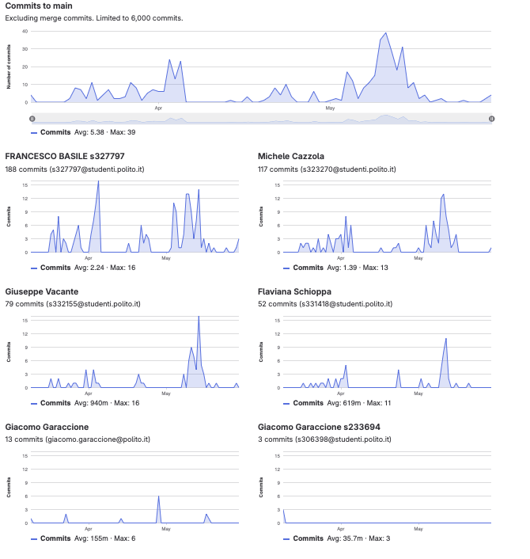

# Gruppo 42

## Valutazione deliverable V1

| gruppo | context diagram | business model | stakeholder | stories | interface | FR | NFR | use cases diagram | use cases | scenario | Glossary | DeploymentDiagram | functionality | estimation doc | precisione valori estimation | valutazione |
| --- | --- | --- | --- | --- | --- | --- | --- | --- | --- | --- | --- | --- | --- | --- | --- | --- |
| - | 1 | 0.5 | 0.5 | 1 | 1 | 3 | 3 | 1 | 5 | 5 | 5 | 2 | 1 | 2 | 2 | 33 |
| 42 | 100 | 100 | 90 | 100 | 100 | 100 | 100 | 100 | 100 | 95 | 85 | 90 | 100 | 90 | 99.78 | 97.12 |

## Valutazione deliverable V2

| gruppo | context diagram | business model | stakeholder | stories | interface | FR | NFR | ACCESS RIGHTS | use cases diagram | use cases | scenario | Glossary | DeploymentDiagram | functionality | estimation | precisione valori estimation | valutazione |
| --- | --- | --- | --- | --- | --- | --- | --- | --- | --- | --- | --- | --- | --- | --- | --- | --- | --- |
| - | 1 | 0.5 | 0.5 | 1 | 1 | 3 | 2 | 1 | 1 | 5 | 5 | 5 | 2 | 1 | 2 | 2 | 33 |
| 42 | 100 | 100 | 100 | 100 | 100 | 100 | 100 | 100 | 100 | 100 | 100 | 100 | 90 | 100 | 95 | 98.21 | 100.51 |

Le percentuali di v2 sono state riscalate in quanto la media pesata delle percentuali portava alcuni gruppi oltre al 100%.

## Valutazione codice e test (V2 + V3)

| Test Unit Totali | Test Unit Passati | Statement Coverage Unit | Branch Coverage Unit | Function Coverage Unit | Line Coverage Unit | Test Integration Totali | Test Integration Falliti | Statement Coverage Integration | Branch Coverage Integration | Function Coverage Integration | Line Coverage Integration | Correttezza V2 | Correttezza V3 | valutazione |
| --- | --- | --- | --- | --- | --- | --- | --- | --- | --- | --- | --- | --- | --- | --- |
| 1 | 0.5 | 2 | 2 | 1 | 1 | 1 | 0.5 | 2 | 2 | 1 | 1 | 16 | 2 | 33 |
| 100 | 100 | 100 | 100 | 100 | 100 | 100 | 100 | 100 | 75 | 100 | 100 | 95.7983193277311 | 100 | 96.45 |

 Unit e integration test prodotti dai gruppi sono stati eseguiti con la versione V2 del codice.

## Risultati Progetto

| Deliverable | Punteggio | Peso |
| --- | --- | --- |
| **Documenti V1** | 97.12% | 6 |
| **Documenti V2** | 99.16% | 2 |
| **Codice e Test** | 96.45% | 22 |
| **Timesheet** | 66.66% | 3 |
| **Valutazione** | 31.03 | 33 |
| **Valutazione** | 12.41 | 13.2 |

## Calcolo pesi progetto per singolo studente

| cognome | nome | email | gruppo | commit studente | commit totali | commit sul totale | coefficiente catme | coefficiente pesato | coefficiente progetto |
| --- | --- | --- | --- | --- | --- | --- | --- | --- | --- |
| BASILE | FRANCESCO | s327797@studenti.polito.it | 42 | 188 | 436 | 0.43 | 1.01 | 0.89 | 1.00 |
| CAZZOLA | MICHELE | s323270@studenti.polito.it | 42 | 117 | 436 | 0.27 | 1.05 | 0.89 | 1.00 |
| SCHIOPPA | FLAVIANA | s331418@studenti.polito.it | 42 | 52 | 436 | 0.12 | 0.94 | 0.78 | 0.87 |
| VACANTE | GIUSEPPE | s332155@studenti.polito.it | 42 | 79 | 436 | 0.18 | 1.00 | 0.84 | 0.94 |

 I pesi del progetto sono ottenuti per l'80% dal valore calcolato da CATME e per il 20% dalla percentuale dei commit del singolo studente sul totale dei commit effettuati dagli studenti dello stesso gruppo. Il risultato è stato poi riscalato in modo che il punteggio più alto del gruppo ottenesse 1.

## Studenti

| Nome | Matricola | Email | Bonus | Voto Primo Appello | Voto Secondo Appello | Voto Progetto | Voto Finale |
| --- | --- | --- | --- | --- | --- | --- | --- |
| FRANCESCO BASILE | 327797 | s327797@studenti.polito.it | 0 | 17.0 | | 12.41 | 29 |
| FLAVIANA SCHIOPPA | 331418 | s331418@studenti.polito.it | 1 | 15.2 | | 10.77 | 27 |
| GIUSEPPE VACANTE | 332155 | s332155@studenti.polito.it | 1 | 13.25 | | 11.61 | 26 |
| MICHELE CAZZOLA | 323270 | s323270@studenti.polito.it | 1 |  | 17.4 | 12.40 | 30 |
